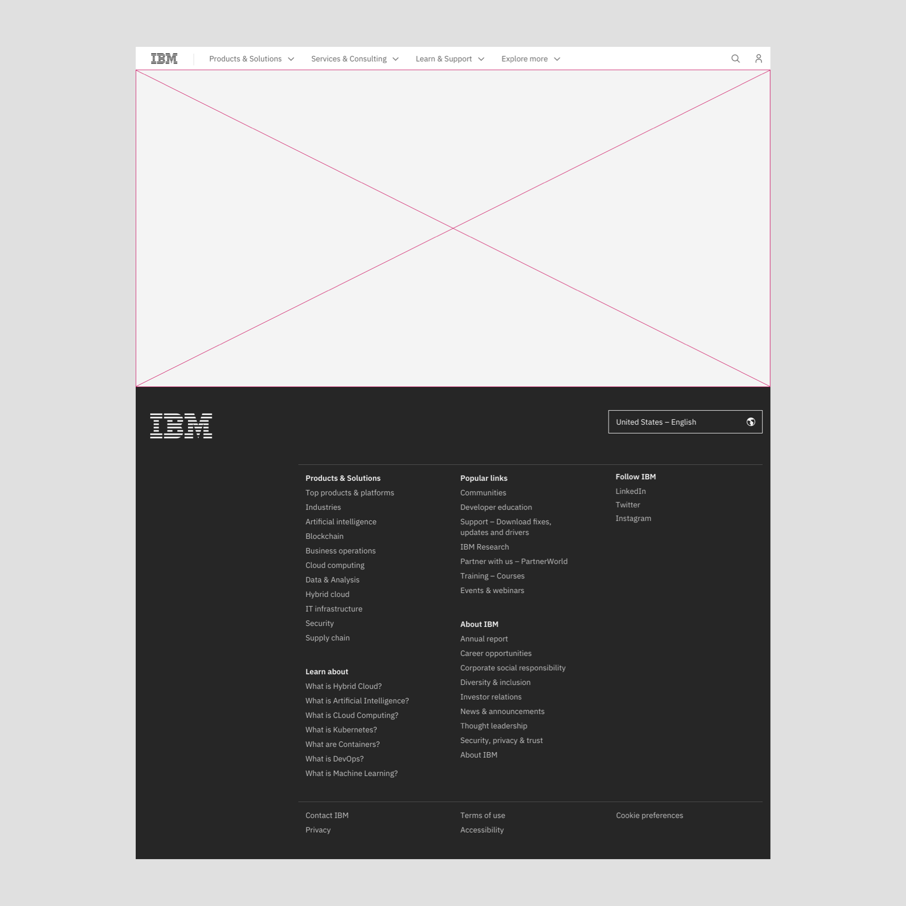

import ComponentDescription from 'components/ComponentDescription';
import ComponentFooter from 'components/ComponentFooter';
import ResourceLinks from 'components/ResourceLinks';

<ComponentDescription name="Dotcom shell" type="ui" />

<InlineNotification>

**Note:** Additional usage guidelines are coming soon.

</InlineNotification>

<AnchorLinks>

<AnchorLink>Resources</AnchorLink>
<AnchorLink>Overview</AnchorLink>
<AnchorLink>Feedback</AnchorLink>

</AnchorLinks>

<ResourceLinks name="Dotcom shell" type="ui" />

## Overview

<Row>
<Column colMd={8} colLg={12}>

</Column>
</Row>

<ComponentFooter name="Dotcom shell" type="ui" />
