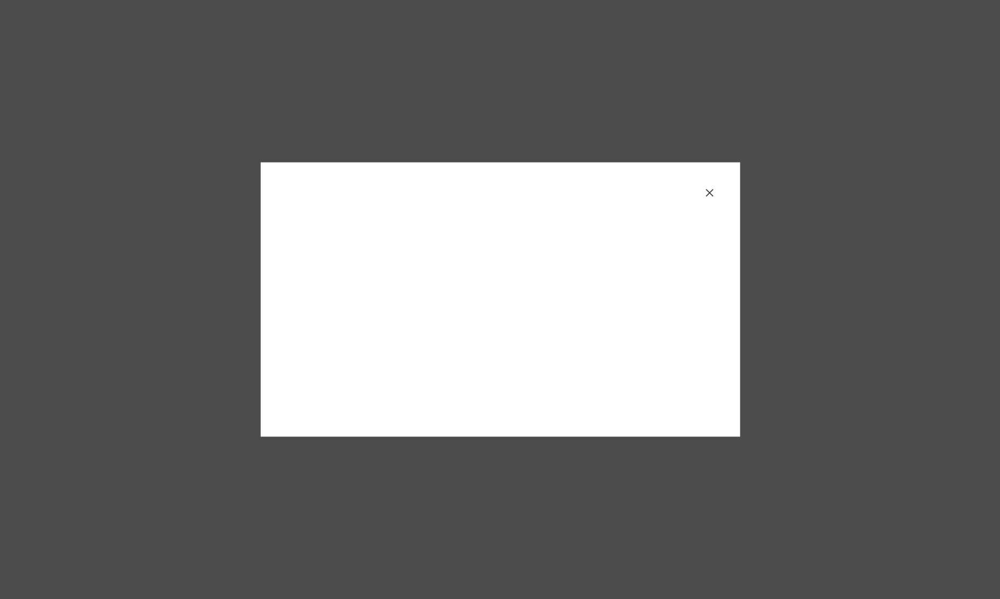
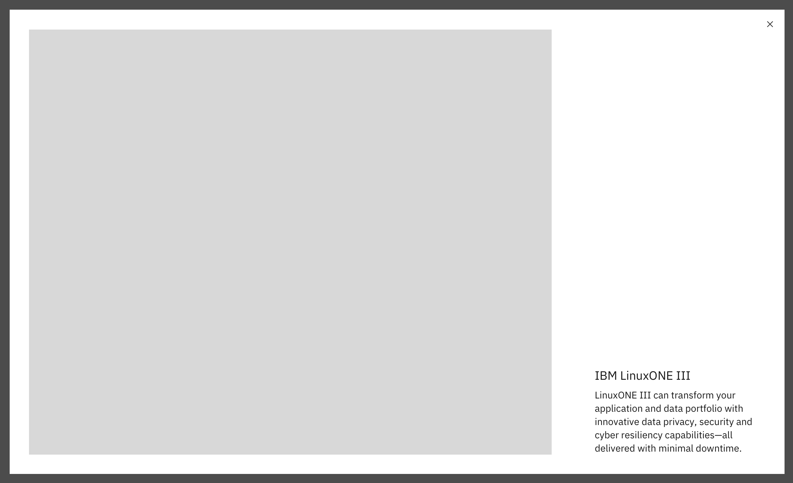
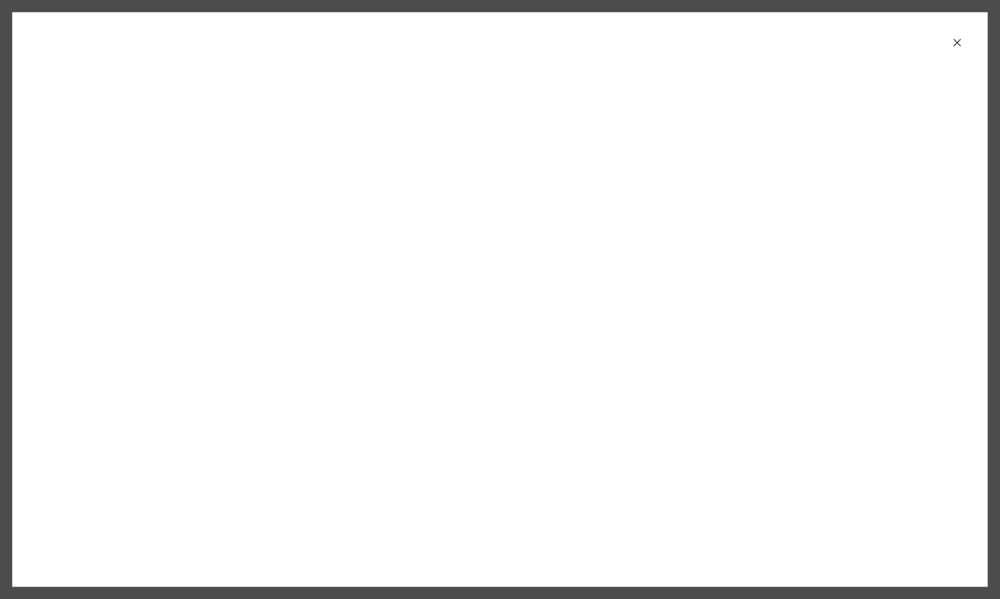
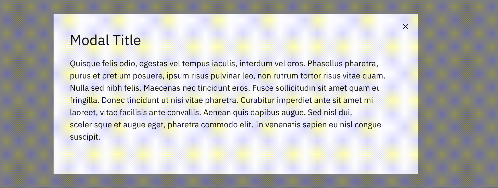
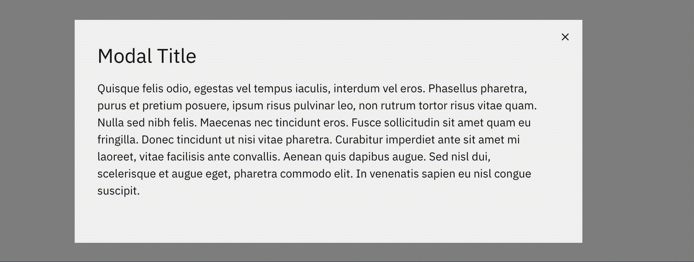
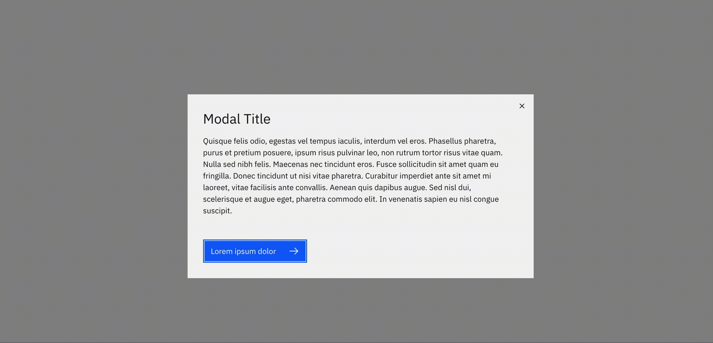

import ComponentDescription from 'components/ComponentDescription';
import ComponentFooter from 'components/ComponentFooter';
import ResourceLinks from 'components/ResourceLinks';

<ComponentDescription name="Expressive modal" type="ui" />

<AnchorLinks>

<AnchorLink>Overview</AnchorLink>
<AnchorLink>Variations</AnchorLink>
<AnchorLink>Behavior</AnchorLink>
<AnchorLink>Resources</AnchorLink>
<AnchorLink>Feedback</AnchorLink>

</AnchorLinks>

## Overview

The default variation reflects the <a href="https://www.carbondesignsystem.com/components/modal/usage/" target="_blank">Carbon modal</a> entirely with minimal styling updates to increase the padding and usage of fixed buttons.

<Row>
<Column colMd={8} colLg={8}>

</Column>
</Row>

<Title>Use case</Title>

<Row>
<Column colMd={8} colLg={8}>

</Column>
</Row>

## Variations

### Expanded

The expanded variation fills the screen and is typically used to display large amounts of content, images or video.

<Row>
<Column colMd={8} colLg={8}>

</Column>
</Row>

## Behavior

### Centered in screen

Expressive Modal is standardized to appear in the center of the screen, with the dark overlay extending across the browser window.

### Overflow

When the modal content is longer than the modal height then the body section should scroll vertically.
The content should visibly fade at the end of the modal body area to indicate there is additional content out of view.
Modal content should never scroll horizontally; instead, use a larger size modal.

<Row>
<Column colMd={8} colLg={8}>
<GifPlayer>

</GifPlayer>
</Column>
</Row>

### Closing the modal

Clicking on the close close button icon [ x ] or on the dark overlay will dismiss the modal.

<Row>
<Column colMd={8} colLg={8}>
<GifPlayer color='dark'>

</GifPlayer>
</Column>
</Row>

<ResourceLinks name="Expressive modal" type="ui" />
<ComponentFooter name="Expressive modal" type="ui" />
