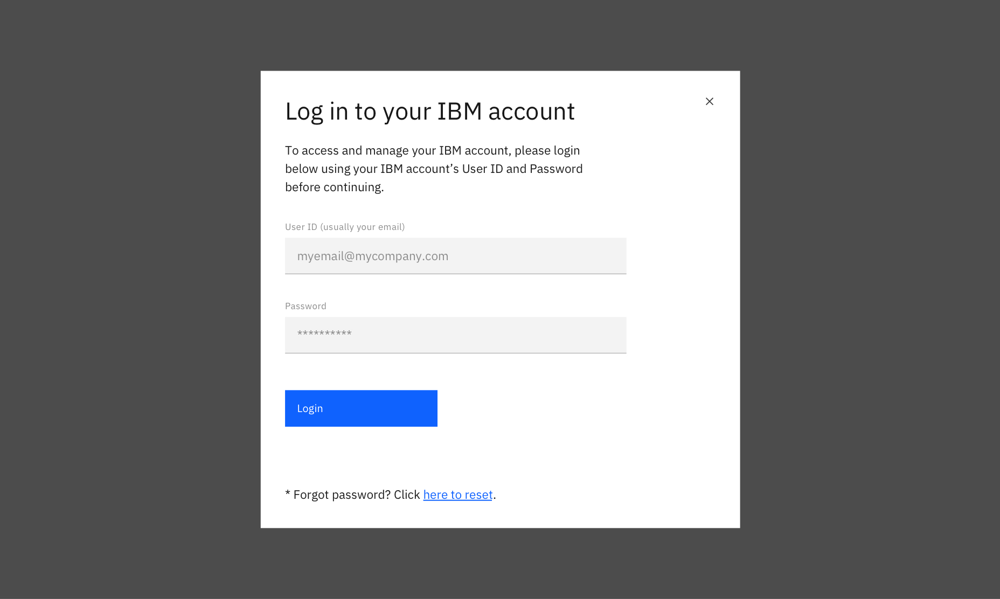
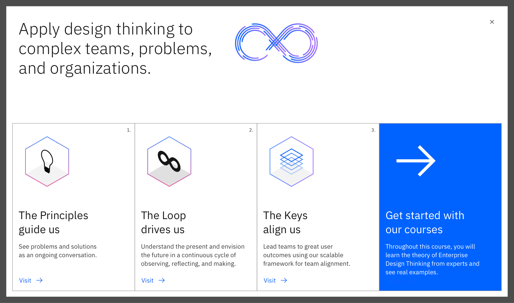

import ComponentDescription from 'components/ComponentDescription';
import ComponentFooter from 'components/ComponentFooter';
import ResourceLinks from 'components/ResourceLinks';

<ComponentDescription name="Expressive modal" type="ui" />

<AnchorLinks>

<AnchorLink>Resources</AnchorLink>
<AnchorLink>Overview</AnchorLink>
<AnchorLink>Variations</AnchorLink>
<AnchorLink>Feedback</AnchorLink>

</AnchorLinks>

<ResourceLinks name="Expressive modal" type="ui" />

## Overview

The default variation reflects the <a href="https://www.carbondesignsystem.com/components/modal/usage/" target="_blank">Carbon modal</a> entirely with minimal styling updates to increase the padding and usage of fixed buttons.

<Row>
<Column colMd={8} colLg={8}>

</Column>
</Row>

<Title>Use case</Title>

## Variations

### Expanded

The expanded variation fills the screen and is typically used to display large amounts of content, images or video.

<Row>
<Column colMd={8} colLg={8}>

</Column>
</Row>

<Title>Use case</Title>

<ComponentFooter name="Expressive modal" type="ui" />
