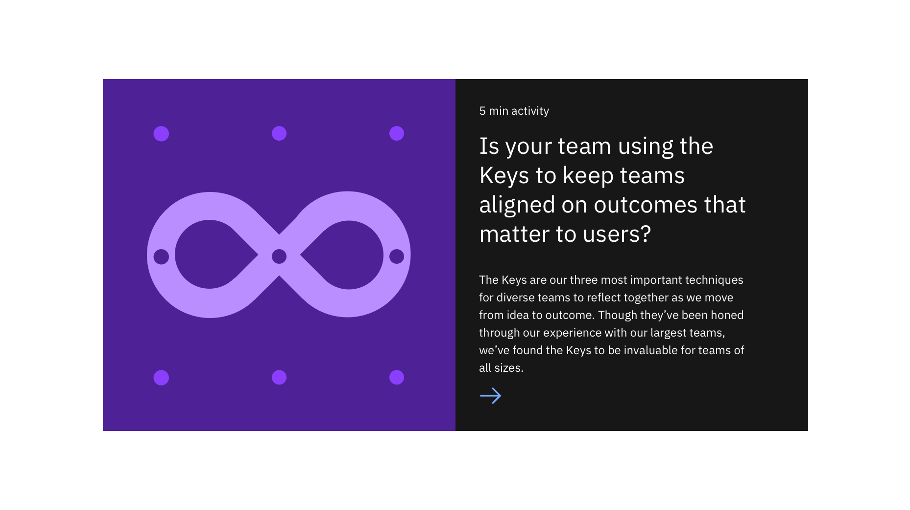

import ComponentDescription from "components/ComponentDescription";
import ComponentFooter from "components/ComponentFooter";

<ComponentDescription name="Feature card block" type="layout" />

<AnchorLinks>

<AnchorLink>Feature card block – medium</AnchorLink>
<AnchorLink>Feature card block – large</AnchorLink>
<AnchorLink>Content guidance</AnchorLink>
<AnchorLink>Design and functional specifications</AnchorLink>
<AnchorLink>Development documentation</AnchorLink>
<AnchorLink>Feedback</AnchorLink>

</AnchorLinks>

## Feature card block – medium

Feature card block – medium is used to present a group of information with a medium size card with an image.

 

## Feature card block – large

Feature card block – large is used to present main piece of content as a main feature.

 

## Content guidance

### Featured card block – medium

| Field                                                                                            | Field type | Required | Cardinality | Max character size (English / translated) |
| ------------------------------------------------------------------------------------------------ | ---------- | -------- | ----------- | ----------------------------------------- |
| Headline                                                                                         | Short copy | Yes      | 1           | XS (65 / 85)                              |
| [Featured card](https://www.ibm.com/standards/web/carbon-for-ibm-dotcom/components/feature-card) | Component  | Yes      | 1           | –                                         |

### Featured card block – large

| Field                                                                                      | Field type  | Required | Cardinality | Max character size (English / translated) |
| ------------------------------------------------------------------------------------------ | ----------- | -------- | ----------- | ----------------------------------------- |
| Eyebrow                                                                                    | Short copy  | Yes      | 1           | Mini (25 / 35)                            |
| Headline                                                                                   | Short copy  | Yes      | 1           | XS (65 / 85)                              |
| Paragraph                                                                                  | Long copy   | No       | 1           | LL (200 / 260)                            |
| Image                                                                                      | Media       | Yes      | 1           | –                                         |
| URL                                                                                        | Link        | Yes      | 1           | –                                         |
| [Type](https://www.ibm.com/standards/web/carbon-for-ibm-dotcom/components/cta) (ex. Local) | Option list | Yes      | 1           | –                                         |

To see the list of all character count standards, go to this <a href="https://github.com/carbon-design-system/carbon-for-ibm-dotcom-website/wiki/Character-count-standards" target="_blank">link</a>.

 

## Design and functional specifications

For more details on Feature card block – medium, [see design and functional specs](https://ibm.box.com/s/pasipprq3njaholcg9bgtnv7khzq4kkq). 
For more details on Feature card block – large, [see design and functional specs](https://ibm.box.com/s/fort8v1pj93z0ax6zgipcu0mbxsuwry1).

<ComponentFooter name="Feature card block" type="layout" />
