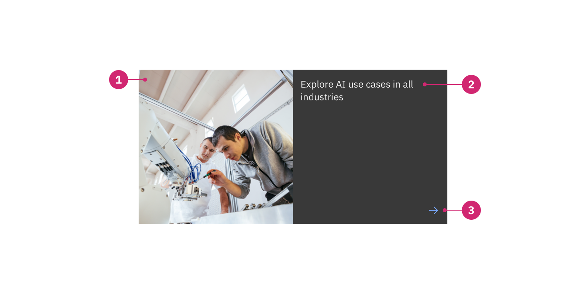

import ComponentDescription from 'components/ComponentDescription';
import ComponentFooter from 'components/ComponentFooter';
import ResourceLinks from 'components/ResourceLinks';

<ComponentDescription name="Feature card" type="ui" />

<AnchorLinks>
  <AnchorLink>Overview</AnchorLink>
  <AnchorLink>Modifiers</AnchorLink>
  <AnchorLink>Resources</AnchorLink>
  <AnchorLink>Content guidance</AnchorLink>
  <AnchorLink>Feedback</AnchorLink>
</AnchorLinks>

## Overview

Feature card is used for visually highlighting an important piece of content on page and driving users to that content. It should be used sparingly to be effective. Feature
card contains options for size and color scheme.

<Row>
<Column colMd={8} colLg={8}>

<Caption>
  An example of feature card – medium using the regular color scheme.
</Caption>

</Column>
</Row>

<Row>
<Column colMd={8} colLg={8}>

<Caption>
  An example of feature card – large using the regular color scheme.
</Caption>

</Column>
</Row>

## Modifiers

### Size

The medium version of feature card is the default size, occupying eight columns and consisting of an image, heading, and CTA (call-to-action).

The large version of feature card occupies twelve columns and allows for the addition of an eyebrow as well as body copy. Use the large version for a more prominent call-to-action, and/or when you need to support the heading with additional copy.

### Color scheme

Both sizes of Feature card have additional color schemes to enable more flexibility in how feature card appears on the page. These include the default `regular` color scheme, as well as `inverse` color scheme. The `regular` color scheme is the default to reduce high contrast moments in IBM.com pages, and should be used most of the time.

Note that the color scheme effects the background, border, heading, and icon in both variants. In the large size, eyebrow and body copy are also effected. Consider these changes when creating or choosing image assets displayed in feature card.

<ResourceLinks name="Feature card" type="ui" />

## Content guidance

| Element        | Content type                                                     | Required | Instances | Character limit  (English / translated) | Notes                                |
| -------------- | ---------------------------------------------------------------- | -------- | --------- | ------------------------------------------- | ------------------------------------ |
| Eyebrow        | Text                                                             | No       | 1         | 25 / 35                                     | Large only.                          |
| Heading        | Text                                                             | Yes      | 1         | 65 / 85                                     |                                      |
| Copy           | Text                                                             | No       | 1         | 200 / 260                                   | Large only.                          |
| Media          | [Image](https://www.ibm.com/standards/carbon/components/images/) | Yes      | 1         | –                                           | 1:1 aspect ratio.                    |
| Image alt text | Text                                                             | No       | 1         | 75 / 100                                    | Image description for accessibility. |
| Icon           | Icon                                                             | Yes      | 1         | –                                           |                                      |

For more information, see the
[character count standards](https://www.ibm.com/standards/carbon/guidelines/content#character-count-standards).

<ComponentFooter name="Card" type="ui" />
