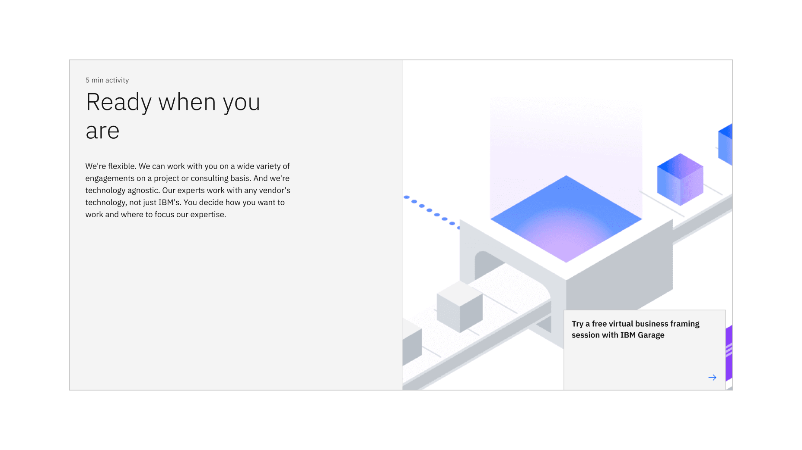

import ComponentDescription from 'components/ComponentDescription';
import ComponentFooter from 'components/ComponentFooter';
import ResourceLinks from 'components/ResourceLinks';

<ComponentDescription name="Feature section" type="layout" />

<InlineNotification>

Additional usage guidelines will be available soon.

</InlineNotification>

<AnchorLinks>

<AnchorLink>Resources</AnchorLink>
<AnchorLink>Overview</AnchorLink>
<AnchorLink>Content guidance</AnchorLink>
<AnchorLink>Feedback</AnchorLink>

</AnchorLinks>

<ResourceLinks name="Feature section" type="layout" />

## Overview

Feature section is a full-width section, designed to create a visual break from the rest of the page and focus the viewer's attention to one single story. It contains expressive imagery and a CTA linking people to more details.

<Row>
<Column colMd={8} colLg={12}>

</Column>
</Row>

## Content guidance

| Element                                                                      | Content type                                                     | Required | Instances | Character limit  (English / translated) | Notes                                |
| ---------------------------------------------------------------------------- | ---------------------------------------------------------------- | -------- | --------- | ------------------------------------------- | ------------------------------------ |
| Eyebrow                                                                      | Text                                                             | No       | 1         | 25 / 35                                     |                                      |
| Heading                                                                      | Text                                                             | Yes      | 1         | 65 / 85                                     |                                      |
| Copy                                                                         | Text                                                             | Yes      | 1         | 200 / 260                                   |                                      |
| Media                                                                        | [Image](https://www.ibm.com/standards/carbon/components/images/) | Yes      | 1         | –                                           | 1:1 aspect ratio.                    |
| Image alt text                                                               | Text                                                             | No       | 1         | 75 / 100                                    | Image description for accessibility. |
| [Card link](https://www.ibm.com/standards/carbon/components/cards#card-link) | Component                                                        | Yes      | 1         | –                                           |                                      |

For more information, see the [character count standards](https://www.ibm.com/standards/carbon/guidelines/content#character-count-standards).

<ComponentFooter name="Feature section" type="layout" />
