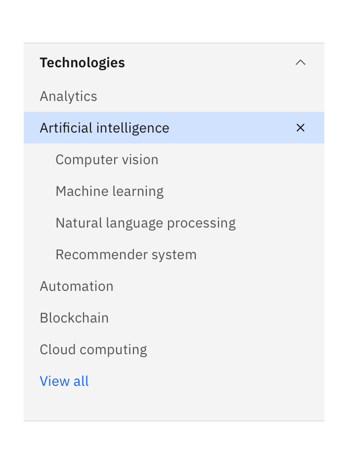

import ComponentDescription from 'components/ComponentDescription';
import ComponentFooter from 'components/ComponentFooter';
import ResourceLinks from 'components/ResourceLinks';

<ComponentDescription name="Filter panel" type="ui" />

<InlineNotification>

**Note:** The View all feature is currently in development and will be available soon.

</InlineNotification>

<AnchorLinks>

<AnchorLink>Resources</AnchorLink>
<AnchorLink>Overview</AnchorLink>
<AnchorLink>Anatomy</AnchorLink>
<AnchorLink>Selection methods</AnchorLink>
<AnchorLink>Behaviors</AnchorLink>
<AnchorLink>Recommendations</AnchorLink>
<AnchorLink>Feedback</AnchorLink>

</AnchorLinks>

<ResourceLinks name="Filter panel" type="ui" />

## Overview

Filter panel includes a heading, configurable filters, and an optional children heading area. Filter panel supports
multiple categories and selection methods, and it is typically placed on the left side of the page.

<Row>

<Column colMd={4} colLg={6}>

<Caption>Example of the filter panel component</Caption>

</Column>

</Row>

### Use case

<Caption>
  Example of results being filtered by selections from within one category
</Caption>

## Anatomy

<Row>

<Column colMd={4} colLg={6}>

</Column>

</Row>

 

1. **Child/children (optional):** Container that allows for components such as tag group.
2. **Header:** Customizable header for the filter panel.
3. **Category (required):** Customizable category header for a group of filters.
4. **Filter item (required):** Customizable filter item, it can be a single or multi select.
5. **Clear button:** Customizable button that deselects all selected filter items.

## Selection methods

Choosing the correct filter selection method will improve usability and user efficiency. Filter panel supports several
selection methods that are appropriate for different situations. Consider the data your users are looking at, what they
are trying to achieve, and how they might intuitively narrow down the data.

### Single selection

Use a single-selection filter when the user can pick only one attribute to modify data results. Under the hood, single
selection behaves like a radio button.

<Row>

<Column colMd={4} colLg={4}>

<Caption>Example of single selection with no filter item selected</Caption>{' '}

</Column>

<Column colMd={4} colLg={4}>

<Caption>Example of single selection with a filter item selected</Caption>

</Column>

</Row>

Single selection supports multiple tiers of content. Second tier content is exposed after the user selects the parent
filter, and the tiered content is indented below the parent filter.

<Row>

<Column colMd={4} colLg={4}>

<Caption>
  Example of single selection hover state of a parent tier filter item
</Caption>

</Column>

<Column colMd={4} colLg={4}>

<Caption>
  Example of parent tier filter item selected, with child tier items exposed
</Caption>

</Column>

</Row>

### Multiselect

Use a multiselect filter when the user has the option to pick more than one attribute to modify the data results. Under
the hood, multiselects behave like checkboxes.

<Row>

<Column colMd={4} colLg={4}>

<Caption>Example of multiselect with no selected filter item</Caption>

</Column>

<Column colMd={4} colLg={4}>

<Caption>Example of multiselect with multiple filter items selected</Caption>

</Column>

</Row>

### Multiple categories

A category is a set of filter items within the same topic. For example, “size” is a category and small, medium, large,
and extra large are its filter choices. Selections from multiple categories may be applied to the same data set. For
example, the user can filter by size, color, and price range.

<Caption>
  Example of results being filtered by selections from within two categories
</Caption>

## Behaviors

### Expanding and collapsing

The filter panel can be configured with any number of filters and categories.

- The user may expand multiple filter categories at a time.
- The user may collapse all categories.
- The user can collapse categories that have filters selected.

### Larger breakpoints (lg, xl, max)

The filter panel spans 4 columns of the 16 column grid with a customizable height.

#### Scroll

Filter panel scrolls with the page. Depending on the amount of filters available to the user, the filter panel could
exceed the browser height.

#### Keyboard interaction

Filter panel includes a Skip to main content option for keyboard users so they can jump into the main content and/or
search results.

### Smaller breakpoints (sm and md)

On smaller breakpoints, the filter panel is triggered by a button that can be configured anywhere within the experience.
Once the user selects the filter button, a modal will open and display the filter panel, the user can close the modal to
view the filtered results. The filter button should indicate how many filters the user has selected.

<Caption>
  From left to right, the small breakpoint screens above demonstrate the
  following states: no filter applied, filter panel open, and filters active.
</Caption>

## Recommendations

When determining the default display for your user, consider the information you have in your filter, including:

- The ordering of categories
- The number of categories
- The number of items within each category

Decide which categories should be open by default and which categories can be closed. Try to strike a balance between
what the user may need and the cognitive load of seeing too many options at once.

### Ordering of categories

The ordering of top level categories is usually determined by relevance to user goals.

Within the categories, we recommend the default ordering of items to be alphabetical unless business goals require a
different ordering.

### Open or closed?

#### One category

If there is only one category, consider displaying all the filters open.

<Row>

<Column colMd={4} colLg={6}>

<Caption>
  Example of Filter panel with one filter category, open by default.
</Caption>

</Column>

</Row>

#### Two to nine categories

If there are between two and nine categories of filters, consider having the top one to three categories open by
default, and the other categories collapsed.

<Row>

<Column colMd={4} colLg={6}>

<Caption>
  Example of Filter panel with seven filter categories, the first two categories
  open by default, the other five categories collapsed.
</Caption>

</Column>

</Row>

#### Ten or more categories

If there are over ten categories, consider collapsing all of the categories on initial load, or having the first
category open.

<Row>

<Column colMd={4} colLg={6}>

<Caption>
  Example of Filter panel with ten filter categories, the first category open by
  default, the other nine categories collapsed.
</Caption>

</Column>

</Row>

### Number of items per category

#### One to seven filter items

If there are between one and seven filter items within a category, expose all of the items.

<Row>

<Column colMd={4} colLg={6}>

<Caption>
  Example of a filter category with seven filter items open by default.
</Caption>

</Column>

</Row>

#### Eight or more filter items

If there are eight or more filter items within a given category, consider utilizing the “View all” button. Expose a
portion of the filter items so the user can quickly scan the options, once they select the view all button, the rest of
the items are revealed.

<Row>

<Column colMd={4} colLg={6}>

<Caption>
  Example of a filter category with five filter items exposed, followed by a
  View all button that will display the remaining filter items within the
  category.
</Caption>

</Column>

<Column colMd={4} colLg={6}>

<Caption>
  Example of a the filter category with all filter items open after the user
  selected the View all button.
</Caption>

</Column>

</Row>

<ComponentFooter name="Filter panel" type="ui" />
