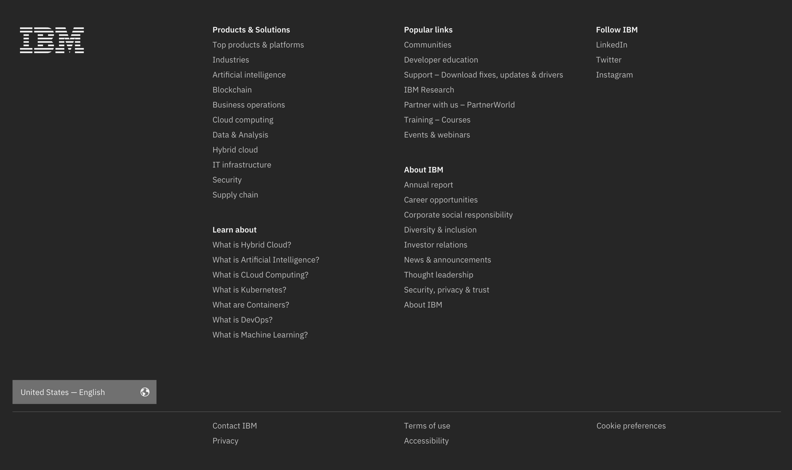
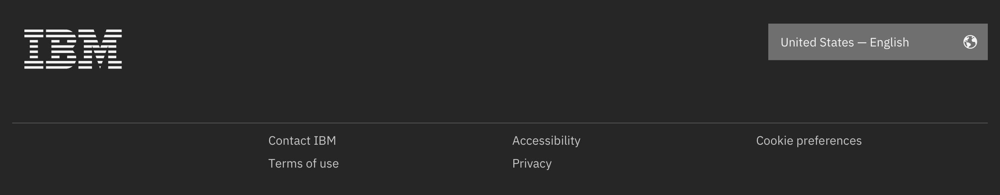
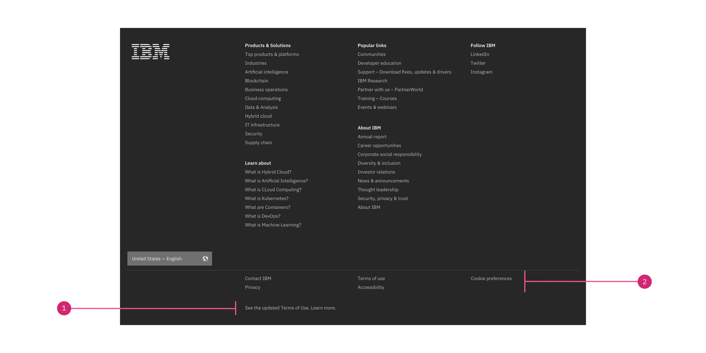
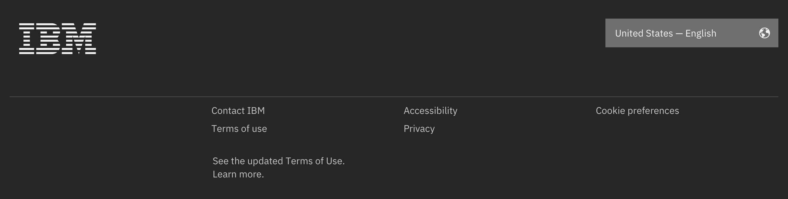
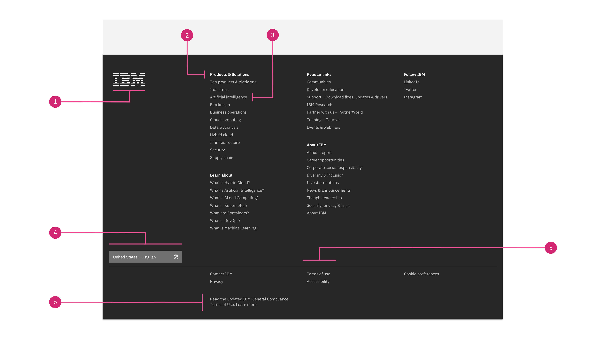
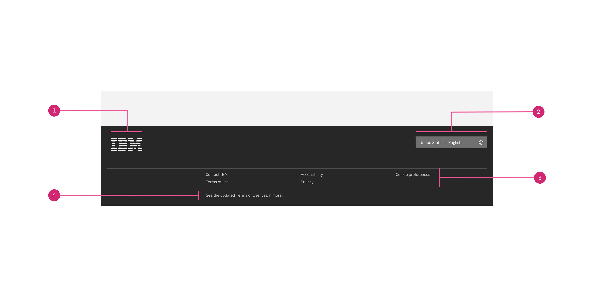
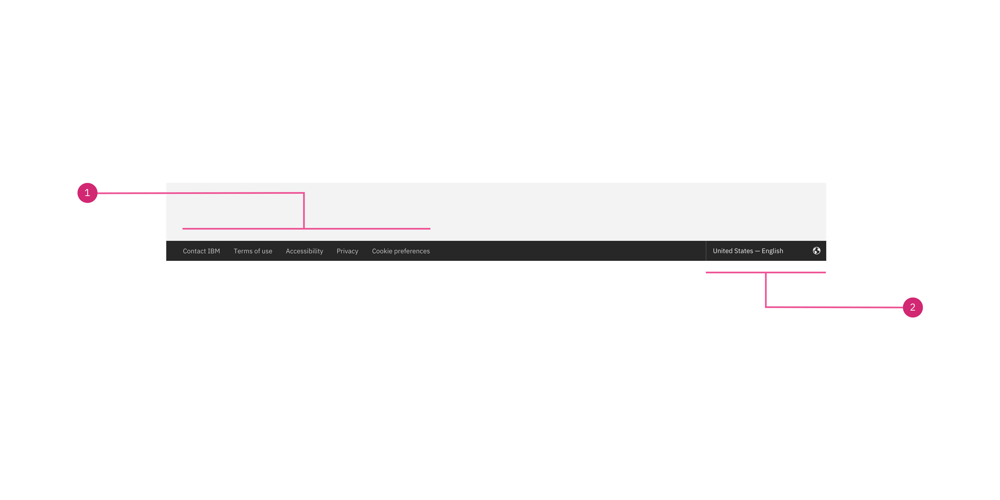
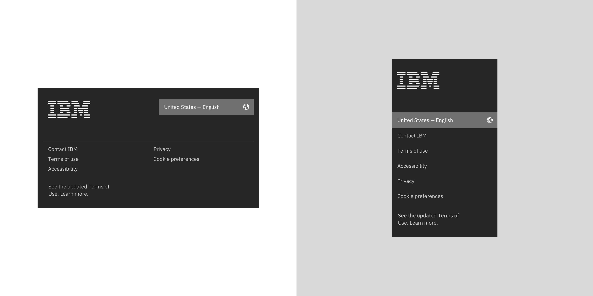
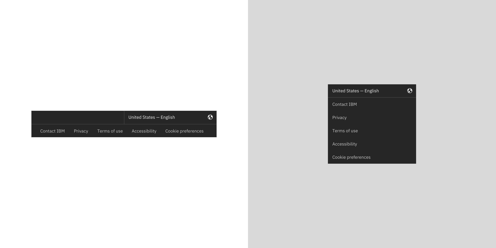

import { ComponentStatus } from "components/ComponentList";
import ComponentDescription from "components/ComponentDescription";
import ComponentFeedback from "components/ComponentFeedback";

<ComponentDescription name="Footer" type="ui" />

<AnchorLinks>

<AnchorLink>Default</AnchorLink>
<AnchorLink>Variations</AnchorLink>
<AnchorLink>Anatomy</AnchorLink>
<AnchorLink>Behaviour</AnchorLink>
<AnchorLink>Design and functional specifications</AnchorLink>
<AnchorLink>Development documentation</AnchorLink>
<AnchorLink>Feedback</AnchorLink>

</AnchorLinks>

## Default

Default footer includes all high-level corporate navigation, the required legal links, the optional adjunct legal links, the locale selector and branding. This footer is generated automatically, based on the country and language code that you set on your page in the metadata.

<Caption>Default footer at max 1584px breakpoint, without optional adjunct legal links</Caption>

#### When to use
Default footer is suitable for most of the IBM.com pages. Examples include the IBM.com home page.

 

## Variations

### Short

Short footer removes all the high-level corporate navigation, leaving the required legal links, the optional adjunct legal links, the locale selector and branding.

<Caption>Short footer at xlg 1312px breakpoint</Caption>

#### When to use
Short footer is reserved for approved transactional pages, such as check out and registration experiences.
 

### Micro

Micro footer variation only shows the required legal links and the optional locale selector to maximize the space for the page content. Adjunct legal links are not allowed. If you need them, please use either the Default, or the Short footer.

<Caption>Micro Footer at xlg 1312px breakpoint</Caption>

#### When to use
This footer is reserved for stand-alone experiences such as product demos, or slide shows. All other pages and experiences on IBM.com should use the Default or the Short variations. 

### With adjunct legal links

Only the Default and the Short footers may contain up to 2 adjunct legal links for legally required notes or messages. They are displayed at the very bottom of the page, under the main legal links.

<Caption>Default footer at max 1584px breakpoint with one optional adjunct legal link</Caption>

 

1. **Adjunct legal link:** Use up to two adjunct legal links regarding changes, policies or trademark issues.
1. **Legal links:** The general Legal links are present on every IBM footer and cannot be changed.

 
 

<Caption>Short Footer at xlg 1312px breakpoint, with one optional adjunct legal link</Caption>

 

#### When to use
Use up to two adjunct legal links for legally required notes or messages legally required to provide, regarding changes, policies or trademark issues.
 
An adjunct legal link will open a web page or a modale window with detailed changes to policies or trademark issues. 
 

#### When not to use
Do not use an adjunct legal link to write footnotes or content-related notices. Include only links with basic text; do not include imagery or special formatting.
 

## Anatomy

### Default

<Caption>Default Footer at max 1584px breakpoint width one adjunct legal link</Caption>
 

1. **IBM logo:** Links to the IBM homepage and is a required piece of the footer. The IBM logo should not be altered.
1. **Link group heading:** The link group heading is present for all the link groups.
2. **Link:** The Default Footer links are carefuly considered from the main navigation level and should not be changed.
3. **Locale selector:** Use the Locale selector to trigger the Locale modal component to allow users to change geographic regions and languages, if available.
4. **Legal links:** The general Legal links are present on every IBM footer and cannot be changed.
5. **Adjunct legal link(s)** \*optional: Use up to two adjunct legal links for legally required notes or messages legally required to provide, regarding changes, policies or trademark issues.

 
 

### Short

<Caption>Short footer at max 1584px breakpoint width one adjunct legal link</Caption>
 

1. **IBM logo:** Links to the IBM homepage and is a required piece of the footer. The IBM logo should not be altered.
3. **Locale selector:** Use the Locale selector to trigger the Locale modal component to allow users to change geographic regions and languages, if available.
4. **Legal links:** The general Legal links are present on every IBM footer and cannot be changed.
5. **Adjunct legal link(s)** \*optional: Use up to two adjunct legal links for legally required notes or messages legally required to provide, regarding changes, policies or trademark issues.

 
 

### Micro

<Caption>Micro footer at max 1584px breakpoint/Caption>
 

1. **IBM logo:** Links to the IBM homepage and is a required piece of the footer. The IBM logo should not be altered.
3. **Locale selector:** Use the Locale selector to trigger the Locale modal component to allow users to change geographic regions and languages, if available.

 

## Behaviour

### Default
  
  
Default footer spans the full width of the viewport and is the last element in the browser window. The footer elements are persistent throughout the online experience. It is fully responsive and changes how elements are displayed based on the browser size.
  
  
#### Max breakpoint
If the browser is wider than the max breakpoint of 1584px, the Default footer and all other page content will center and extra margin will appear on either side of the page layout.
 

  

<Caption>Default footer at max 1584px breakpoint</Caption>
   

#### Md and sm breakpoints
At medium breakpoint, the Default Footer will add a significant change: the Locale selector will move above the link groups and below the IBM logo. 
Also, for the small breakpoint, besides the Locale selector new placement, the link groups become an accordion. See the image below.
 
  

<Caption>Default footer at md 672px and sm 320px breakpoints</Caption>
     
 
  
  
### Short
  
  
The Short Footer spans the full width of the viewport and is the last element in the browser window. It is fully responsive and changes how elements are displayed based on the browser size.
    
#### Max breakpoint
If the browser is wider than the max breakpoint of 1584px, the Short Footer and all other page content will center and extra margin will appear on either side of the page layout.
   

<Caption>Default footer at max 1584px breakpoint</Caption> 
   
  
  
  
  #### Md and sm breakpoints
At medium breakpoint, the Short footer will stack the legal links on two columns.
Also, for the small breakpoint, the legal links are stacked on top of each other on one column. See the image below.
   
  

<Caption>Short footer at md 672px and sm 320px breakpoints</Caption> 
   
 
  
  
  
  ### Micro 
  
  
The Micro footer spans the full width of the viewport and is the last element in the browser window. It is fully responsive and changes how elements are displayed based on the browser size.
   
  

#### Max breakpoint
If the browser is wider than the max breakpoint of 1584px, the Short Footer and all other page content will center and extra margin will appear on either side of the page layout.
   

<Caption>Micro footer at max 1584px breakpoint</Caption> 
    

#### Md and sm breakpoints
At medium breakpoint, the Micro footer will also stack the legal links. For the small breakpoint, the legal links are stacked on top of each other on one column. 
   
  

<Caption>Micro footer at md 672px and sm 320px breakpoints</Caption> 
   
 
  
  

## Design and functional specifications

For more details, [see design and functional specs](https://ibm.box.com/s/nsbccv6jigfw78uwq3r0242qks1x1f87).

 

## Development documentation

<ComponentStatus name="Footer" type="ui" />

 

## Feedback

<ComponentFeedback />
