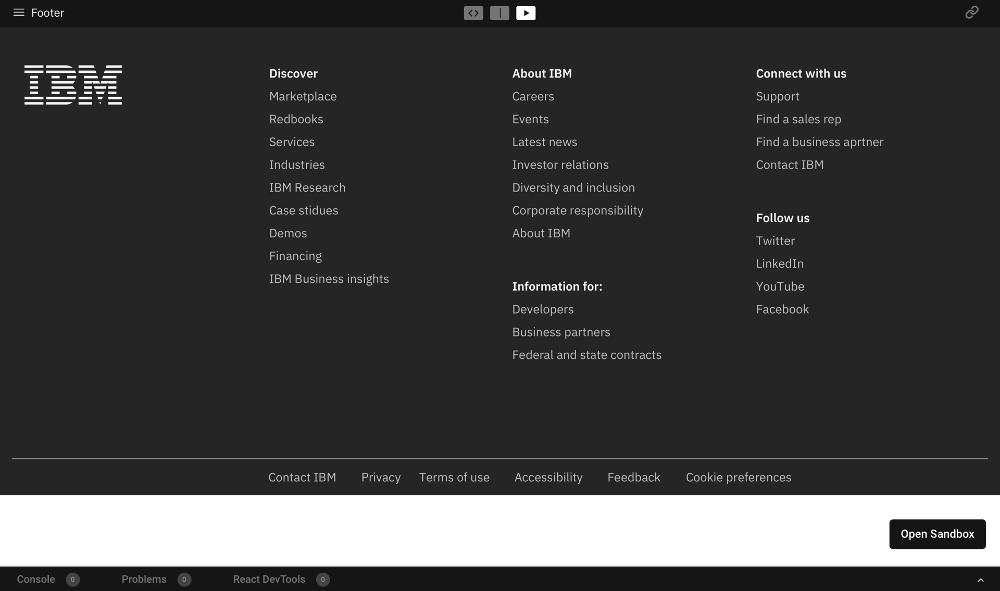
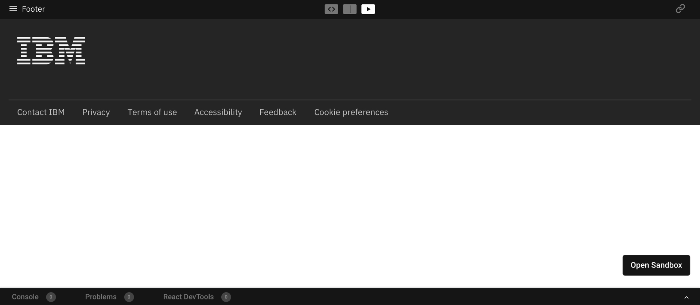
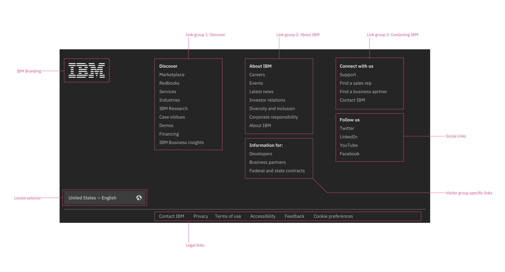

<PageDescription>

The footer is a required navigational element that displays consistently at the bottom of each page of IBM.com.  

</PageDescription>

## Default Footer

## Minimal Footer

## Documentation

| Language      | Status        | Sandbox                                                                              |
| ------------- | -----------   | ------------------------------------------------------------------------             |
| React         | Stable        | [View sandbox](https://ibmdotcom-react.netlify.com/?path=/story/footer--default)     |
| Vanilla       | Coming soon   |                                                                                      |

## Formatting 

### Types

| Name          | Description                                                                          |
| ------------- | ------------------------------------------------------------------------             |
| Default       | Default footer variant includes additional navigation taking up more space. Default footer is automatically generated based on the country and language code that you set on your page in the metadata. |
| Minimal       | Minimal footer variant reduces space by removing any additional navigation and it is used when screen real estate is limited.          |

## Anatomy 

## Rules
* Never customize the footer. 
* The footer contains high-level corporate links that can vary by geographical location and may change periodically. 
* Use the Template Generator or a content management tool to generate the footer HTML with the proper country and language links. 
