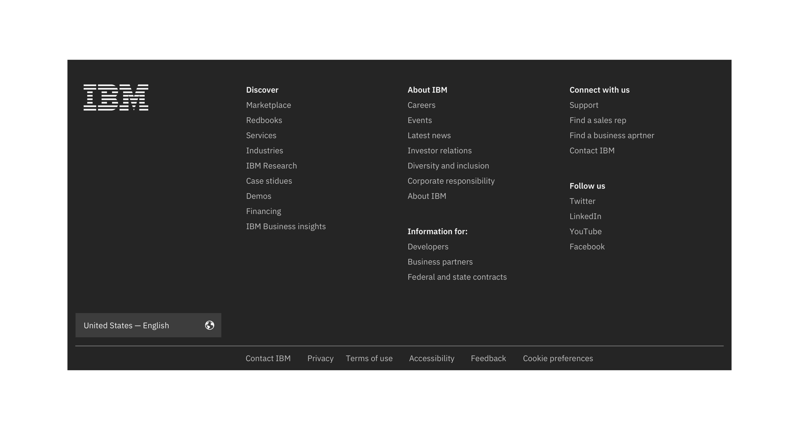
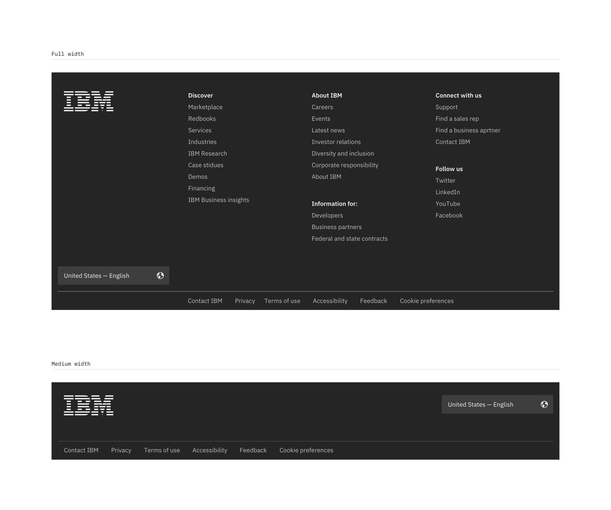

<PageDescription>

The footer is a required navigational element that displays consistently at the bottom of each page of IBM.com.  

</PageDescription>

## Documentation

### Types

| Name          | Description      
| ------------- | ----------- 
| Default       | Default footer variant includes additional navigation taking up more space.
| Minimal       | Short footer variant reduces space by removing any additional navigation. 

## Formatting
The two footer options presented are default and minimal. 

### Default
The default footer is automatically generated based on the country and language code that you set on your page in the metadata. 

### Minimal
The Minimal footer is used when screen real estate is limited. 

## Rules
* Never customize the footer. 
* The footer contains high-level corporate links that can vary by geographical location and may change periodically. 
* Use the Template Generator or a content management tool to generate the footer HTML with the proper country and language links. 
