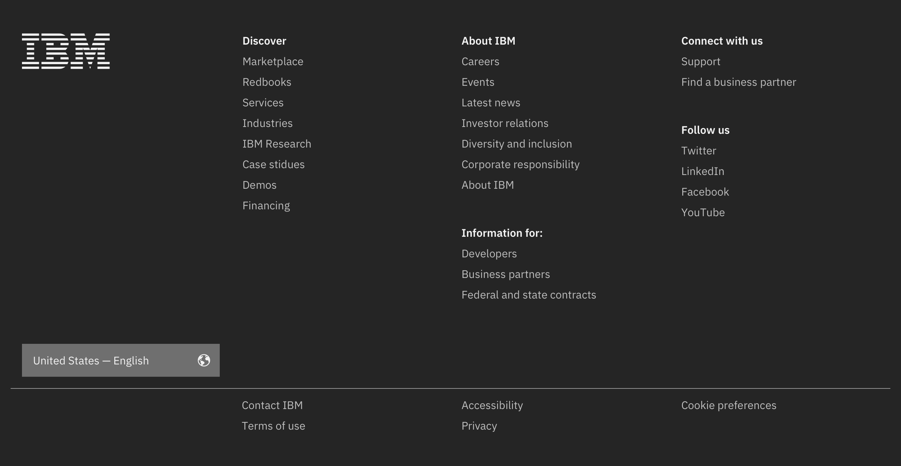
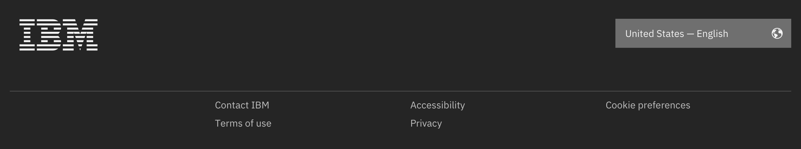
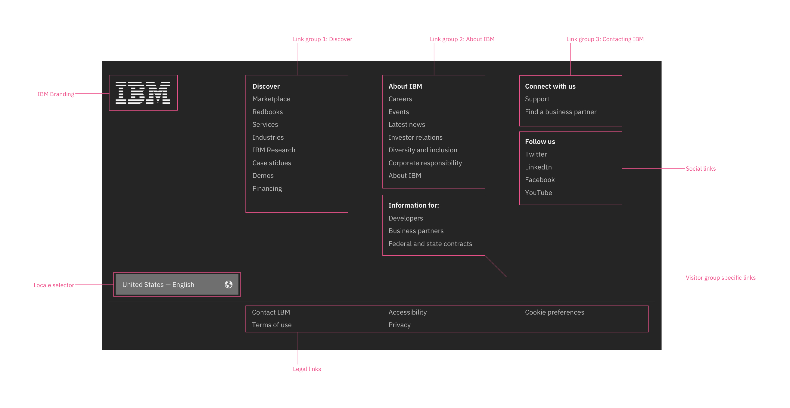

import { ComponentStatus } from 'components/ComponentList';
import ComponentDescription from 'components/ComponentDescription';
import ComponentFeedback from 'components/ComponentFeedback';

<ComponentDescription name="Footer" type="ui" />

<AnchorLinks>

<AnchorLink>Default Footer</AnchorLink>
<AnchorLink>Minimal Footer</AnchorLink>
<AnchorLink>Micro Footer</AnchorLink>
<AnchorLink>Design & functional specifications</AnchorLink>
<AnchorLink>Development documentation</AnchorLink>
<AnchorLink>Anatomy</AnchorLink>
<AnchorLink>Rules</AnchorLink>

</AnchorLinks>

## Default Footer
Default footer includes all high-level corporate navigation, required legal links, locale selector and branding. This footer is automatically generated based on the country and language code that you set on your page in the metadata.

## Minimal Footer
Minimal footer removes all high-level corporate navigation, leaving the required legal links, locale selector and branding. This is reserved for approved transactional pages only, such as check out and registration experiences. All other IBM.com pages should use the default footer.

## Micro Footer
This version only shows the legal links, which are required, and the optional locale selector to maximize the space for the content of the given page. This footer is reserved for stand-alone experiences such as product demos, or slide shows. All other pages and experiences on IBM.com should use the default or the minimal versions.

## Design and functional specifications

The design specs and functional specs for the Footer variations can be viewed <a href="https://ibm.box.com/s/ijcy36qx6nxt8ofaem41l9jla487szjo" target="_blank">here</a>.

## Development documentation

<ComponentStatus name="Footer" type="ui" />

## Anatomy 

## Rules

* Never customize the footer. 
* The default footer contains high-level corporate links that can vary by geographical location and may change periodically. 
