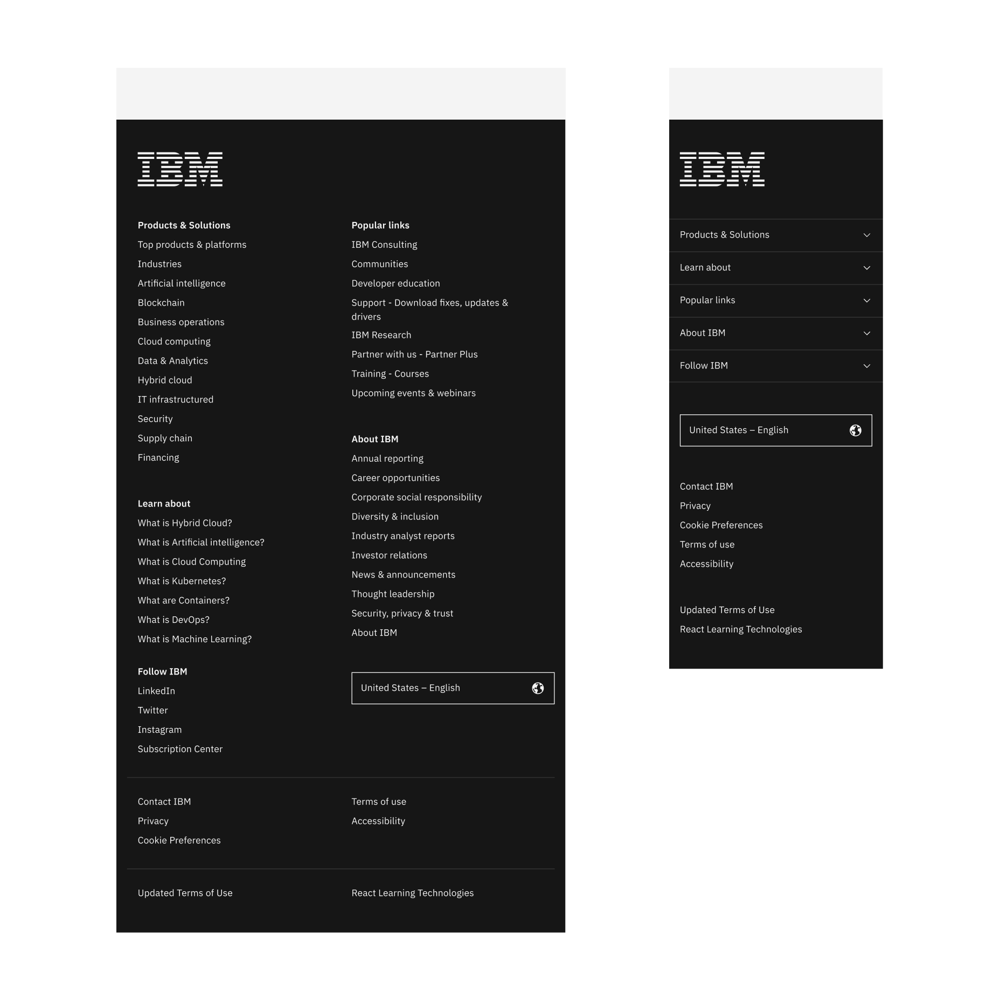

import ComponentDescription from 'components/ComponentDescription';
import ComponentFooter from 'components/ComponentFooter';
import ResourceLinks from 'components/ResourceLinks';

<ComponentDescription name="Footer" type="ui" />

<AnchorLinks>

<AnchorLink>Overview</AnchorLink>
<AnchorLink>Variants</AnchorLink>
<AnchorLink>Modifiers</AnchorLink>
<AnchorLink>Behavior</AnchorLink>
<AnchorLink>Resources</AnchorLink>
<AnchorLink>Content guidance</AnchorLink>
<AnchorLink>Feedback</AnchorLink>

</AnchorLinks>

## Overview

The footer is a required component on all IBM.com pages. There are three sizes available, and each size has a specific use case. [See the table below](#deciding-what-to-use). The footer includes the IBM logo, navigational links, locale or language selector and required legal links.

The footer is generated automatically based on the country and language code that is set on the page in the metadata.

1. **IBM logo:** Links to the IBM homepage and is a required branding element of the Footer. The IBM logo should not be altered.
2. **Link group heading:** The link group heading is present for all the link groups.
3. **Link:** The default footer links are carefully considered from the main navigation level and should not be changed.
4. **Locale selector:** Use the locale selector to trigger the locale modal component to allow users to change geographic regions and languages, if available.
5. **Legal links:** The general legal links are present on every IBM Footer and cannot be changed.
6. **Adjunct legal link(s) (Optional)**: Use up to two adjunct legal links for notes or messages legally required to provide regarding changes, policies or trademark issues.

### Deciding what to use

| Variants            | Use cases                                                                                                                                                                            |
| ------------------- | ------------------------------------------------------------------------------------------------------------------------------------------------------------------------------------ |
| [Default](#default) | Default footer is suitable for most of the IBM.com pages.                                                                                                                            |
| [Short](#short)     | Short footer is reserved for approved transactional pages, such as check out and registration experiences.                                                                           |
| [Micro](#micro)     | This footer is reserved for stand-alone experiences such as product demos or slide shows. All other pages and experiences on IBM.com should use the default or the short variations. |

## Variants

### Default

Default footer includes all high-level corporate navigation, required legal links, locale selector, branding, and optional adjunct legal links.

#### When to use

Default footer is suitable for most of the IBM.com pages. Examples include the IBM.com US home page.

<Caption>Default footer with adjunct legal links</Caption>

### Short

Short footer removes all the high-level corporate navigation, leaving the required legal links, locale selector, branding, and optional adjunct legal links.

#### When to use

Short footer is reserved for approved transactional pages, such as check out and registration experiences.

<Caption>Short footer with adjunct legal links</Caption>

### Micro

The micro footer variation only shows the required branding, legal links, and the optional locale selector to maximize the space for the page content. Adjunct legal links are not allowed. If you need them, please use either the default, or the short footer.

#### When to use

This footer is reserved for stand-alone experiences such as product demos or slide shows. All other pages and experiences on IBM.com should use the default or the short variations.

<Caption>Micro footer, a streamlined variant</Caption>

## Modifiers

### Theme

As a mandatory component of the IBM.com web experience, the footer should remain consistent, creating a branded anchor across all pages. The footer is only available in the gray 100 theme to maintain consistency across all pages.

### Locale or language selector

All footer sizes have the option to choose between using the locale selector or language selector.

#### Locale selector

By default the footer uses the locale selector, which displays the country and language of a given page within a button. It allows the user to change their locale through the [Locale modal](https://www.ibm.com/standards/carbon/components/localemodal) by selecting the desired region, followed by the desired language.

<Row>

<Column colMd={4} colLg={6}>

<Caption>The locale selector, displaying United States – English.</Caption>

</Column>

</Row>

#### Language selector

The language selector displays only the language of a given page. It uses a combo box, and allows the user to select a language from the list or type in their desired language with the default language preselected based on the user’s IP address.

<Row>

<Column colMd={4} colLg={6}>

<Caption>The language selector, displaying English.</Caption>

</Column>

</Row>

### Adjunct legal links

Only the default and the short footers may contain up to two adjunct legal links for legally required notes or messages. They are displayed at the very bottom of the page, under the IBM required legal links.

<Caption>Default footer with adjunct legal links enabled</Caption>

1. **Adjunct legal link:** Use up to two adjunct legal links regarding changes, policies or trademark issues.

<Caption>Short footer with adjunct legal links enabled</Caption>

1. **Adjunct legal link:** Use up to two adjunct legal links regarding changes, policies or trademark issues.

#### When to use

Use up to two adjunct legal links for legally required notes or messages legally required to provide regarding changes, policies or trademark issues.

An adjunct legal link will open a web page or a modal window with detailed changes to policies or trademark issues.

#### When not to use

Do not use an adjunct legal link to write footnotes or content-related notices. Include only links with basic text; do not include imagery or special formatting.

## Behavior

All footer size variants span the full width of the viewport and is the last element in the browser window. If the browser is wider than the max breakpoint of 1584px, the footer and all other page content will center and extra margin will appear on either side of the page layout.

For the medium and small breakpoints, the layout shifts to accommodate the smaller screen sizes. For the default footer at the small breakpoint, the main links are collapsed into accordions to save space.

<Caption>
  From left to right: Default footer at medium and small breakpoints.
</Caption>

<ResourceLinks name="Footer" type="ui" />

## Content guidance

The links within the Footer cannot be changed, please contact the IA guild for any questions or request to alter the links.

| Element                               | Content type | Required | Instances | Character limit  (English / translated) | Notes                                                                                                        |
| ------------------------------------- | ------------ | -------- | --------- | ------------------------------------------- | ------------------------------------------------------------------------------------------------------------ |
| Logo                                  | Image        | Yes      | 1         | –                                           | Required, should not be altered, and links to IBM homepage. The logo is not required in the Micro variation. |
| Size                                  | Option list  | Yes      | 1         | –                                           | Default, Short, or Micro.                                                                                    |
| locale selector, or language selector | Component    | Yes      | 1         | –                                           | -                                                                                                            |
| Legal links                           | Text         | Yes      | 5         | –                                           | Links present on every IBM Footer and cannot be changed.                                                     |
| Adjunct legal links                   | Text         | No       | 2         | 20 / 32                                     | Optional legal content that appears below the required legal links.                                          |

For more information, see the [character count standards](https://www.ibm.com/standards/carbon/guidelines/content/#character-count-standards).

<ComponentFooter name="Footer" type="ui" />
