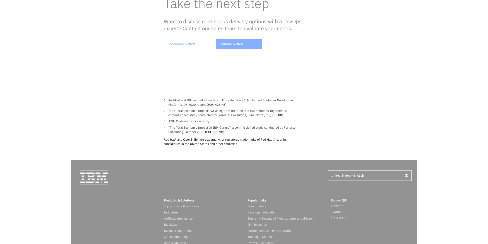
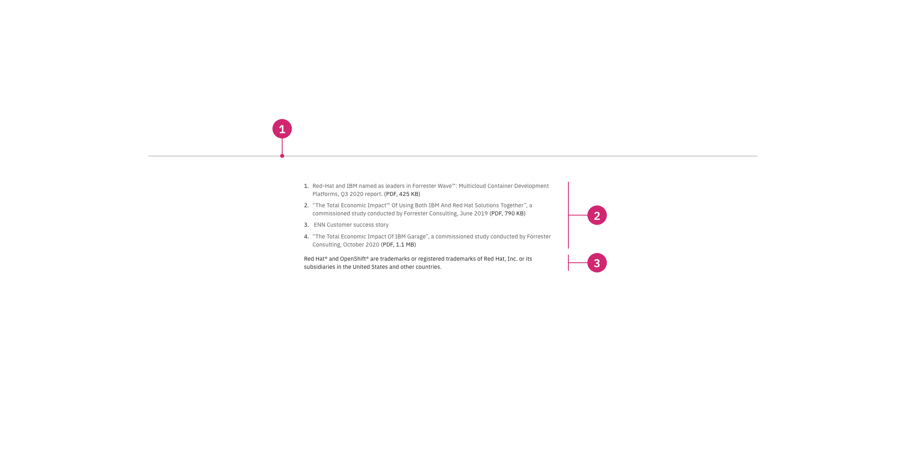

import ComponentDescription from 'components/ComponentDescription';
import ComponentFooter from 'components/ComponentFooter';
import ResourceLinks from 'components/ResourceLinks';

<ComponentDescription name="Footnote section" type="layout" />

<AnchorLinks>

<AnchorLink>Resources</AnchorLink>
<AnchorLink>Overview</AnchorLink>
<AnchorLink>Anatomy</AnchorLink>
<AnchorLink>Feedback</AnchorLink>

</AnchorLinks>

<ResourceLinks name="Footnote section" type="layout" />

## Overview

The Footnote section displays a list of footnotes that have been referenced throughout the current page. If a Footnote section is needed, it should always appear directly above the Footer. The Footnote section can include numbered references and additional content such as copyright or trademark information.

The Footnote section should never be used to display a list other than the Footnotes or additional references in a page, and it should always appear if there are any Footnote references used on the page.

<Caption>
  Footnote section at 1584px max breakpoint with horizontal rule and adjunt
  legal information
</Caption>

## Anatomy

### Default

<Caption>
  Footnote section at 1584px max breakpoint with horizontal rule and adjunt
  legal information
</Caption>

1. **Footnote entries**: Display the full reference for the corresponding Footnote reference that appears in the main content of the page.
2. **Adjunct legal information (optional)**: Can be used to display messages legally required to provide, regarding changes, policies or trademark information.

<ComponentFooter name="Footnote section" type="layout" />
