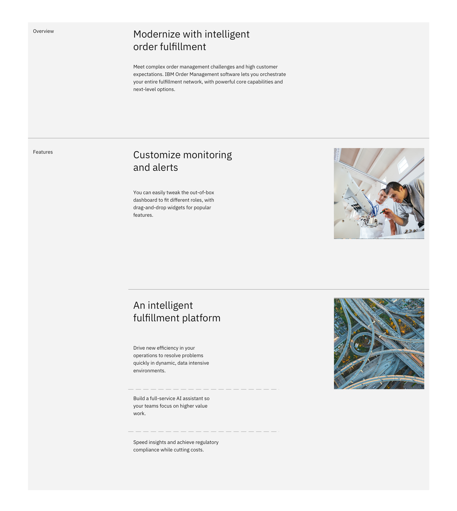

import ComponentDescription from 'components/ComponentDescription';
import ComponentFooter from 'components/ComponentFooter';
import ResourceLinks from 'components/ResourceLinks';

<ComponentDescription name="Horizontal rule" type="ui" />

<AnchorLinks>

<AnchorLink>Resources</AnchorLink>
<AnchorLink>Overview</AnchorLink>
<AnchorLink>Variations</AnchorLink>
<AnchorLink>Feedback</AnchorLink>

</AnchorLinks>

<ResourceLinks name="Horizontal rule" type="ui" />

## Overview

The Horizontal rule provides thematic breaks between content.

<Row>
<Column colMd={8} colLg={8}>

</Column>
</Row>

 

## Variations

### Fixed

In this variation, the Horizontal rule length sizes don't change based on browser size and there are several lengths or this variation usage.

<Row>
<Column colMd={8} colLg={8}>

</Column>
</Row>

<Title>Use case</Title>

### Fluid

In this variation, the Horizontal rule resizes as the window size is changed. The overhang and inset are the two main styles for this variation.

<Row>
<Column colMd={8} colLg={8}>

</Column>
</Row>

<Title>Use case</Title>

<ComponentFooter name="Horizontal rule" type="ui" />
