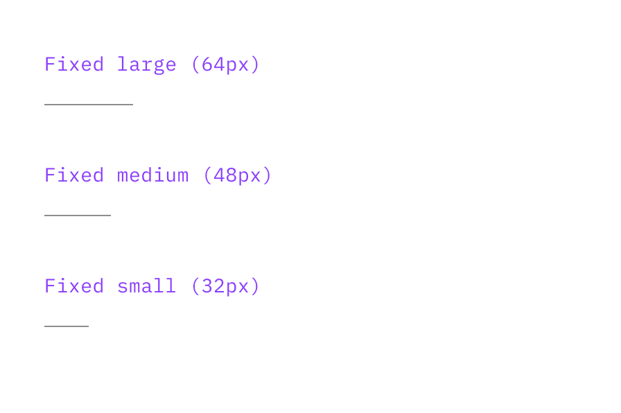

import ComponentDescription from 'components/ComponentDescription';
import ComponentFooter from 'components/ComponentFooter';
import ResourceLinks from 'components/ResourceLinks';

<ComponentDescription name="Horizontal rule" type="ui" />

<AnchorLinks>

<AnchorLink>Overview</AnchorLink>
<AnchorLink>Variations</AnchorLink>
<AnchorLink>Resources</AnchorLink>
<AnchorLink>Feedback</AnchorLink>

</AnchorLinks>

## Overview

The horizontal rule provides thematic breaks or divisions between content. Its primary role is to visually separate content and create clear distinctions between sections of a web page. It can also be used as a graphical element to add structure or delineate pieces of information.

Horizontal rule can most often be found at the bottom of [content section](./content-section) and [content block](./content-block). When deciding whether or not to use a horizontal rule to end a content section or block, always consider the next content in the page. If the next content has a different background color, avoid ending the previous content section or block with a horizontal rule.

<Row>
<Column colMd={8} colLg={8}>

</Column>
</Row>

1. **Horizontal rule:** a stroke separating two content blocks.

## Modifiers

### Type

Horizontal rule has two type options: solid or dashed. If the type is set to solid, the rule will will display as one continuous stroke. If the type is set to dashed, the horizontal rule will display with short strokes with breaks inbetween.

Note that the Solid type is used much more in Carbon for IBM.com components.

<Row>
<Column colMd={6} colLg={6}>

</Column>
</Row>

### Size

Horizontal rule has two main size options: fixed or fluid. If the size is set to fixed, the length of the horizontal rule does not change based on browser size, and there are several fixed sizes to choose from. If the size is set to fluid, the horizontal rule will resize autmatically as the window size changes. The overhang and inset are the two main styles for this variation.

Note that the Fluid size is used much more in Carbon for IBM.com components.

<Row>
<Column colMd={6} colLg={6}>

</Column>

<Column colMd={6} colLg={6}>

</Column>
</Row>

### Contrast

Horizontal rule has two contrast options: strong or subtle. This selection determines how high of a contrast the horizontal rule's color appears on the page, with strong providing a higher contrast than subtle.

<Row>
<Column colMd={6} colLg={6}>

</Column>
</Row>

### Weight

Horizontal rule has two weight options: thick or thin. This selection determines the height of the horizontal rule, with thick displaying with a `2px` stroke and thin displaying with a `1px` stroke.

<Row>
<Column colMd={6} colLg={6}>

</Column>
</Row>

<ResourceLinks name="Horizontal rule" type="ui" />

<ComponentFooter name="Horizontal rule" type="ui" />
