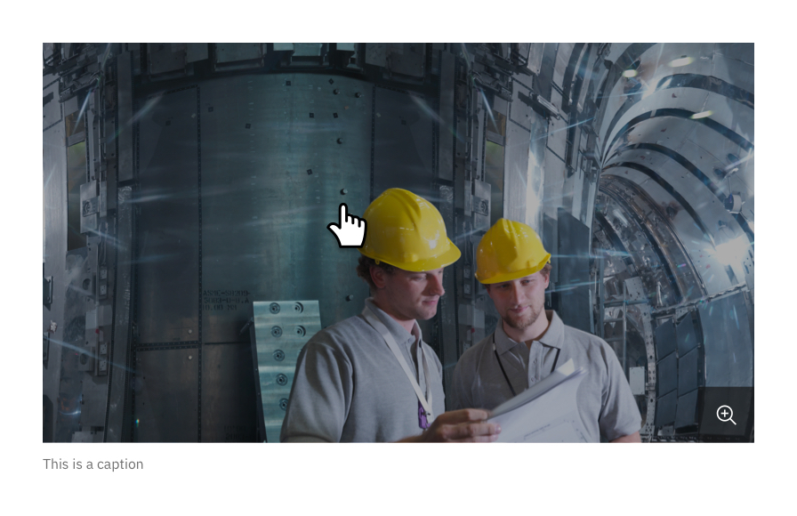

import ComponentDescription from "components/ComponentDescription";
import ComponentFooter from "components/ComponentFooter";

<ComponentDescription name="Image" type="ui" />

<InlineNotification>

**Note:** Additional usage guidelines are coming soon.

</InlineNotification>

<AnchorLinks>
<AnchorLink>Overview</AnchorLink>
<AnchorLink>Options</AnchorLink>
<AnchorLink>Content guidance</AnchorLink>
<AnchorLink>Development documentation</AnchorLink>
<AnchorLink>Feedback</AnchorLink>

</AnchorLinks>

## Overview

Image at its core is a wrapper that adds an image to the page. You have the option to pass multiple images to the image component to render at the various breakpoints. This is particularly useful if you want to render different images at  different screen sizes.

We recommend displaying images at 1x1, 2x1, 4x3, and 16x9 aspect ratios. For guidance on choosing or creating an IBM image, see the <a href="https://www.ibm.com/design/language/photography/overview" target="_blank">photography guidelines</a> on the IBM Design Language site. 

<Row>
<Column colMd={8} colLg={8}>

</Column>
</Row>

## Options

### Caption and zoom

An image can include a caption beneath the image itself to provide more context. With the caption feature, the image can also be clicked to open an overlay (Lightbox media viewer) with a larger version of the image. 

Inside the viewer, the caption becomes the heading and there is an opportunity for additional body text.

For more about Image with caption, see the <a href="https://github.com/carbon-design-system/carbon-for-ibm-dotcom-website/wiki/Image-with-caption" target="_blank">functional specs</a>.

<Row>

<Column colMd={4} colLg={4}>

<Caption>The image with a caption displayed in context</Caption>

</Column>

<Column colMd={4} colLg={4}>

<Caption>Once clicked, the Lightbox media viewer displays a larger version of the image</Caption>

</Column>

</Row>

### Border

An image can include a 1px #E0E0E0 ($decorative-01) border to help frame the images better when the page background and image background colors are the same.

<Row>
<Column colMd={8} colLg={8}>

</Column>
</Row>
<Caption>The border separates the image from the background with the same color</Caption>

## Content guidance
| Field                                                                                                             | Field type | Required | Cardinality | Max character size  (English / translated) | Notes                                                                                                           |
| ----------------------------------------------------------------------------------------------------------------- | ---------- | -------- | ----------- | ---------------------------------------------- | --------------------------------------------------------------------------------------------------------------- |
| Heading                                                                                                           | Short copy | No      | 1           | XXS (40 / 55)                                  | If including a caption, this field is required.                                                                             |
| Description                                                                                                       | Long copy  | No       | 1           | L (150 / 200)                                  | This is only shown in the lightbox media viewer (if enabled)                                                                |
| Image                                 | Component  | Yes      | 1           | –                                              | –                                                                                                               |
| [Lightbox media viewer](https://www.ibm.com/standards/carbon/components/lightbox-media-viewer) | Component  | No       | 1           | –                                              | If enabled, the user can view the image, heading, and description in the lightbox modal by selecting the image. |

To see the list of all character count standards, go to this <a href="https://github.com/carbon-design-system/carbon-for-ibm-dotcom-website/wiki/Character-count-standards" target="_blank" rel="noreferrer">link</a>.

<ComponentFooter name="Image" type="ui" />
