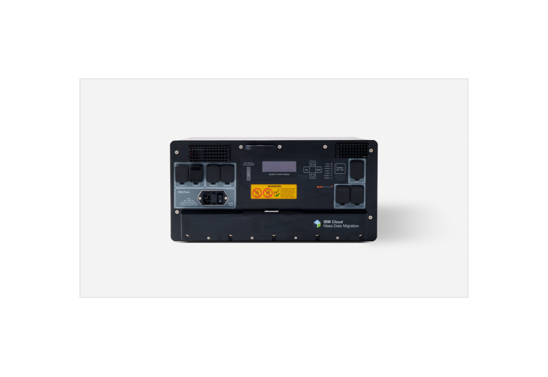
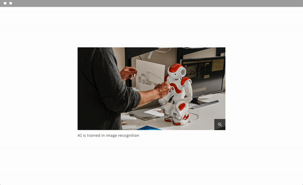

import ComponentDescription from 'components/ComponentDescription';
import ComponentFooter from 'components/ComponentFooter';
import sketchSymbol from '../../images/icon/sketch-symbol.svg';
import githubSymbol from '../../images/icon/github-icon.svg';
import reactSymbol from '../../images/icon/react-icon.svg';
import webComponentsSymbol from '../../images/icon/web-components-icon.svg';
import ResourceLinks from 'components/ResourceLinks';

<ComponentDescription name="Image" type="ui" />

<AnchorLinks>
  <AnchorLink>Overview</AnchorLink>
  <AnchorLink>Image</AnchorLink>
  <AnchorLink>Image with caption</AnchorLink>
  <AnchorLink>Feedback</AnchorLink>
</AnchorLinks>

## Overview

There are two image components available. The Image component allows for a simple image on a page. The Image with
caption component offers the addition of a caption and zoom, which is helpful when showing detailed product shots.

## Image

<Row>
<Column  colLg={8} colMd={8} colSm={4}>

Image, at its core, is a wrapper that adds an image to the page. You have the option to pass multiple images to the
image component to render at the various breakpoints. This is particularly useful if you want to render different images
at different screen sizes.

We recommend displaying images at 1:1, 2:1, 4:3, and 16:9 aspect ratios. For guidance on choosing or creating imagery,
see the IBM Design Language [photography guidelines](https://www.ibm.com/design/language/photography/overview).

</Column>

<Column colMd={2} colLg={3} offsetMd={1} offsetLg={1}>
  <Aside>

**IBM Web Standards**

When using media on a page, refer to
[Use of images](https://w3.ibm.com/w3publisher/ibm-web-standards-external/standards-mandatory/page-layout-design) in the
IBM Web Standards for all type, format, size, and other requirements.

  </Aside>
</Column>

</Row>

<Row>
<Column colMd={8} colLg={8}>

<Caption>Example of an image component</Caption>

</Column>
</Row>

### Modifiers

#### Adding a border

A 1px `$decorative-01` border can be added to the Image component to help frame images. This is useful when the page
background and image background are the same or similar colors.

The border feature is available for images with and without captions.

<Row>
<Column colMd={8} colLg={8}>

</Column>
</Row>
<Caption>The border helps to separate the image from a background with the same color.</Caption>

<ResourceLinks name="Image" type="ui" multiComponent />

### Content guidance for Image

| Element        | Content type | Required | Instances | Character limit  (English / translated) | Notes                                |
| -------------- | ------------ | -------- | --------- | ------------------------------------------- | ------------------------------------ |
| Image alt text | Text         | No       | 1         | 75/100                                      | Image description for accessibility. |

## Image with caption

With the Image with caption component, an image can include a caption beneath to provide more context. In addition, the
image can be clicked to open a larger version of the image, using the
[Lightbox media viewer](https://www.ibm.com/standards/carbon/components/lightbox-media-viewer) overlay.

Inside the overlay, the caption becomes the heading and there is an opportunity for additional body text.

<Row>
<Column colMd={8} colLg={8}>

</Column>
</Row>
<Caption>When an image has a caption, the user can hover over the image and click to trigger a Lightbox overlay with more information.</Caption>

<ResourceLinks name="Image with caption" type="ui" multiComponent />

### Content guidance for Image with caption

Image is a foundational component and does not contain any additional content. Image with caption provides the
opportunity for additional content, as shown in the following table.

| Element        | Content type | Required | Instances | Character limit  (English/translated) | Notes/Options                                                 |
| -------------- | ------------ | -------- | --------- | ----------------------------------------- | ------------------------------------------------------------- | --- |
| Caption        | Text         | No       | 1         | 40 / 55                                   | Becomes heading in lightbox media viewer.                     |
| Copy           | Text         | No       | 1         | 150 / 200                                 | This is only shown in the lightbox media viewer (if enabled). |     |
| Media          | Image        | Yes      | 1         | –                                         | –                                                             |
| Image alt text | Text         | No       | 1         | 75/100                                    | Image description for accessibility.                          |

For more information, see the [character count standards](https://www.ibm.com/standards/carbon/guidelines/content#character-count-standards).

<ComponentFooter name="Image" type="ui" />
