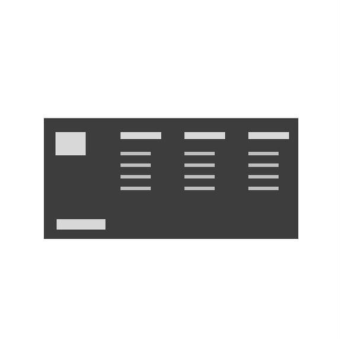
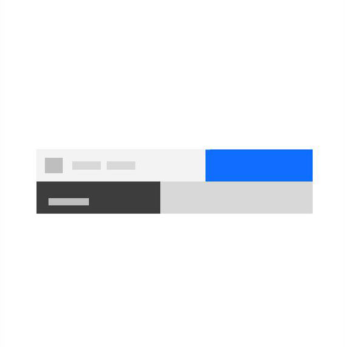

<PageDescription>

Components are one of the key building blocks of the design system. Each component has been designed and coded to solve a specific UI problem, such as presenting a list of options, enabling submission of a form, providing feedback to the user, and so on. All of the components in IBM.com Library have been designed to work harmoniously together, as parts of a greater whole.

</PageDescription>

## IBM.com Library components 

<Row className="image-card-group">
  <Column colMd={3} colLg={3} noGutterSm>
<ImageCard
  title="Footer"
  titleColor="dark"
  href="/components/footer"
  aspectRatio="1:1"
  hoverColor="dark"
>

</ImageCard>
</Column>
<Column colMd={3} colLg={3} noGutterSm>
<ImageCard
  title="Masthead"
  titleColor="dark"
  href="/components/masthead"
  aspectRatio="1:1"
  hoverColor="dark"
>

</ImageCard>
  </Column>
</Row>

 

### Upcoming components

| Name        | Description       | Status |
| ------------- | -----------   | ----- |
| Expressive modal      | The expressive modal is based on the Carbon modal component with slight styling updates to increase the padding. | <pre>Under construction</pre> |
| Horizontal rule      |   The horizontal rule is utilized for thematic breaks within the content.    |  <pre>Under construction</pre> |
| Link with icon       | The link with icon is primarily used as a navigational element with an icon as an indicator to the destination or type of content being referenced. Link with icon should not be used within a paragraph. | <pre>Under construction</pre> |
| Lightbox media viewer |  The lightbox media viewer allows the user to view an image larger within a modal.    |  <pre>Under construction</pre> |
| Locale selector      |  The locale selector allows users to change geographic regions and translate pages to those region languages, if available. | <pre>Stable</pre> |
| Locale selector notification      |  Notifies users if they select a page that is not available in their region languages.  | <pre>Under construction</pre> |
| Table of contents |  The table of contents allows users to quickly navigate through long pages by providing jump links to different sections of the content within a single page.   | <pre>Under construction</pre> |

## Core components 

<Row className="resource-card-group">
<Column colMd={4} colLg={4} noGutterSm>
    <ResourceCard
      subTitle="Carbon design system"
      aspectRatio="2:1"
      actionIcon="launch"
      href="https://www.carbondesignsystem.com/components/overview"
      >

 
</ResourceCard>
</Column>
</Row>

 
