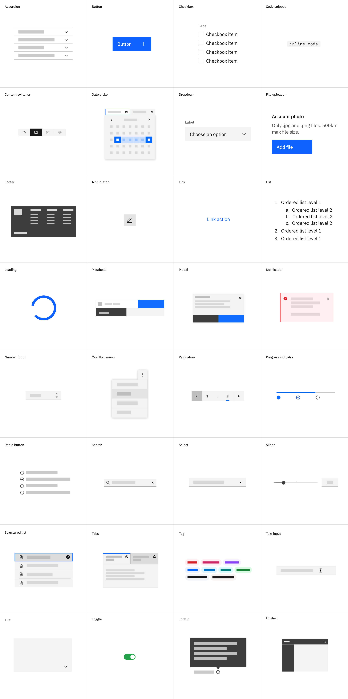

<PageDescription>

Components are one of the key building blocks of the design system. Each component has been designed and coded to solve a specific UI problem, such as presenting a list of options, enabling submission of a form, providing feedback to the user, and so on. All of the components in Carbon for IBM.com have been designed to work harmoniously together, as parts of a greater whole.

</PageDescription>

## IBM.com components

## Carbon core components

