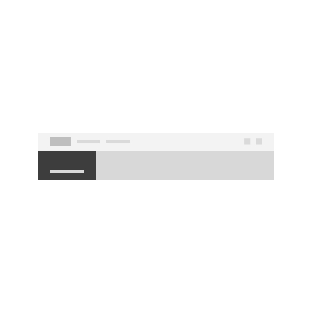

<PageDescription>

Components are one of the key building blocks of the design system. Each component has been designed and coded to solve a specific UI problem, such as presenting a list of options, enabling submission of a form, providing feedback to the user, and so on. All of the components in IBM.com Library have been designed to work harmoniously together, as parts of a greater whole.

</PageDescription>

## IBM.com Library components 

<Row className="image-card-group">
  <Column colMd={3} colLg={3} noGutterSm>
<ImageCard
  title="Footer"
  titleColor="dark"
  href="/components/footer"
  aspectRatio="1:1"
  hoverColor="dark"
>

</ImageCard>
</Column>
<Column colMd={3} colLg={3} noGutterSm>
<ImageCard
  title="Masthead"
  titleColor="dark"
  href="/components/masthead"
  aspectRatio="1:1"
  hoverColor="dark"
>

</ImageCard>
  </Column>
</Row>

 

### Upcoming components

| Name        | Description       | Status |
| ------------- | -----------   | ----- |
| [Button group](https://ibmdotcom-react.mybluemix.net/?path=/story/components-buttongroup--default)      | The button group component is to be utilized within IBM.com for grouping two or more Button components together. | <pre>Stable</pre> |
| [CTA](https://ibmdotcom-react.mybluemix.net/?path=/story/components-cta--default)      | CTA stands for the call to action. A CTA refers to the use of words or phrases that can compel an audience to act in a specific way. | <pre>Stable</pre> |
| [Call out](https://ibmdotcom-react.mybluemix.net/?path=/story/components-callout--simple-example)      | The call out component is a word identifying a specific part of the content. It usually includes a key excerpt or detail to help an audience get to the key information right away. | <pre>Stable</pre> |
| [Card](https://ibmdotcom-react.mybluemix.net/?path=/story/components-card--static)      | The card is a component that uses [Carbon's Clickable Tile component](https://www.carbondesignsystem.com/components/tile/code/?_ga=2.39273835.99880711.1593442650-307858221.1580923214&_gac=1.225068648.1591128470.CjwKCAjw8df2BRA3EiwAvfZWaGUjZQnnrv8ge7mj0QK-aznUpWxDyF_GnUEiNKD3TmzGTvRupdVs6RoCKZcQAvD_BwE#clickable-tile) while presenting content in a concise and readable style. | <pre>Stable</pre> |
| [Card group](https://ibmdotcom-react.mybluemix.net/?path=/story/components-cardgroup--default)      | The CardGroup component is a collection of Card components that can be used in block and group -level patterns. | <pre>Stable</pre> |
| [Card link](https://ibmdotcom-react.mybluemix.net/?path=/story/components-cardlink--default)      | The card link is a component that uses [Carbon's Clickable Tile component](https://www.carbondesignsystem.com/components/tile/code/?_ga=2.39273835.99880711.1593442650-307858221.1580923214&_gac=1.225068648.1591128470.CjwKCAjw8df2BRA3EiwAvfZWaGUjZQnnrv8ge7mj0QK-aznUpWxDyF_GnUEiNKD3TmzGTvRupdVs6RoCKZcQAvD_BwE#clickable-tile) while presenting content in a concise and readable style. | <pre>Stable</pre> |
| [Content item horizontal](https://ibmdotcom-react.mybluemix.net/?path=/story/components-contentitemhorizontal--default)      | The Content item horizontal component displays information in a horizontal orientation. | <pre>Stable</pre> |
| [Dotcom shell](https://ibmdotcom-react.mybluemix.net/?path=/story/components-dotcom-shell--default)      | The dotcom shell component includes the [Masthead](https://www.ibm.com/standards/web/ibm-dotcom-library/components/masthead), and [Footer](https://www.ibm.com/standards/web/ibm-dotcom-library/components/footer) components, all wrapped in a UI shell using Carbon's grid. | <pre>Stable</pre> |
| [Expressive modal](https://ibmdotcom-react.mybluemix.net/?path=/story/components-expressive-modal--default)      | The expressive modal component is based on the Carbon modal component with slight styling updates to increase the padding. | <pre>Stable</pre> |
| [Feature card](https://ibmdotcom-react.mybluemix.net/?path=/story/components-featurecard--default)      | Coming soon. | <pre>Stable</pre> |
| [Horizontal rule](https://ibmdotcom-react.mybluemix.net/?path=/story/components-horizontalrule--default)      |   The horizontal rule component is utilized for thematic breaks within the content.    |  <pre>Stable</pre> |
| [Image](https://ibmdotcom-react.mybluemix.net/?path=/story/components-image--default)      | The Image component is used as the primary way of embedding images on pages. | <pre>Stable</pre> |
| [Image with caption](https://ibmdotcom-react.mybluemix.net/?path=/story/components-imagewithcaption--default)      |  The Image with caption component is used to embed images and has an optional caption. It can support images at 1x1, 2x1, 4x3 and 16x9 aspect ratios.   | <pre>Stable</pre> |
| [Layout](https://ibmdotcom-react.mybluemix.net/?path=/story/components-layout--default)      | The Layout component is to be utilized within IBM.com for various abstract layout configurations. | <pre>Stable</pre> |
| [Lightbox media viewer](https://ibmdotcom-react.mybluemix.net/?path=/story/components-lightboxmediaviewer--default)       |  The lightbox media viewer component allows the user to view an image larger within a modal.    | <pre>Stable</pre> |
| [Link list](https://ibmdotcom-react.mybluemix.net/?path=/story/components-linklist--default)      | The Link List component will be used to have list of different cta types. | <pre>Stable</pre> |
| [Link with icon](https://ibmdotcom-react.mybluemix.net/?path=/story/components-link-with-icon--default)       | The link with icon component is primarily used as a navigational element with an icon as an indicator to the destination or type of content being referenced. Link with icon should not be used within a paragraph. | <pre>Stable</pre> |
| [Locale modal](https://ibmdotcom-react.mybluemix.net/?path=/story/components-locale-modal--default)      |  The locale selector component allows users to change geographic regions and translate pages to those region languages, if available. | <pre>Stable</pre> |
| [Pictogram item](https://ibmdotcom-react.mybluemix.net/?path=/story/components-pictogramitem--default)      | Coming soon. | <pre>Stable</pre> |
| [Quote](https://ibmdotcom-react.mybluemix.net/?path=/story/components-quote--default)      | Coming soon. | <pre>Stable</pre> |
| [Table of contents](https://ibmdotcom-react.mybluemix.net/?path=/story/components-table-of-contents--manually-define-menu-items)      | The table of contents component allows users to quickly navigate through long pages by providing jump links to different sections of the content within a single page. | <pre>Stable</pre> |
| [Video player](https://ibmdotcom-react.mybluemix.net/?path=/story/components-videoplayer--default) |  The Video Player component plays embedded videos using the Kaltura video platform. It can be used in inline patterns as well as modals. It is always the full width of its containing element and maintains an aspect ratio of 16:9.   | <pre>Stable</pre> |

## Core components 

<Row className="resource-card-group">
<Column colMd={4} colLg={4} noGutterSm>
    <ResourceCard
      subTitle="Carbon design system"
      aspectRatio="2:1"
      actionIcon="launch"
      href="https://www.carbondesignsystem.com/components/overview"
      >

 
</ResourceCard>
</Column>
</Row>

