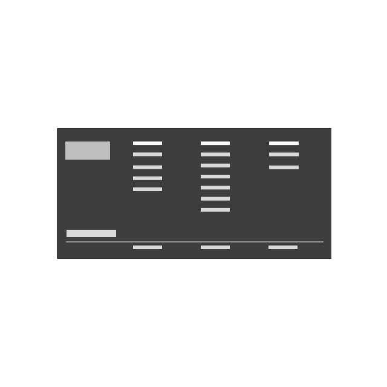

<PageDescription>

Components are one of the key building blocks of the design system. Each component has been designed and coded to solve a specific UI problem, such as presenting a list of options, enabling submission of a form, providing feedback to the user, and so on. All of the components in Carbon for IBM.com have been designed to work harmoniously together, as parts of a greater whole.

</PageDescription>

## IBM.com components 

<Row className="image-card-group">
  <Column colMd={3} colLg={3} noGutterSm>
<ImageCard
  title="Footer"
  titleColor="dark"
  href="/components/footer"
  aspectRatio="1:1"
  hoverColor="dark"
>

</ImageCard>
</Column>
<Column colMd={3} colLg={3} noGutterSm>
<ImageCard
  title="Masthead"
  titleColor="dark"
  href="/components/masthead"
  aspectRatio="1:1"
  hoverColor="dark"
>

</ImageCard>
  </Column>
</Row>

 
 

### Upcoming components

| Components                            | Status                                                                                                             |
 | ---------------------------------------------- | ------------------------------------------------------------------------------------------------------------ |
 | Expressive modal     | Coming soon |
  | Horizontal rule     | Coming soon |
   | Lightbox media viewer     | Coming soon |
    | Link with icon     | Coming soon |
        | Locale selector     | Coming soon |
            | Table of contents     | Coming soon |
   

## Carbon core components 

<Row>
  <Column colMd={12} colLg={12} noGutterSm>

</Column>
</Row>
