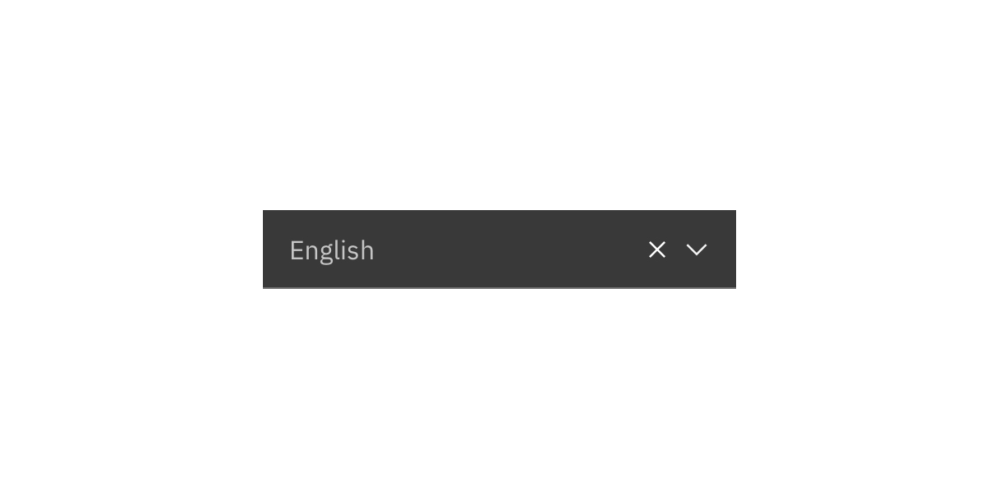
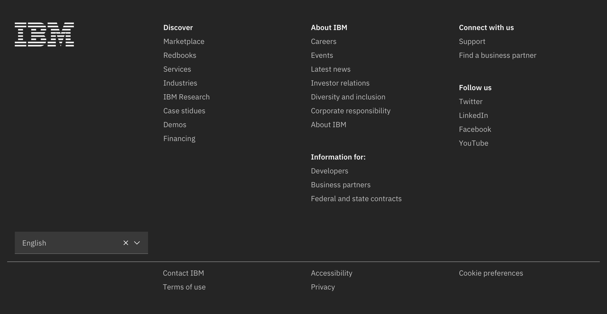
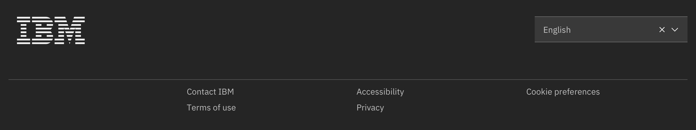
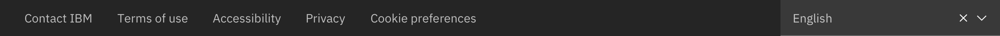

import { ComponentStatus } from 'components/ComponentList';
import ComponentDescription from 'components/ComponentDescription';
import ComponentFeedback from 'components/ComponentFeedback';
import SpecLinks from "components/SpecLinks";

<ComponentDescription name="Language selector" type="ui" />

<AnchorLinks>

<AnchorLink>Default</AnchorLink>
<AnchorLink>Design and functional specifications</AnchorLink>
<AnchorLink>Development documentation</AnchorLink>
<AnchorLink>Feedback</AnchorLink>

</AnchorLinks>

## Default

Language selector consists of a drop-down with the default language preselected based on the user’s IP address. The Language selector is an alternative option to the Locale selector as part of the Footer. Please see the [Footer page](http://localhost:8000/components/footer) to learn more.

<Row>
<Column colMd={8} colLg={8}>

</Column>
</Row>

<Title>Use case</Title>

 

<SpecLinks designLink="https://ibm.box.com/s/nsbccv6jigfw78uwq3r0242qks1x1f87" />

 

## Development documentation

<ComponentStatus name="Language selector" type="ui" />

 

## Feedback

<ComponentFeedback />
