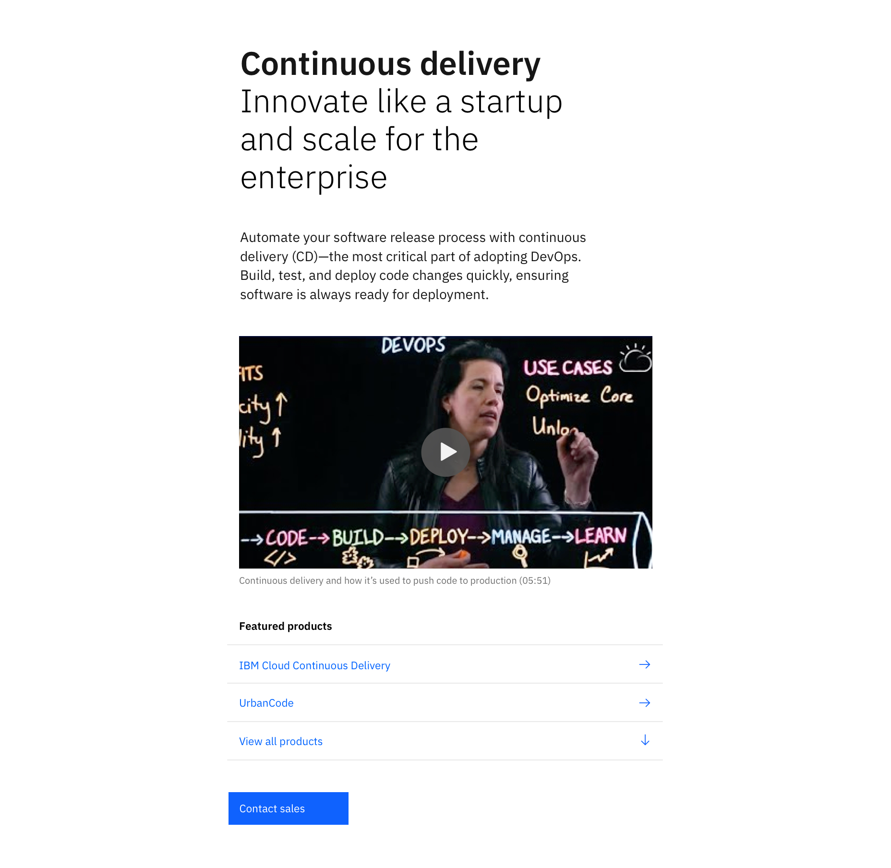

import ComponentDescription from 'components/ComponentDescription';
import ComponentFooter from 'components/ComponentFooter';
import ResourceLinks from 'components/ResourceLinks';

<ComponentDescription name="Lead space block" type="layout" />

<AnchorLinks>

<AnchorLink>Resources</AnchorLink>
<AnchorLink>Overview</AnchorLink>
<AnchorLink>Modifiers</AnchorLink>
<AnchorLink>Content guidance</AnchorLink>
<AnchorLink>Feedback</AnchorLink>

</AnchorLinks>

<ResourceLinks name="Lead space block" type="layout" />

## Overview

When designed and implemented effectively, lead space block can be used to engage visitors immediately upon page load. Lead space block is one of the most streamlined beginnings to a page.

It includes a headline, subheadline, supporting message,
[Link list](https://www.ibm.com/standards/carbon/web-components/?path=/story/components-linklist--default), and a call to action.
There is also the option to add media in the form of an image or video.

## Modifiers

### Heading highlight

Like other lead spaces, lead spaceblock's heading can be modified to highlight a word or phrase. This can be used to highlight product names, industries, or particular value. The highlighted word or phrase can be anywhere in the heading, but it should only ever appear once in a single lead space. This only applies to the heading, and does not extend to any other lead space block element.

<Row>

<Column colMd={6} colLg={6}>

<Caption>
  An example of a word highlighted near the center of the heading
</Caption>

</Column>

<Column colMd={6} colLg={6}>

<Caption>An example of a word highlighted at the start of the heading</Caption>

</Column>

</Row>

## Content guidance

| Element                                                                                                 | Content type                                                                                                                      | Required | Instances | Character limit  (English / translated) | Notes                                |
| ------------------------------------------------------------------------------------------------------- | --------------------------------------------------------------------------------------------------------------------------------- | -------- | --------- | ------------------------------------------- | ------------------------------------ |
| Headline                                                                                                | Text                                                                                                                              | Yes      | 1         | 40 / 55                                     |                                      |
| Sub-heading                                                                                             | Text                                                                                                                              | Yes      | 1         | 65 / 85                                     |                                      |
| Copy                                                                                                    | Text                                                                                                                              | Yes      | 1         | 250 / 325                                   |                                      |
| Media                                                                                                   | [Image](https://www.ibm.com/standards/carbon/components/images) or [Video](https://www.ibm.com/standards/carbon/components/video) | No       | 1         | –                                           | Image with caption may also be used. |
| Image alt text                                                                                          | Text                                                                                                                              | No       | 1         | 75 / 100                                    | Image description for accessibility. |
| [Link list (end of section)](https://www.ibm.com/standards/carbon/components/link-list/#end-of-section) | Component                                                                                                                         | Yes      | 1         | –                                           |                                      |
| [CTA](https://www.ibm.com/standards/carbon/components/cta/#button)                                      | Component                                                                                                                         | No       | 1         | 25 / 35                                     | Button style CTA only.               |

For more information, see the [character count standards](https://www.ibm.com/standards/carbon/guidelines/content#character-count-standards).

<ComponentFooter name="Lead space block" type="layout" />
