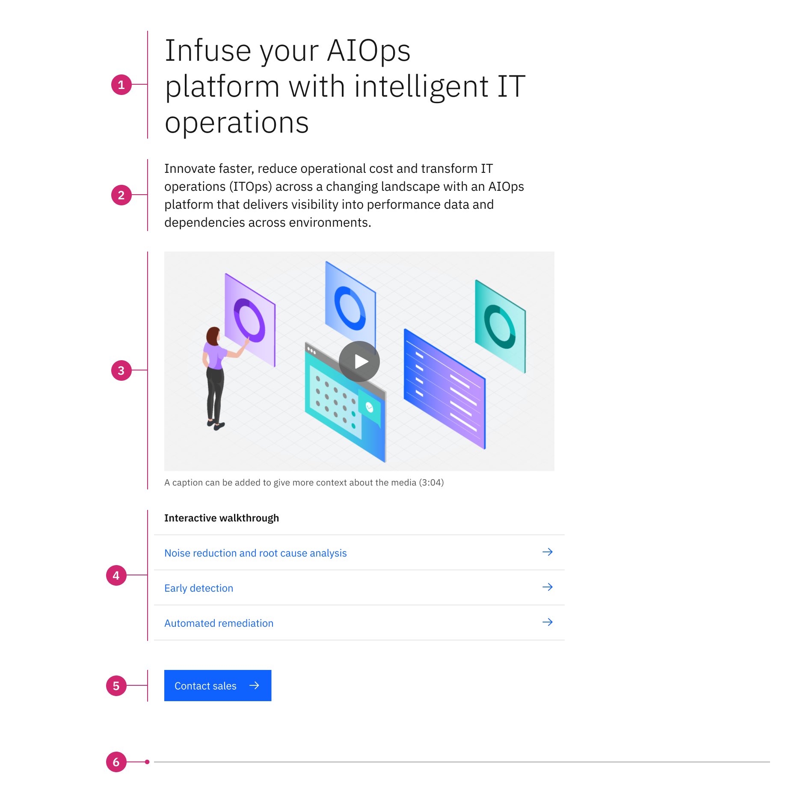

import ComponentDescription from 'components/ComponentDescription';
import ComponentFooter from 'components/ComponentFooter';
import ResourceLinks from 'components/ResourceLinks';

<ComponentDescription name="Lead space block" type="layout" />

<AnchorLinks>

<AnchorLink>Overview</AnchorLink>
<AnchorLink>Modifiers</AnchorLink>
<AnchorLink>Resources</AnchorLink>
<AnchorLink>Content guidance</AnchorLink>
<AnchorLink>Related components</AnchorLink>
<AnchorLink>Feedback</AnchorLink>

</AnchorLinks>

## Overview

When designed and implemented effectively, lead space block can be used to engage visitors immediately upon page load. Lead space block is one of the most streamlined beginnings to a page.

It includes a heading, subheading, supporting media,
[link list](https://www.ibm.com/standards/carbon/web-components/?path=/story/components-linklist--default), and a call to action. Note that most elements in the lead space block are optional, meaning they can be hidden or enabled as needed.

<Row>

<Column colMd={8} colLg={8}>

</Column>

</Row>

1. **Heading:** Heading has the highest information hierarchy in a lead space block, and should be succinct and descriptive.
2. **Subheading:** Optional copy can be added for additional description.
3. **Media:** An optional image or video that provide more context to the lead space block.
4. **Link list:** Optional link list to related resources.
5. **CTA:** Optional CTA to lead the user to additional resources.
6. **Bottom border:** Optional border to help separate the lead space block from the following [content section](../components/content-section) or [content block](../components/content-block).

## Modifiers

### Heading highlight

Like other lead spaces, lead space block's heading can be modified to highlight a word or phrase. This can be used to highlight product names, industries, or a particular value. The highlighted word or phrase can be anywhere in the heading, but it should only ever appear once in a single lead space. This only applies to the heading, and does not extend to any other lead space block element.

Keep in mind that the highlight is meant to only apply to an important word or phrase. The highlight should not cover the entire heading, and should only highlight one word or phrase.

<Row>

<Column colMd={6} colLg={6}>

<Caption>An example of a phrase highlighted at the end of the heading.</Caption>

</Column>

<Column colMd={6} colLg={6}>

<Caption>
  An example of a phrase highlighted at the start of the heading.
</Caption>

</Column>

</Row>

<ResourceLinks name="Lead space block" type="layout" />

## Content guidance

| Element                                                                                                 | Content type                                                                                                                      | Required | Instances | Character limit  (English / translated) | Notes                                |
| ------------------------------------------------------------------------------------------------------- | --------------------------------------------------------------------------------------------------------------------------------- | -------- | --------- | ------------------------------------------- | ------------------------------------ |
| Heading                                                                                                 | Text                                                                                                                              | No       | 1         | 40 / 55                                     |                                      |
| Subheading                                                                                              | Text                                                                                                                              | Yes      | 1         | 250 / 325                                   |                                      |
| Media                                                                                                   | [Image](https://www.ibm.com/standards/carbon/components/images) or [Video](https://www.ibm.com/standards/carbon/components/video) | No       | 1         | –                                           |                                      |
| Image alt text                                                                                          | Text                                                                                                                              | No       | 1         | 75 / 100                                    | Image description for accessibility. |
| [Link list (end of section)](https://www.ibm.com/standards/carbon/components/link-list/#end-of-section) | Component                                                                                                                         | Yes      | 1         | –                                           |                                      |
| [CTA](https://www.ibm.com/standards/carbon/components/cta/#button)                                      | Component                                                                                                                         | No       | 1         | 25 / 35                                     | Button style CTA only.               |

For more information, see the [character count standards](https://www.ibm.com/standards/carbon/guidelines/content#character-count-standards).

## Related components

| Component name                                                                         | Relationship                                                                                                               |
| -------------------------------------------------------------------------------------- | -------------------------------------------------------------------------------------------------------------------------- |
| [Lead space](https://www.ibm.com/standards/carbon/components/leadspace)                | Lead space orients the user and quickly informs them of page content.                                                      |
| [Lead space search](https://www.ibm.com/standards/carbon/components/lead-space-search) | Lead space search provides a fast route to information discovery by including a prominent search option in the lead space. |

<ComponentFooter name="Lead space block" type="layout" />
