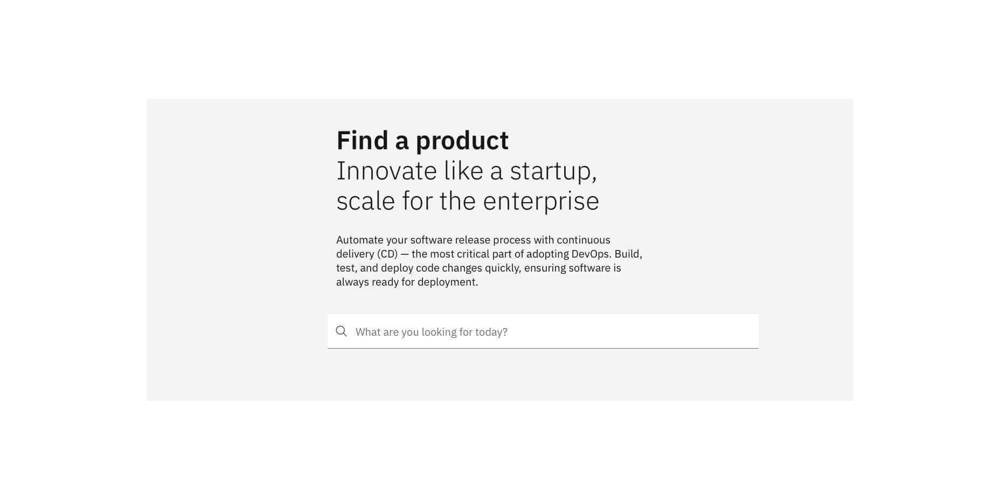
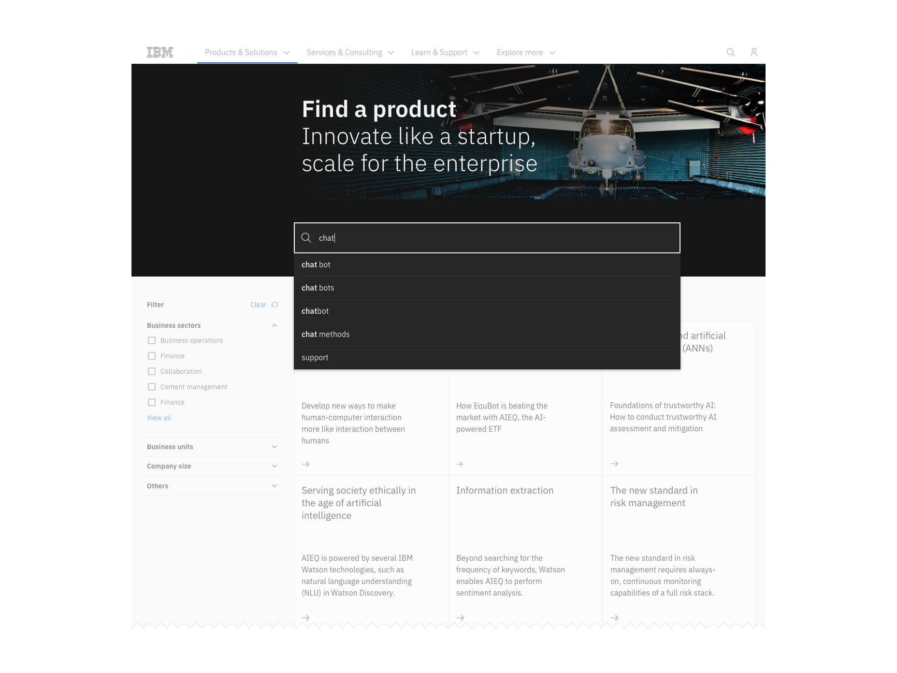
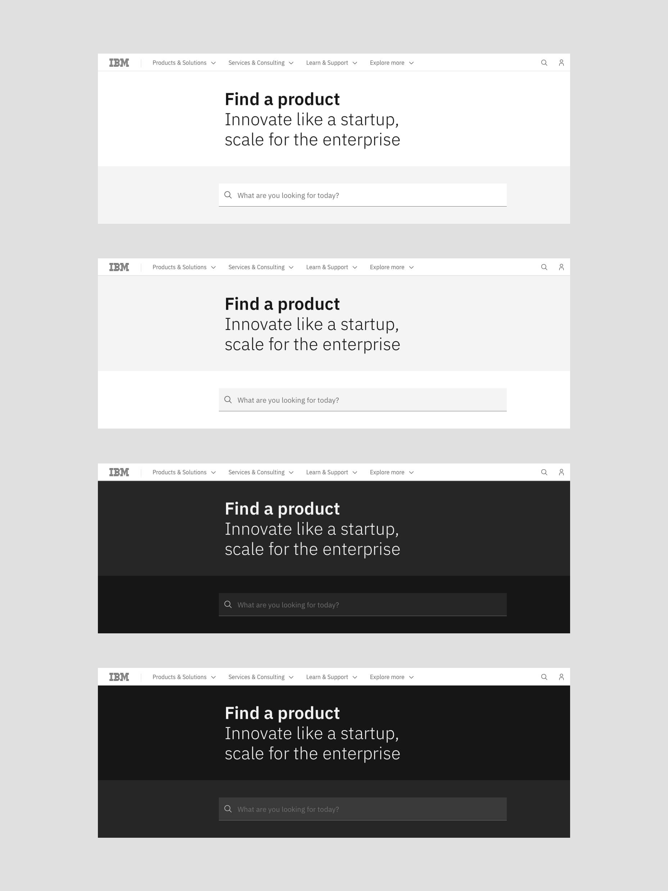
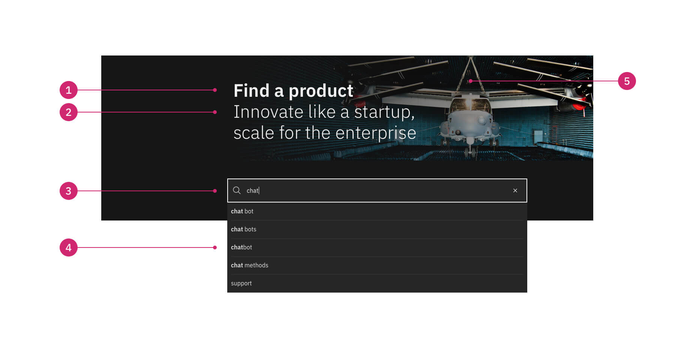
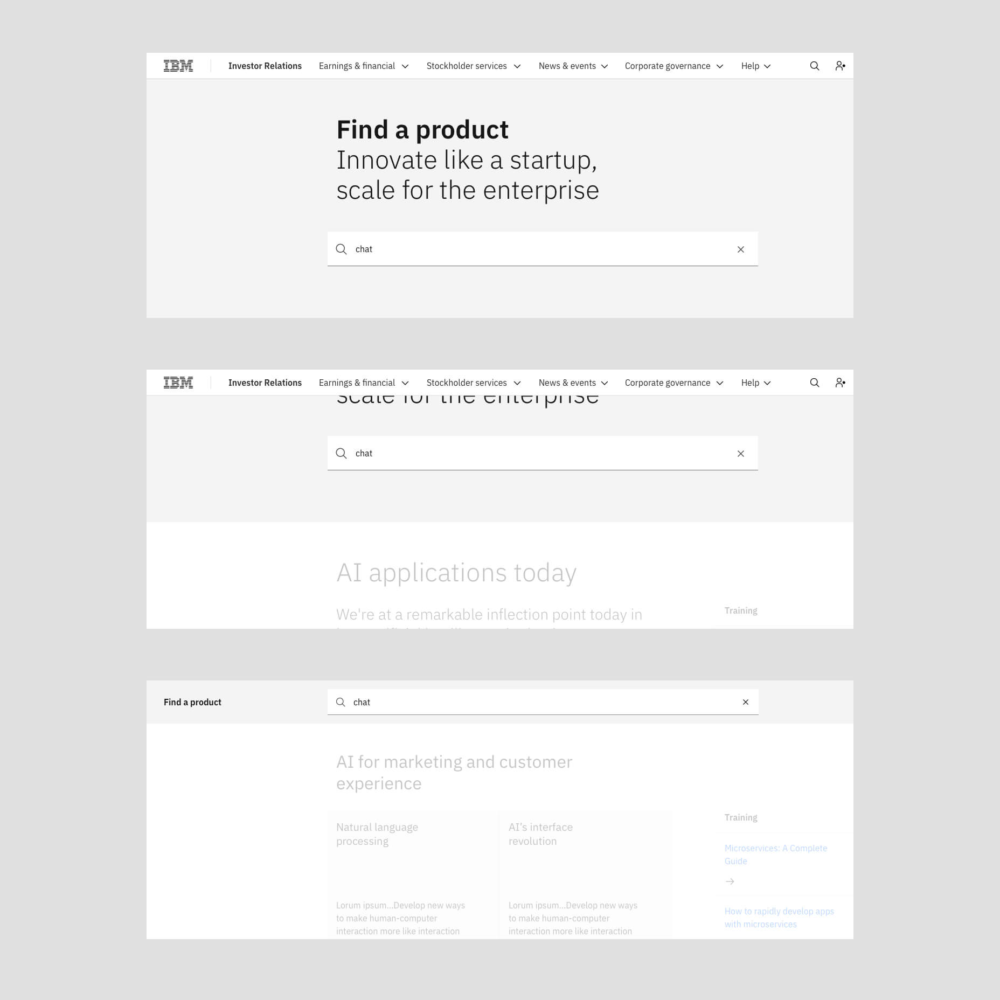
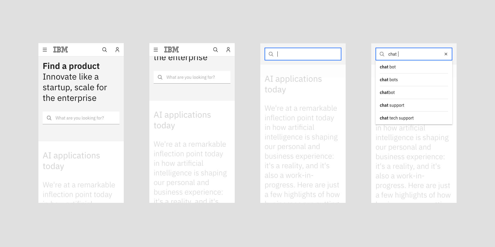

import ComponentDescription from 'components/ComponentDescription';
import ComponentFooter from 'components/ComponentFooter';

import ComponentFeedback from 'components/ComponentFeedback';

<ComponentDescription name="Lead space search" type="layout" />

<AnchorLinks>
<AnchorLink>Default</AnchorLink>
<AnchorLink>Variations</AnchorLink>
<AnchorLink>Anatomy</AnchorLink>
<AnchorLink>Behaviors</AnchorLink>
<AnchorLink>Design and functional specifications</AnchorLink>
<AnchorLink>Development documentation</AnchorLink>
<AnchorLink>Feedback</AnchorLink>
</AnchorLinks>

## Default

Lead space search includes a heading, a typeahead search field, an optional subheading, an optional paragraph, and an optional background image. 

Typeahead is a language prediction tool that provides suggestions for users as they type in the search field. It is also known as autocomplete, incremental search, or search-as-you-type.

<Caption>Example of the lead space search component</Caption>

### Use case

<Caption>Example of lead space with search, showing the typeahead feature. It suggests results as the user types in the search field.</Caption>

### When to use
The search box is one of the most frequently used design elements in a content-heavy web experience. To be effective, the search should be displayed prominently as it can be the fastest route to information discovery. Finding information quickly is essential for reducing bounce, extending the time users spend on the page, and can also motivate them to take action. 

Use lead space search when you are displaying lists of multiple items and you need to provide an efficient way for users to find items inside the lists. Lead space search is an excellent choice for content-heavy pages and knowledge base experiences. It can be used together with the filter panel component for even greater discoverability.

### When not to use
If you are not building a content-heavy page, a knowledge base experience, or if you do not need to display a great number of products or services, with categories and other classification criteria, you should consider using another lead space component such as lead space, lead space centered, or lead space block. 

Lead space search has a contextual, local search, and is not used for global search. If you need a global search option, you can find it in the masthead.

## Variations
### With adjacent theme search

Lead space search provides the option to wrap the search field and search field container into an adjacent theme. You can use the adjacent themes pairs White/Gray10, Gray10/White, Gray90/Gray100 and Gray100/Gray90.

<Caption>Examples of lead space with search adjacent themes pairs. From top to bottom: White/Gray 10, Gray 10/White, Gray 90/Gray 100, and Gray 100/Gray 90.</Caption>

## Anatomy

<Caption>Anatomy of the lead space search component</Caption>

  
1. **Heading (required):** Customizable heading for the lead space search component.
2. **Subheading (optional):** Emphasize the heading by adding a subheading under it.
3. **Search (required):** Search field component displayed prominently.
4. **Typeahead (required):** Carbon typeahead component that displays increasingly accurate suggestions for users as they type in the search field. 
5. **Background media (optional)**

## Behaviors

### Scrolling behavior
Lead space search can scroll with the page, or it can be configured to adopt an optional sticky behavior for the search component and its container. 

If the table of contents component is present, the lead space with search sticky option will become inactive.

The scrolling options available are:

* The user may opt for a sticky behaviour applied to the search
* The user may choose to push the masthead out of view and keep the search while scrolling
* The user can customise a heading to appear in the sticky search container while scrolling 

* Sticky behavior is applied to the lead space search component and the page scrolls underneath the entire component
* The heading is pushed out of view on scroll but the search field remains visible
* A customized header that contains a smaller version of the heading and the search field can appear on scroll 

### Desktop breakpoints (max, xlg, lg)

The search component spans 10 columns of the 16 column grid with an overhang of 16px left and right. 

<Caption>Optional sticky scrolling behavior of the lead space search component</Caption>

#### Keyboard interaction
Lead space search includes a `skip to main content` option for keyboard users so they can jump into the main content and/or search results.

### Mobile breakpoints (md, sm)

The search component spans 8/8 columns of the grid for the `md` breakpoint and 4/4 columns of the grid for the `sm` breakpoint. 

The component can scroll with the page, or adopt a sticky behaviour for the search container. There is no option to display a sticky heading because the search component takes the maximum number of columns.

<Caption>Optional sticky scrolling behavior of the lead space search component on small breakpoint</Caption>

<ComponentFooter name="Lead space search" type="layout" />
