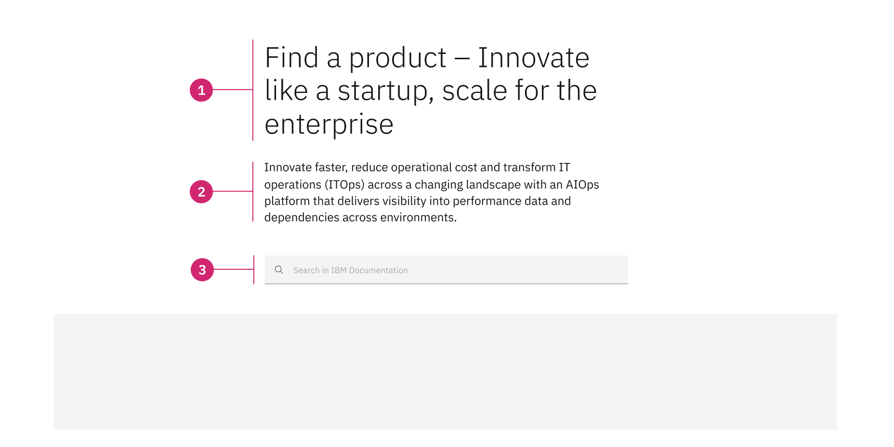

import ComponentDescription from 'components/ComponentDescription';
import ComponentFooter from 'components/ComponentFooter';
import ResourceLinks from 'components/ResourceLinks';

import ComponentFeedback from 'components/ComponentFeedback';

<ComponentDescription name="Lead space search" type="layout" />

<AnchorLinks>

<AnchorLink>Resources</AnchorLink>
<AnchorLink>Overview</AnchorLink>
<AnchorLink>Anatomy</AnchorLink>
<AnchorLink>Modifiers</AnchorLink>
<AnchorLink>Behaviors</AnchorLink>
<AnchorLink>Content guidance</AnchorLink>
<AnchorLink>Feedback</AnchorLink>

</AnchorLinks>

<ResourceLinks name="Lead space search" type="layout" />

## Overview

Lead space search includes a heading, a Carbon [search field](https://carbondesignsystem.com/components/search/usage/), an optional subheading, an optional paragraph, and an optional background image. This version of the lead space is especially useful when the page displays many options that a user could be interested in.

<Caption>Example of the lead space search component</Caption>

## Anatomy

<Caption>Anatomy of the lead space search component</Caption>

1. **Heading (required):** Customizable heading for the lead space search component.
2. **Subheading (optional):** Emphasize the heading by adding a subheading under it.
3. **Search (required):** Search field component displayed prominently.
4. **Typeahead (required):** Carbon typeahead component that displays increasingly accurate suggestions for users as they type in the search field.
5. **Background media (optional)**

### Use case

<Caption>
  Example of lead space search, showing the typeahead feature. Typeahead
  suggests results as the user types in the search field.
</Caption>

### When to use

The search field is one of the most frequently used design elements in a content-heavy web experience. To be effective, the search should be displayed prominently as it can be the fastest route to information discovery. Finding information quickly is essential for reducing bounce rate, extending the time users spend on the page, and can also motivating them to take action.

Use lead space search when you are displaying multiple items and you need to provide an efficient way for users to find items relevant to them. Lead space search is an excellent choice for content-heavy pages and knowledge base experiences. It can be used together with the filter panel component for even greater discoverability.

### When not to use

If you are not building a content-heavy page, a knowledge base experience, or if you do not need to display a great number of products or services, with categories and other classification criteria, you should consider using another lead space component such as [lead space](../components/leadspace), [lead space centered](../components/lead-space), or [lead space block](../components/lead-space-block).

Lead space search has a contextual, local search, and is not used for global search. If you need a global search option, you can find it in the masthead.

## Modifiers

### Adjacent theme

Lead space search provides the option to display the heading and subheading container as one theme, and the search field as an adjacent theme. When enabled, the search field container will automatically adopt the adjacent theme which pairs with the theme in the heading and subheading container.

This is useful when you wish to visually separate the two containers while more closely associating the search with the results visualized on the page.

<Caption>
  Examples of lead space search using adjacent themes. From top to bottom:
  White/Gray 10, Gray 10/White, Gray 90/Gray 100, and Gray 100/Gray 90.
</Caption>

### Heading highlight

Like other lead spaces, lead space search's heading can be modified to highlight a word or phrase. This can be used to highlight product names, industries, or particular value. The highlighted word or phrase can be anywhere in the heading, but it should only ever appear once in a single lead space. This only applies to the heading, and does not extend to any other lead space search element.

Keep in mind that the highlight is meant to only apply to an important word or phrase. The highlight should not cover the entire heading, and should only highlight one word or phrase.

<Row>

<Column colMd={6} colLg={6}>

<Caption>An example of a phrase highlighted at the end of the heading.</Caption>

</Column>

<Column colMd={6} colLg={6}>

<Caption>
  An example of a phrase highlighted at the start of the heading.
</Caption>

</Column>

</Row>

## Behaviors

### Scrolling behavior

Lead space search can scroll with the page, or it can be configured to adopt an optional sticky behavior for the search component and its container.

The sticky behavior ensures that the search field is always present as the user scrolls down the page. The masthead is pushed out of view and a customized heading can appear in the sticky search container.

Note that if the table of contents component is present, the lead space search sticky option will become inactive.

### Desktop breakpoints

The search component spans 10 columns of the 16 column grid with an overhang of 16px left and right.

<Caption>
  Optional sticky scrolling behavior of the lead space search component
</Caption>

#### Keyboard interaction

Lead space search includes a `skip to main content` option for keyboard users so they can jump into the main content and/or search results.

### Mobile breakpoints

The search component spans 8 columns of the grid for the `md` breakpoint and 4 columns of the grid for the `sm` breakpoint.

The component can scroll with the page, or adopt a sticky behaviour for the search container. There is no option to display a sticky heading because the search component takes the maximum number of columns.

<Row>

<Column colMd={4} colLg={8}>

<Caption>
  Optional sticky scrolling behavior of the lead space search component on small
  breakpoint
</Caption>

</Column>

</Row>

## Content guidance

| Element                 | Content type | Required | Instances | Character limit  (English / translated) | Notes                                    |
| ----------------------- | ------------ | -------- | --------- | ------------------------------------------- | ---------------------------------------- |
| Parent navigation       | Option list  | No       | 1         | –                                           | Breadcrumbs or Tag group.                |
| Heading                 | Text         | Yes      | 1         | 40 / 55                                     |                                          |
| Sub-heading             | Text         | No       | 1         | 200 / 260                                   |                                          |
| Search placeholder copy | Text         | Yes      | 1         | 40 / 55                                     | Longer phrases may be cut off on mobile. |

For more information, see the [character count standards](https://www.ibm.com/standards/carbon/guidelines/content#character-count-standards).

<ComponentFooter name="Lead space search" type="layout" />
