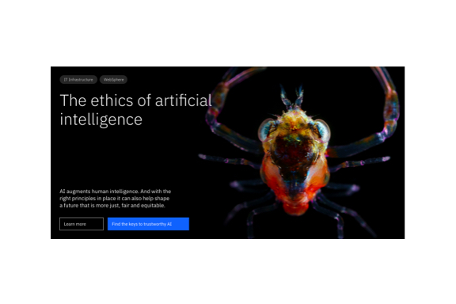
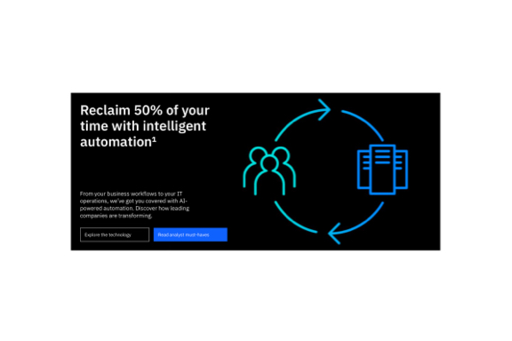
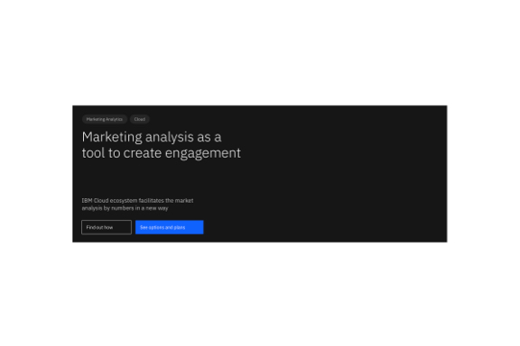
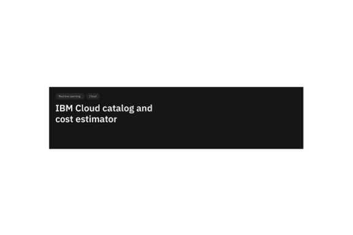

import ComponentDescription from 'components/ComponentDescription';
import ComponentFooter from 'components/ComponentFooter';
import ResourceLinks from 'components/ResourceLinks';

<ComponentDescription name="Lead space" type="layout" />

<AnchorLinks>

<AnchorLink>Resources</AnchorLink>
<AnchorLink>Overview</AnchorLink>
<AnchorLink>Super</AnchorLink>
<AnchorLink>Tall</AnchorLink>
<AnchorLink>Medium</AnchorLink>
<AnchorLink>Short</AnchorLink>
<AnchorLink>Centered</AnchorLink>
<AnchorLink>Related components</AnchorLink>
<AnchorLink>Feedback</AnchorLink>

</AnchorLinks>

<ResourceLinks name="Lead space" type="layout" />

## Overview

A lead space is positioned at the top of a web page and serves as one of the most efficient and powerful communication tools. Its primary purpose is to orient the user and quickly inform them of the page content. [Super](#super) is the most prominent lead space component. It is used at the start of a user's journey, for homepages and landing pages. [Tall](#tall) and [Medium](#medium) are lead spaces that follow the users throughout their pre-purchase or post-purchase journey, and [Short](#short) is a more efficient and precise type of lead space, for users that are engaged in the purchase stages of their journey. [Centered](#centered) lead space can be a powerful tool for long-form reading experiences.

<Row>

<Column colMd={4} colLg={4}>

<Caption>Super (640px height)</Caption>

</Column>

<Column colMd={4} colLg={4}>

<Caption>Tall (560px height)</Caption>

</Column>

<Column colMd={4} colLg={4}>

<Caption>Medium (480px height)</Caption>

</Column>

</Row>

<Row>

<Column colMd={4} colLg={4}>

<Caption>Short (320px height)</Caption>

</Column>

<Column colMd={4} colLg={4}>

<Caption>Centered (variable height)</Caption>

</Column>

</Row>

#### Deciding what to use

| Component name   | Use cases              | 
| ---------------- | ---------------------- |
| [Super](#super)   |  Homepages, landing pages and more expressive marketing experiences |
| [Tall](#tall)     |  Pre-purchase learn pages |
| [Medium](#medium)  |  Pre-purchase and post-purchase navigation pages |
| [Short](#short)   |  Purchase stage, registration, configuration and checkout, etc |
| [Centered](#centered)   |  Learning pages, long-form reading experiences, use cases |

## Super

Super is a left-aligned lead space component with a big, fluid heading that immediately draws users' attention. It has a 640px fixed height for the desktop experience, and it is variable in height for smaller screens. It can be used on many different page types, but its main purpose is to be used on homepages and landing pages, helping products to create strong emotional connections with the audience.

<Caption>
  Super lead space anatomy
</Caption>

1. **Tag group:** Tag group consists of a number of clickable tags that link the topic to other pages with more information.
1. **Heading:** Heading has the highest information hierarchy on a lead space, and should be succinct and descriptive.
1. **Short copy:** Optional copy can be added for additional description.
1. **Button group:** A group of CTAs that provides options for users to continue their journey.
1. **Background media** Optional component that adds a background image and a gradient for accessibility.

### Behaviors

It is worth noting that on the mobile breakpoint small, **for all the lead space components detailed on this page**, the background media component transforms the background image in an inline image and positions it last, after the button group, as seen below.

<Caption>
  Lead space behavior on small breakpoint
</Caption>

### Modifiers

#### Breadcrumbs

Any lead space component detailed here (Super, Tall, Medium, Short and Centered) allows the use of breadcrumbs instead of Tag group to cover a wider range of needs and navigational purposes.

<Caption>
  Lead space with breadcrumbs
</Caption>

### Content guidance for Super lead space

| Element                                                         | Content type | Required | Instances | Character count  (English / translated) | Notes                                                                                         |
| --------------------------------------------------------------- | ------------ | -------- | --------- | ------------------------------------------- | --------------------------------------------------------------------------------------------- |
| Parent navigation                                               | Option list  | No       | 1         | –                                           |   Breadcrumbs or Tag group   |
| Heading                                                         | Text         | Yes      | 1         | 40 / 55                                     |     |
| Copy                                                            | Text         | No       | 1         | 120 / 150                                   |     |
| Button group                                                    | Component    | No       | 1         | 40 / 55                                     |     |
| Background media                                                | Component    | No       | 1         | –                                           |     |
| Alt image text                                                  | Text         | No       | 1         | 75 / 100                                    | Image description for accessibility  |

For more information, see the
[character count standards](https://github.com/carbon-design-system/carbon-for-ibm-dotcom-website/wiki/Character-count-standards).

## Tall

Tall is a left-aligned lead space component mostly used in the pre-purchase stages of the buying cycle, like the learning stage. It can communicate a message very clearly with its semibold, big type heading. It has a 560px fixed height for the desktop experience, and it is variable in height for smaller screens.

<Caption>
  Tall lead space example
</Caption>

### Content guidance for Tall lead space

| Element                                                         | Content type | Required | Instances | Character count  (English / translated) | Notes                                                                                         |
| --------------------------------------------------------------- | ------------ | -------- | --------- | ------------------------------------------- | --------------------------------------------------------------------------------------------- |
| Parent navigation                                               | Option list  | No       | 1         | –                                           |   Breadcrumbs or Tag group   |
| Heading                                                         | Text         | Yes      | 1         | 40 / 55                                     |     |
| Copy                                                            | Text         | No       | 1         | 120 / 150                                   |     |
| Button group                                                    | Component    | No       | 1         | 40 / 55                                     |     |
| Background media                                                | Component    | No       | 1         | –                                           |     |
| Alt image text                                                  | Text         | No       | 1         | 75 / 100                                    | Image description for accessibility  |

For more information, see the
[character count standards](https://github.com/carbon-design-system/carbon-for-ibm-dotcom-website/wiki/Character-count-standards).

## Medium

Medium is a left-aligned lead space component mostly used in the pre-purchase and post-purchase stages of the buying cycle, like the solution and learning pages, or MyIBM. It has a 480px fixed height for the desktop experience, and it is variable in height for smaller screens.

<Caption>
  Medium lead space example
</Caption>

### Content guidance for Medium lead space

| Element                                                         | Content type | Required | Instances | Character count  (English / translated) | Notes                                                                                         |
| --------------------------------------------------------------- | ------------ | -------- | --------- | ------------------------------------------- | --------------------------------------------------------------------------------------------- |
| Parent navigation                                               | Option list  | No       | 1         | –                                           |   Breadcrumbs or Tag group   |
| Heading                                                         | Text         | Yes      | 1         | 40 / 55                                     |     |
| Copy                                                            | Text         | No       | 1         | 120 / 150                                   |     |
| Button group                                                    | Component    | No       | 1         | 40 / 55                                     |     |
| Background media                                                | Component    | No       | 1         | –                                           |     |
| Alt image text                                                  | Text         | No       | 1         | 75 / 100                                    | Image description for accessibility  |

For more information, see the
[character count standards](https://github.com/carbon-design-system/carbon-for-ibm-dotcom-website/wiki/Character-count-standards).

## Short

Short is an efficient and precise left-aligned lead space component mostly used in the purchase stages of the buying cycle, like registration, configuration and checkout pages. It has a 320px fixed height for the desktop experience, and it is variable in height for smaller screens. 

<Caption>
  Short lead space example
</Caption>

### Content guidance for Short lead space

| Element                                                         | Content type | Required | Instances | Character count  (English / translated) | Notes                                                                                         |
| --------------------------------------------------------------- | ------------ | -------- | --------- | ------------------------------------------- | --------------------------------------------------------------------------------------------- |
| Parent navigation                                               | Option list  | No       | 1         | –                                           |   Breadcrumbs or Tag group   |
| Heading                                                         | Text         | Yes      | 1         | 40 / 55                                     |     |
| Background media                                                | Component    | No       | 1         | –                                           |     |
| Alt image text                                                  | Text         | No       | 1         | 75 / 100                                    | Image description for accessibility  |

The Short lead space does not accept a short copy or a Button group component. For more information, see the
[character count standards](https://github.com/carbon-design-system/carbon-for-ibm-dotcom-website/wiki/Character-count-standards).

## Centered

This lead space has four empty columns on the left and right to accommodate pages that
have content positioned in the center of the 16-column grid. Used in the learn
pages templates and other long-form reading experiences. It has a fluid height and a prominent heading. 

<Caption>
  Centered lead space example
</Caption>

### Content guidance for Centered lead space

| Element                                                         | Content type | Required | Instances | Character count  (English / translated) | Notes                                                                                         |
| --------------------------------------------------------------- | ------------ | -------- | --------- | ------------------------------------------- | --------------------------------------------------------------------------------------------- |
| Parent navigation                                               | Option list  | No       | 1         | –                                           |   Breadcrumbs or Tag group   |
| Heading                                                         | Text         | Yes      | 1         | 40 / 55                                     |     |
| Copy                                                            | Text         | No       | 1         | 120 / 150                                   |     |
| Button group                                                    | Component    | No       | 1         | 40 / 55                                     |     |
| Background media                                                | Component    | No       | 1         | –                                           |     |
| Alt image text                                                  | Text         | No       | 1         | 75 / 100                                    | Image description for accessibility  |

For more information, see the
[character count standards](https://github.com/carbon-design-system/carbon-for-ibm-dotcom-website/wiki/Character-count-standards).

## Related components

| Component name                                                                                               | Relationship                                                                                                                                                        |
| ------------------------------------------------------------------------------------------------------------ | ------------------------------------------------------------------------------------------------------------------------------------------------------------------- |
| [Lead space block](https://www.ibm.com/standards/carbon/components/lead-space-block)                                 | Lead space block is an alternative lead space component, enabling a more productive first site of viewer engagement.             |
| [Lead space search](https://www.ibm.com/standards/carbon/components/lead-space-search)               | Lead space search provides a fast route to information discovery by including a prominent search option in the lead space.         |
| Lead space video | Coming soon. |

<ComponentFooter name="Lead space" type="layout" />
