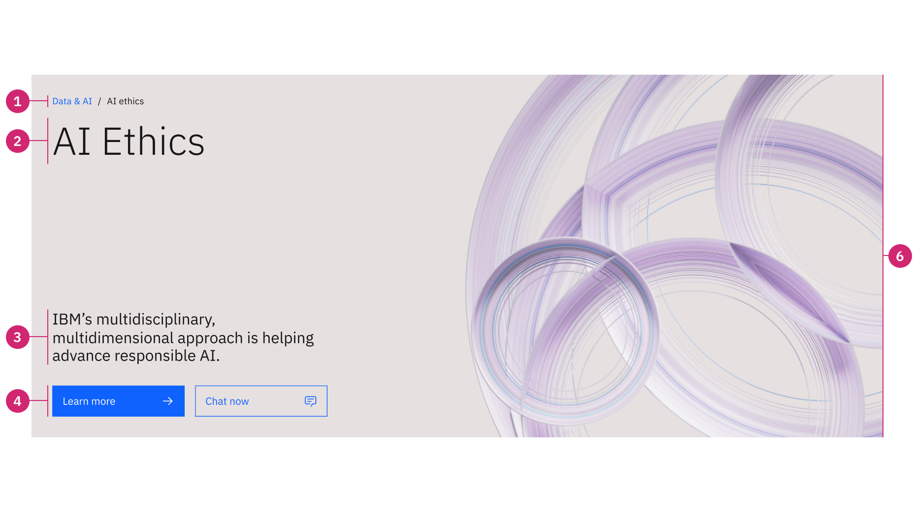
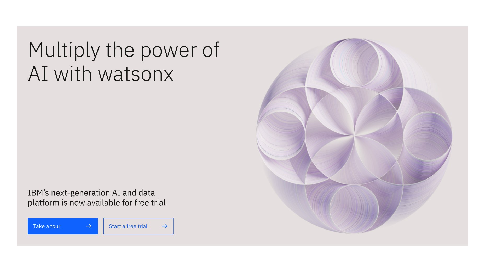
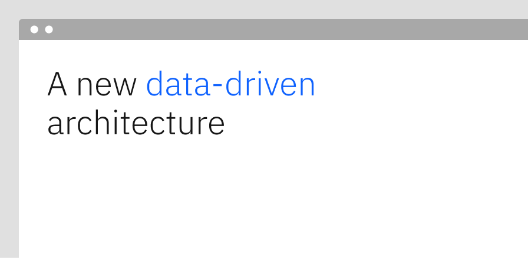
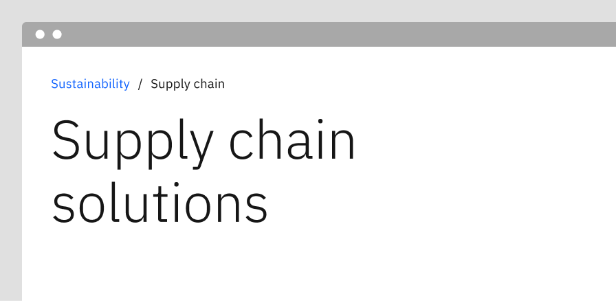
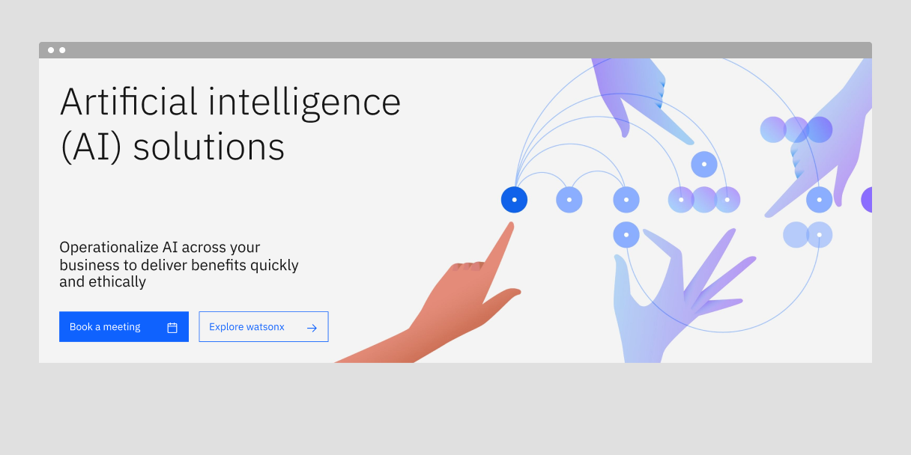
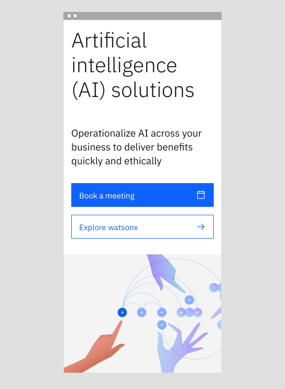

import ComponentDescription from 'components/ComponentDescription';
import ComponentFooter from 'components/ComponentFooter';
import ResourceLinks from 'components/ResourceLinks';

<ComponentDescription name="Lead space" type="layout" />

<AnchorLinks>

<AnchorLink>Overview</AnchorLink>
<AnchorLink>Variants</AnchorLink>
<AnchorLink>Modifiers</AnchorLink>
<AnchorLink>Behaviors</AnchorLink>
<AnchorLink>Resources</AnchorLink>
<AnchorLink>Content guidance</AnchorLink>
<AnchorLink>Related components</AnchorLink>
<AnchorLink>Feedback</AnchorLink>

</AnchorLinks>

## Overview

A lead space is positioned at the top of a web page and serves as one of the most efficient and powerful communication
tools. Its primary purpose is to orient the user and quickly inform them of the page content.

There are five variants split into two types, each designed for specific situations. Four size variants are available for left-aligned lead spaces, and a fifth variant exists for center-aligned lead spaces. See the table below.

<Row>

<Column colMd={4} colLg={8}>

<Caption>Lead space anatomy</Caption>

</Column>

</Row>

1. **Wayfinding:** Optional elements that provide additional hierarchical context to the page.
2. **Heading:** Heading has the highest information hierarchy on a lead space, and should be succinct and descriptive.
3. **Subheading:** Optional copy can be added for additional description.
4. **Button group:** A group of CTAs that provides options for users to continue their journey.
5. **Background media:** Optional background that adds an image or video for visual interest.

### Deciding what to use

| Variants              | Use cases                                                                                                                                                                                                                        |
| --------------------- | -------------------------------------------------------------------------------------------------------------------------------------------------------------------------------------------------------------------------------- |
| [Super](#super)       | The most prominent variant. Used mainly for home pages, landing pages, and more expressive marketing experiences. _Available for left-aligned content_.                                                                          |
| [Tall](#tall)         | The second most prominent variant. Tall is more efficient when used for pre-purchase learning pages. _Available for left-aligned content_.                                                                                       |
| [Medium](#medium)     | Closely related to Tall, this variant can be used for the pre-purchase and post-purchase stage in the user journey. It captures attention while allowing for more content in the lead space. _Available for left-aligned content_. |
| [Short](#short)       | This is is the most efficient variant. It is mostly used in purchase stage experiences, such as product pricing pages, where users are more focused on the product or service details. _Available for left-aligned content_.     |
| [Centered](#centered) | This is a special variant that can be used for learning pages, long-form reading experiences, and other use cases. When center-aligning content, the Lead space height varies to accommodate the content.                        |

## Variants

### Super

Super is a left-aligned lead space variant with a large, fluid heading that immediately draws the user's attention. It has
a 640px fixed height for the desktop experience, and it is variable in height for smaller screens. It can be used on
many different page types, but its main purpose is for use on homepages and landing pages, helping products and services
to create strong emotional connections with the audience.

<Caption>Super (640px height), the most prominent lead space size.</Caption>

### Tall

Tall is the left-aligned default lead space variant, and it is mostly used in the pre-purchase stages of the buying
cycle, like the learning stage. It can communicate a message very clearly with its semibold, big type heading. It has a
560px fixed height for the desktop experience, and it is variable in height for smaller screens.

<Caption>
  Tall (560px height), using an isometric illustration in the background.
</Caption>

### Medium

Medium is a left-aligned lead space variant mostly used in the pre-purchase and post-purchase stages of the buying
cycle. It is generally a safe choice, because it captures attention while still allowing a lot of content to peek above
the fold. Avoid using this height variant if the page is a homepage or you are creating a landing page experience. It
has a 480px fixed height for desktop viewports, and it is also variable in height for smaller screens.

<Caption>
  Medium (480px height), using an illustration in the background.
</Caption>

### Short

Short is an efficient and precise left-aligned lead space variant mostly used in the purchase stages of the buying
cycle. Short can also be used to lead additional info following a landing page, for example the product pricing page. It
has a 320px fixed height for the desktop experience, and it is variable in height for smaller screens.

Unlike other lead space sizes, the Short version does not have a subheading or button group.

<Caption>
  Short (320px height), using an abstract illustrated background.
</Caption>

### Centered

This lead space has four empty columns on the left and right to accommodate pages that have content positioned in the
center of the 16-column grid. Used in the learn pages templates and other long-form reading experiences. It has a fluid
height and a prominent heading.

<Caption>
  Centered (variable hieght), using an abstract illustrated background.
</Caption>

## Modifiers

### Background media

All lead space variants have the option to include a background image or video to create visual interest from the first moment in an experience. In both cases, a gradient can be enabled on top of the media so that the lead space content passes accessibility requirements. If the overlay is disabled, be sure that the media does not create contrast issues with the lead space content.

#### Background image

An image can be used in the lead space to draw attention to the first content on the page. At the medium and small breakpoints, the image will appear behind the heading, body copy, and button group. When creating imagery for the lead space, keep the focus of the image on the area that appears without the gradient.

#### Background video (Accessibility info TBD)

A video can be used instead of an image as an animated background for the lead space. Videos are paused by default, and the user can begin the video by clicking the play button. Like background images, ensure that the focus of the video is clearly visible based on the location of the gradient overlay.

When a user clicks the play button, the video will begin playing in the background of the lead space. The design intent of a video used in this way is to create ambiance - if you require a video to convey more information, consider another [video](https://www.ibm.com/standards/carbon/components/video)-related component. Videos should not have any sound or captions to ensure the lead space is accessible.

The lead space with background video cannot expand to show a larger or more in-depth video. If you need that functionality, consider [video player](../components/video).

<Caption>Lead space super with background video</Caption>

#### When to use video

- The background video is intended to add ambiance to an experience.
- If the video is brief and works well on a loop. If the video loops, it should stop at 5-10 seconds.

#### When not to use video

- No audio is allowed in the background video. If your video requires audio, use another video-related component.
- If the background video contains critical information for users to complete their goal on the page, do not deliver the video in the lead space.
- If the required video is long and information dense.

### Gradient

The gradient that sits between the background media and the other lead space elements can be added or removed based on the asset needs. We strongly recommend using the gradient when the heading content would be difficult to read due to low contrast with the background. If using an illustration in the background, be aware of visual elements that would overlap with the lead space copy that would make it harder to read without a gradient. See the [design specs](https://www.figma.com/file/Gfb6xdHwKdBgNloNqlSbnG/Lead-space-v2?type=design&node-id=1031%3A20561&mode=design&t=xrvdzPlkLXOPoTg8-1) for illustration guidance by lead space size.

<Row>

<Column colMd={6} colLg={6}>

<Caption>An example lead space with a gradient</Caption>

</Column>

<Column colMd={6} colLg={6}>

<Caption>An example lead space without a gradient</Caption>

</Column>

</Row>

### Heading

#### Heading type

For the left-aligned lead spaces, the type token can be one of two options: a larger display token or a smaller heading token. Note that for the Short lead space, only the smaller heading token is available.

#### Heading highlight

The lead space heading can be modified to highlight a word or phrase. This can be used to highlight product names, industries, or particular value. The highlighted word or phrase can be anywhere in the heading, but it should only ever appear once in a single lead space. This only applies to the heading, and does not extend to any other lead space element. The highlight is available for both lead space heading types.

<Row>

<Column colMd={6} colLg={6}>

<Caption>
  An example of a word highlighted near the center of the heading
</Caption>

</Column>

<Column colMd={6} colLg={6}>

<Caption>An example of a word highlighted at the start of the heading</Caption>

</Column>

</Row>

### Wayfinding

All lead space variants have the option to include wayfinding elements – either breadcrumbs or tag links – to provide feedback on where the user is in the experience.

#### Breadcrumbs

[Breadcrumbs](https://www.carbondesignsystem.com/components/breadcrumb/usage/) can be added above the lead space heading, replacing the Tag group to cover a wider range of needs and
navigational purposes. Breadcrumbs work well when navigation has a clear, linear hierarchy.

<Row>

<Column colMd={6} colLg={6}>

<Caption>
  An example of a lead space with breadcrumbs. Breadcrumbs are useful when there
  is clear, linear hierarchy.
</Caption>

</Column>

</Row>

#### Tag links

A collection of [Tag links](https://www.ibm.com/standards/carbon/components/tag-link) can be added to the lead space, and always appear above the headline to establish context. Tag links are not interactive, and instead provide more context to the lead space by indicating architecture. Tag links work well in cases where the navigation does not have a clear, linear hierarchy. We recommend using more than one Tag link to represent a polyhierarchical structure.

<Row>

<Column colMd={6} colLg={6}>

<Caption>
  An example of a lead space with tag links. Tag links are useful when the
  hierarchy can be split among multiple categories.
</Caption>

</Column>

</Row>

## Behaviors

On small breakpoint (320px), the background image or video switches to an inline image and is positioned last, after the button
group, as shown below. The button group displays the primary button first in the order across breakpoints. On mobile, the buttons stack with the primary button appearing first.

<Row>

<Column colMd={8} colLg={8}>

<Caption>
  A lead space in a desktop breakpoint with the background media behind the rest
  of the lead space content.
</Caption>

</Column>

<Column colMd={4} colLg={4}>

<Caption>
  A lead space in the mobile breakpoint with the background media below the rest
  of the lead space content.
</Caption>

</Column>

</Row>

<ResourceLinks name="Lead space" type="layout" />

## Content guidance

| Element                                                                         | Content type                                                                                                                       | Required | Instances | Character limit  (English / translated) | Notes                                                                 |
| ------------------------------------------------------------------------------- | ---------------------------------------------------------------------------------------------------------------------------------- | -------- | --------- | ------------------------------------------- | --------------------------------------------------------------------- |
| Wayfinding                                                                      | Option list                                                                                                                        | No       | 1         | –                                           | Breadcrumbs or Tag group.                                             |
| Heading                                                                         | Text                                                                                                                               | Yes      | 1         | 40 / 55                                     |                                                                       |
| Subheading                                                                      | Text                                                                                                                               | No       | 1         | 120 / 150                                   | Lead space short variant does not allow subheading under the heading. |
| [Button group CTA](https://www.ibm.com/standards/carbon/components/cta/#button) | Component                                                                                                                          | No       | 1         | 25 / 35                                     | Lead space short variant does not allow a CTA under the heading.      |
| Background media                                                                | [Image](https://www.ibm.com/standards/carbon/components/images/) or [Video](https://www.ibm.com/standards/carbon/components/video) | No       | 1         | –                                           |                                                                       |
| Image alt text                                                                  | Text                                                                                                                               | No       | 1         | 75 / 100                                    | Image description for accessibility.                                  |
| Gradient                                                                        | UI element                                                                                                                         | No       | 1         | –                                           | Consider contrast between lead space elements and background media.   |

For more information, see the
[character count standards](https://www.ibm.com/standards/carbon/guidelines/content#character-count-standards).

## Related components

| Component name                                                                         | Relationship                                                                                                               |
| -------------------------------------------------------------------------------------- | -------------------------------------------------------------------------------------------------------------------------- |
| [Lead space block](https://www.ibm.com/standards/carbon/components/lead-space-block)   | Lead space block is an alternative lead space component, enabling a more productive first site of viewer engagement.       |
| [Lead space search](https://www.ibm.com/standards/carbon/components/lead-space-search) | Lead space search provides a fast route to information discovery by including a prominent search option in the lead space. |

<ComponentFooter name="Lead space" type="layout" />
