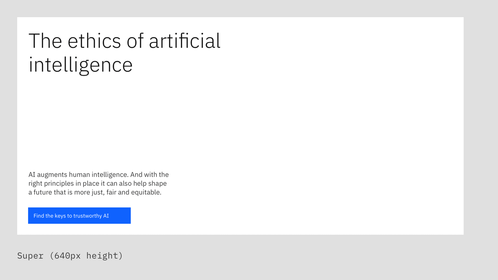
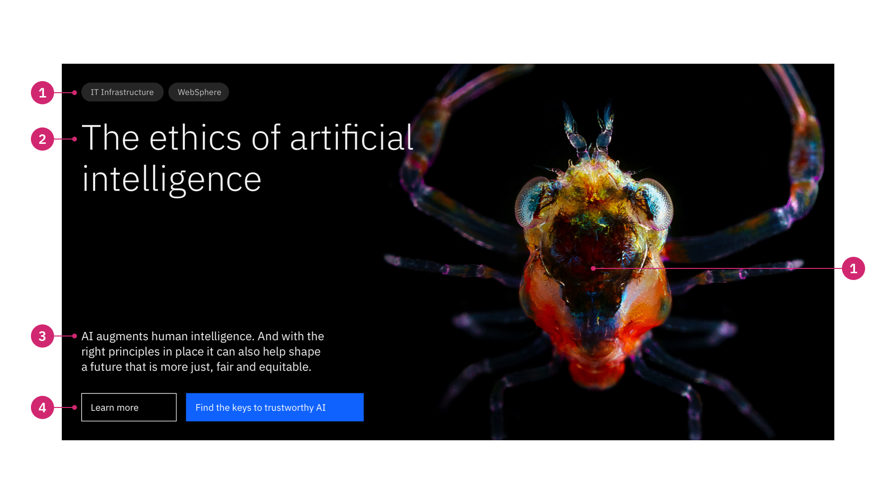
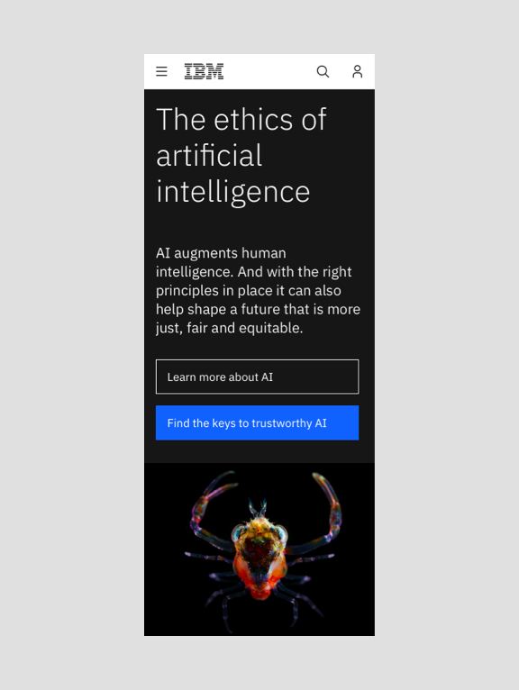
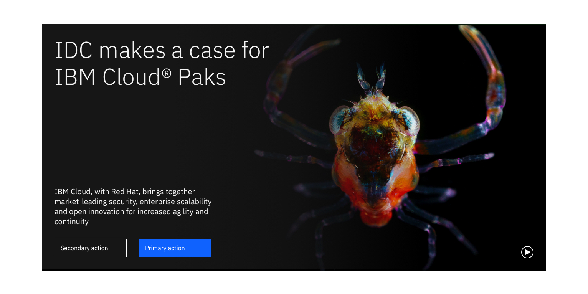

import ComponentDescription from 'components/ComponentDescription';
import ComponentFooter from 'components/ComponentFooter';
import ResourceLinks from 'components/ResourceLinks';

<ComponentDescription name="Lead space" type="layout" />

<AnchorLinks>

<AnchorLink>Resources</AnchorLink>
<AnchorLink>Overview</AnchorLink>
<AnchorLink>Variants</AnchorLink>
<AnchorLink>Behaviors</AnchorLink>
<AnchorLink>Modifiers</AnchorLink>
<AnchorLink>Content guidance</AnchorLink>
<AnchorLink>Related components</AnchorLink>
<AnchorLink>Feedback</AnchorLink>

</AnchorLinks>

<ResourceLinks name="Lead space" type="layout" />

## Overview

A lead space is positioned at the top of a web page and serves as one of the most efficient and powerful communication
tools. Its primary purpose is to orient the user and quickly inform them of the page content.

There are five variants, designed for specific situations. [Super](#super) is the most prominent variant. It is used at
the start of a user's journey, for homepages and landing pages. [Tall](#tall) and [Medium](#medium) are variants that
follow the users throughout their pre-purchase or post-purchase journey, and [Short](#short) is a height efficient type
of lead space, for users that are engaged in the purchase stages of their journey. [Centered](#centered) lead space can
be a powerful tool for long-form reading experiences.

<Row>

<Column colMd={4} colLg={8}>

<Caption>The Lead space variants</Caption>

</Column>

</Row>

### Deciding what to use

| Variants              | Use cases                                                                                                                                                                                                                                              |
| --------------------- | ------------------------------------------------------------------------------------------------------------------------------------------------------------------------------------------------------------------------------------------------------ |
| [Super](#super)       | Used mainly for home pages, landing pages and more expressive marketing experiences. Available for left-aligned content.                                                                                                                               |
| [Tall](#tall)         | This variant is the default lead space. It is more efficient when used for pre-purchase learn pages. Available for left-aligned content.                                                                                                               |
| [Medium](#medium)     | Closely related to Tall, this variant can be used for pre-purchase and post-purchase stage. It is generally a safe choice, because it captures attention while still allowing a lot of content above the fold. Available for left-aligned content.     |
| [Short](#short)       | This is the shortest, yet very efficient variant. It is mostly used in the purchase stage experiences, for example, the product pricing pages, where the users are more focused on the product or service details. Available for left-aligned content. |
| [Centered](#centered) | This is a special variant that can be used for learning pages, long-form reading experiences, and use cases. When center-aligning content, the Lead space height varies based on the content.                                                          |

## Variants

### Super

Super is a left-aligned lead space variant with a big, fluid heading that immediately draws the user's attention. It has
a 640px fixed height for the desktop experience, and it is variable in height for smaller screens. It can be used on
many different page types, but its main purpose is for use on homepages and landing pages, helping products and services
to create strong emotional connections with the audience.

<Caption>Super (640px height), with tag links as a navigational option</Caption>

1. **Tag group:** Optional Tag group consists of a number of clickable tags that link the topic to other pages with more
   information.
1. **Heading:** Heading has the highest information hierarchy on a lead space, and should be succinct and descriptive.
1. **Short copy:** Optional copy can be added for additional description.
1. **Button group:** A group of CTAs that provides options for users to continue their journey.
1. **Background media:** Optional component that adds a background image and a gradient for accessibility.

### Tall

Tall is the left-aligned default Lead space variant, and it is mostly used in the pre-purchase stages of the buying
cycle, like the learning stage. It can communicate a message very clearly with its semibold, big type heading. It has a
560px fixed height for the desktop experience, and it is variable in height for smaller screens.

<Caption>Tall (560px height), with its prominent semibold heading</Caption>

### Medium

Medium is a left-aligned lead space variant mostly used in the pre-purchase and post-purchase stages of the buying
cycle. It is generally a safe choice, because it captures attention while still allowing a lot of content to peek above
the fold. Avoid using this height variant if the page is a homepage or you are creating a landing page experience. It
has a 480px fixed height for desktop viewports, and it is also variable in height for smaller screens.

<Caption>
  Medium (480px height), with tag links and no background media option
</Caption>

### Short

Short is an efficient and precise left-aligned lead space variant mostly used in the purchase stages of the buying
cycle. Short can also be used to lead additional info following a landing page, for example the product pricing page. It
has a 320px fixed height for the desktop experience, and it is variable in height for smaller screens.

<Caption>
  Short (320px height), with tag links but no background media option
</Caption>

### Centered

This lead space has four empty columns on the left and right to accommodate pages that have content positioned in the
center of the 16-column grid. Used in the learn pages templates and other long-form reading experiences. It has a fluid
height and a prominent heading.

<Caption>
  Centered (variable height), designed to accommodate longer copy
</Caption>

## Behaviors

On small breakpoint (320px), the background image switches to an inline image and is positioned last, after the button
group, as shown below.

<Caption>Lead space behavior change on mobile (right)</Caption>

## Modifiers

#### Breadcrumbs

Breadcrumbs can be used above the Lead space heading, replacing the Tag group to cover a wider range of needs and
navigational purposes.

<Caption>Lead space with breadcrumbs</Caption>

#### Background video

A video can be used instead of an image as an animated background for the Lead space. Videos are paused by default, and the user can begin the video by clicking the play button. Like background images, ensure that the focus of the video is clearly visible based on the location of the gradient overlay.

When a user clicks the play button, the video will begin playing in the background of the lead space. The design intent of a video used in this way is to create ambiance - if you require a video to convey more information, consider another [video](https://www.ibm.com/standards/carbon/components/video)-related component.

<Caption>Lead space with background video</Caption>

## Content guidance

| Element                                                            | Content type                                                                                                                       | Required | Instances | Character limit  (English / translated) | Notes                                                                                                  |
| ------------------------------------------------------------------ | ---------------------------------------------------------------------------------------------------------------------------------- | -------- | --------- | ------------------------------------------- | ------------------------------------------------------------------------------------------------------ |
| Parent navigation                                                  | Option list                                                                                                                        | No       | 1         | –                                           | Breadcrumbs or Tag group.                                                                              |
| Heading                                                            | Text                                                                                                                               | Yes      | 1         | 40 / 55                                     |                                                                                                        |
| Copy                                                               | Text                                                                                                                               | No       | 1         | 120 / 150                                   | Lead space short variant (320px height) does not allow copy under the heading.                         |
| [CTA](https://www.ibm.com/standards/carbon/components/cta/#button) | Component                                                                                                                          | No       | 1         | 25 / 35                                     | Button style CTA only. Lead space short variant (320px height) does not allow a CTA under the heading. |
| Background media                                                   | [Image](https://www.ibm.com/standards/carbon/components/images/) or [Video](https://www.ibm.com/standards/carbon/components/video) | No       | 1         | –                                           |                                                                                                        |
| Image alt text                                                     | Text                                                                                                                               | No       | 1         | 75 / 100                                    | Image description for accessibility.                                                                   |

For more information, see the
[character count standards](https://www.ibm.com/standards/carbon/guidelines/content#character-count-standards).

## Related components

| Component name                                                                         | Relationship                                                                                                               |
| -------------------------------------------------------------------------------------- | -------------------------------------------------------------------------------------------------------------------------- |
| [Lead space block](https://www.ibm.com/standards/carbon/components/lead-space-block)   | Lead space block is an alternative lead space component, enabling a more productive first site of viewer engagement.       |
| [Lead space search](https://www.ibm.com/standards/carbon/components/lead-space-search) | Lead space search provides a fast route to information discovery by including a prominent search option in the lead space. |

<ComponentFooter name="Lead space" type="layout" />
