import ComponentDescription from "components/ComponentDescription";
import ComponentFooter from "components/ComponentFooter";

<ComponentDescription name="Lead space" type="layout" />

<AnchorLinks>

<AnchorLink>Lead space left-aligned</AnchorLink>
<AnchorLink>Lead space centered</AnchorLink>
<AnchorLink>Content guidance</AnchorLink>
<AnchorLink>Usage guidance</AnchorLink>
<AnchorLink>Color themes</AnchorLink>
<AnchorLink>Type styles</AnchorLink>
<AnchorLink>Design and functional specifications</AnchorLink>
<AnchorLink>Development documentation</AnchorLink>
<AnchorLink>Resources</AnchorLink>
<AnchorLink>Feedback</AnchorLink>

</AnchorLinks>

## Lead space left-aligned

This is the most commonly used Lead space style. The left-aligned type draws the users' attention to the Lead space messaging immediately. Used in marketing and product pages, among others.

There are 4 available heights for the lead space left-aligned:

| Name   | Height | Heading type token      |
| ------ | ------ | ----------------------- |
| Super  | 640 px | \$display-01            |
| Tall   | 560 px | \$expressive-heading-06 |
| Medium | 480 px | \$expressive-heading-05 |
| Short  | 320 px | \$expressive-heading-06 |

 
 

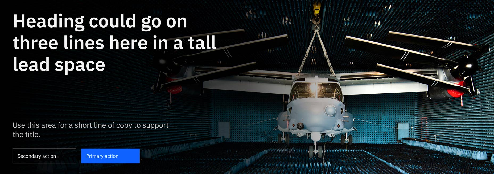

<Caption>
  Example: Lead space – Tall – 560px height at max 1584px breakpoint, with
  $expressive-heading-06 heading
</Caption>

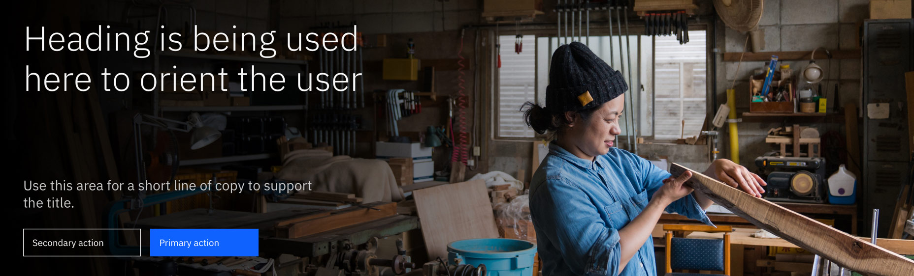

<Caption>
  Example: Lead space – Medium – 480px height at max 1584px breakpoint, with
  $expressive-heading-05
</Caption>

 

## Lead space centered

This option has 4 empty columns on the left and right to accommodate pages that have content positioned in the center of the 16-column grid. Used in the Learn page template and other long-form reading experiences.

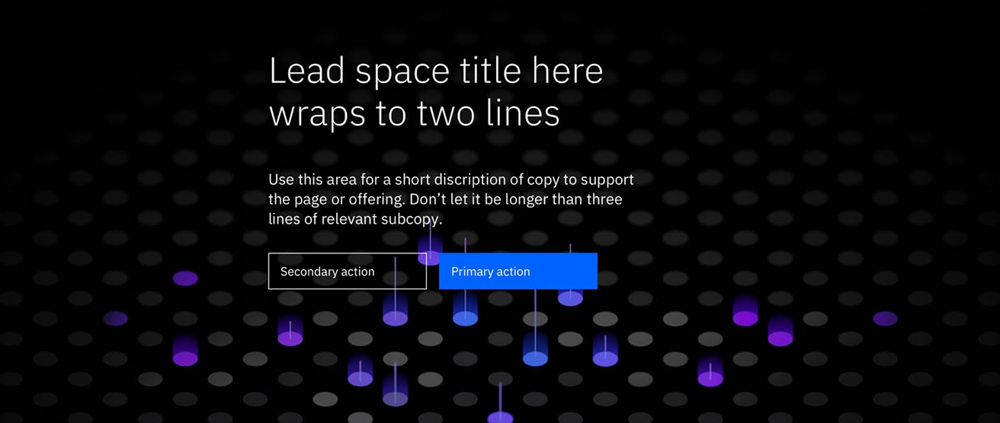

<Caption>
  Example: Lead space centered at max 1584px breakpoint, with
  $expressive-heading-05
</Caption>

 

## Content guidance

### Lead space left-aligned

| Field                                                                                           | Field type | Required | Max character size  (English / translated) | Notes                                                                   |
| ----------------------------------------------------------------------------------------------- | ---------- | -------- | ---------------------------------------------- | ----------------------------------------------------------------------- |
| Headline                                                                                        | Short copy | Yes      | XS (65 / 85)                                   | –                                                                       |
| Description                                                                                     | Short copy | No       | M (120 / 150)                                  | –                                                                       |
| [Button group](https://www.ibm.com/standards/web/carbon-for-ibm-dotcom/components/button-group) | Component  | No       | XXS (40 / 55)                                  | Lead space Short (320px) does not allow a button group or a short copy. |
| Gradient                                                                                        | True/False | No       | –                                              | True – Show gradient (default)  False – No gradient                 |
| Background [image](https://www.ibm.com/standards/web/carbon-for-ibm-dotcom/components/image)    | Component  | No       | –                                              | Breakpoints require different images.                                   |

### Lead space centered

| Field                                                                                           | Field type  | Required | Cardinality        | Max character size  (English / translated) | Notes                                                  |
| ----------------------------------------------------------------------------------------------- | ----------- | -------- | ------------------ | ---------------------------------------------- | ------------------------------------------------------ |
| Headline                                                                                        | Short copy  | Yes      | 1                  | XS (65 / 85)                                   | –                                                      |
| Description                                                                                     | Short copy  | No       | 1                  | M (120 / 150)                                  | –                                                      |
| [Button group](https://www.ibm.com/standards/web/carbon-for-ibm-dotcom/components/button-group) | Component   | No       | Max of two buttons | XXS (40 / 55)                                  | –                                                      |
| Gradient                                                                                        | True/False  | No       | –                  | –                                              | True – Show gradient (default) False – No gradient |
| Background [image](https://www.ibm.com/standards/web/carbon-for-ibm-dotcom/components/image)    | Component   | No       | 1                  | –                                              | Breakpoints require different images.                  |
| Type                                                                                            | Option list | Yes      | –                  | –                                              | Center, Left, or Small                                 |

More more on character count, <a href="https://github.com/carbon-design-system/carbon-for-ibm-dotcom-website/wiki/Character-count-standards" target="_blank" rel="noreferrer">see all character count standards</a>.

 

## Usage guidance

For detailed guidelines around usage, also reference the [Lead space pattern page](/patterns/lead-space).

 

## Color themes

There are two themes to choose from when using the Lead space:

### Dark themes (gray 100 or gray 90)

Use `gray 100` or `gray 90` when the background image has shadows, is dimly lit, or uses a dark color palette.

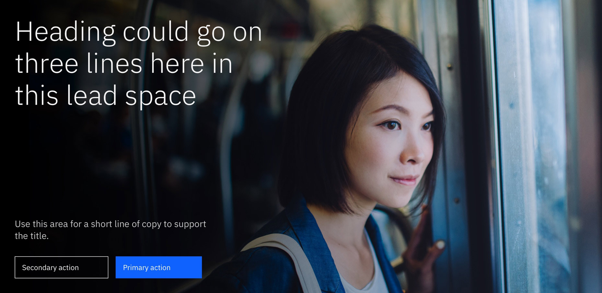

<Caption>
  Dark Lead space – Super – 640px height at xlg 1312px breakpoint
</Caption>
 

### Light themes (white or gray 10)

Use `white` or `gray 10` when the background image is well-lit or brightly colored.

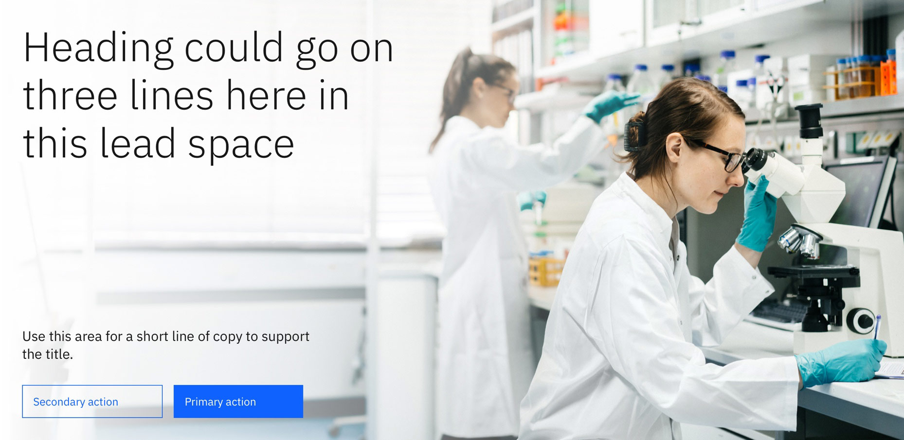

<Caption>
  Light Lead space – Super – 640px height at xlg 1312px breakpoint
</Caption>

 

## Type styles

### Lead space left-aligned

Please use the following recommended expressive type styles for the Lead space left-aligned heading:

| Name   | Height | Heading type token      |
| ------ | ------ | ----------------------- |
| Super  | 640 px | \$display-01            |
| Tall   | 560 px | \$expressive-heading-06 |
| Medium | 480 px | \$expressive-heading-05 |
| Short  | 320 px | \$expressive-heading-06 |

 
 

<Caption>
  $expressive-heading-06 can be used to highlight the name of the product,
  offering or title of topic. This option is optimal if using all Lead space
  components together. 
</Caption>

### Lead space centered

There are two recommended expressive type styles to choose from when using Lead space centered:

- `$expressive-heading-06` is recommended for pages that surface detailed, productive content to users such as product pages.
- `$display-01` is recommended for pages that have rich, editorial, expressive moments, such as marketing or campaign pages.

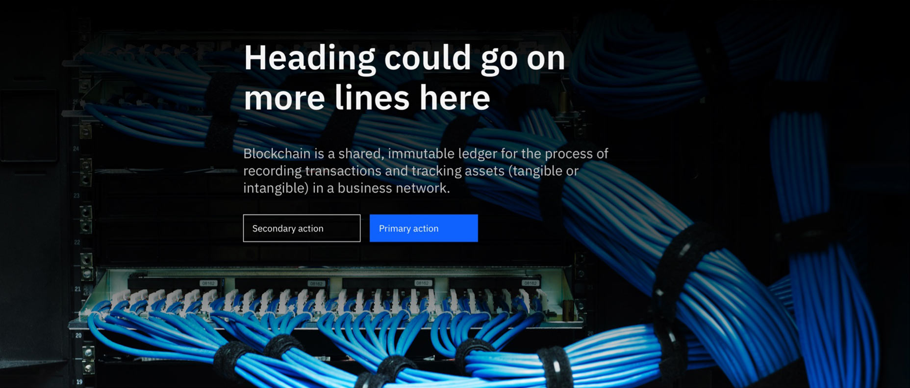

<Caption>
  $expressive-heading-06 can be used to highlight the name of the product,
  offering or title of topic. This option is optimal if using all Lead space and
  components together.
</Caption>

 

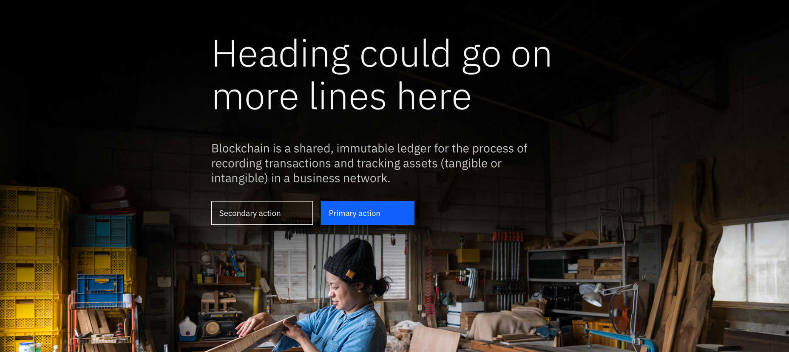

<Caption>
  $display-01 can be used to celebrate strong, editorial messaging.
</Caption>

 

### Lead space left-aligned

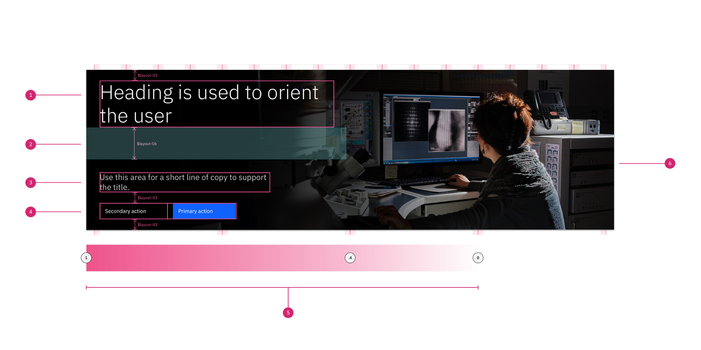

<Caption>
  Example: $expressive-heading-05 at xlg breakpoint (1312px) for a Medium (480px
  height) lead space
</Caption>

 

1. **Heading:** \$expressive-heading-05
1. **Content spacer:** safe space between heading and short copy
1. **Short copy:** \$expressive-heading-03
1. **Button group**
1. **Gradient (applied over image)**
1. **Background image** \*optional: cover, width: 100% of container

 
 

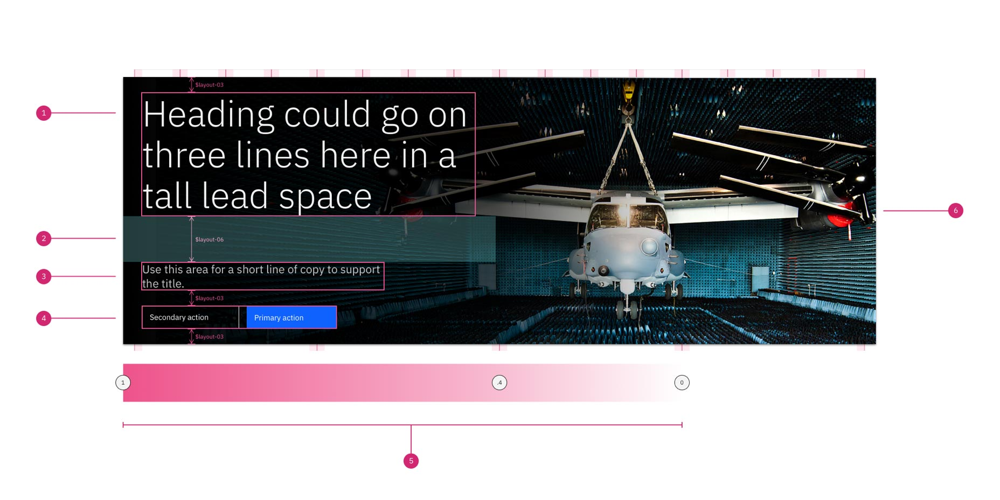

<Caption>
  Example: $display-01 at xlg breakpoint (1312px) for a Super (640px) lead space
</Caption>

 

1. **Heading:** \$display-01
1. **Content spacer:** safe space between heading and short copy
1. **Short copy:** \$expressive-heading-03
1. **Button group**
1. **Gradient (applied over image)**
1. **Background image** \*optional: cover, width: 100% of container

 
 

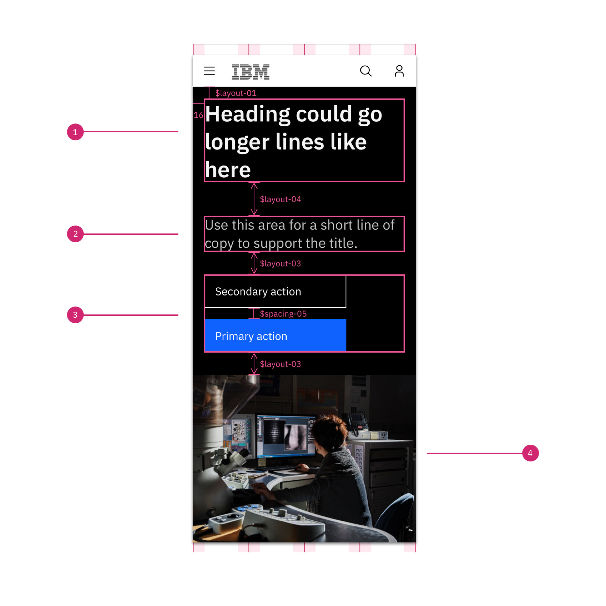

<Caption>$expressive-heading-06 mobile display</Caption>

 

1. **Heading:** \$expressive-heading-06
1. **Short copy:** \$expressive-heading-03
1. **Button group**
1. **Inline image (from background image)** \*optional  width: 100% of container, 4:3

 
 

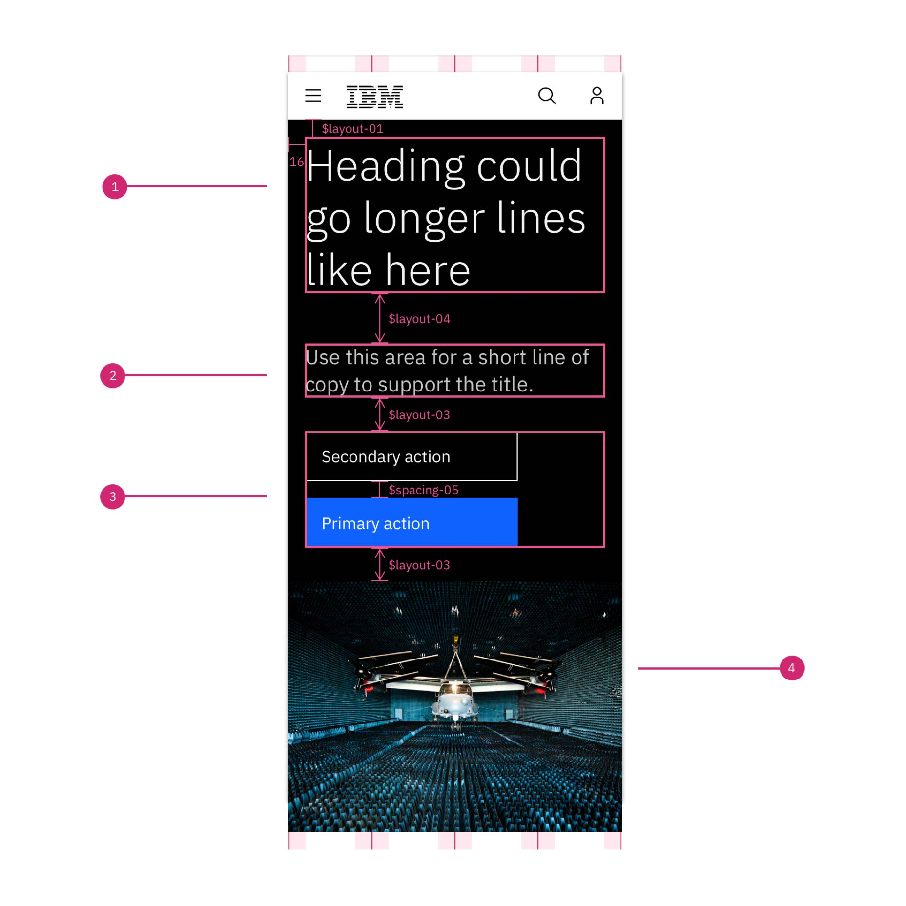

<Caption>$display-01 mobile display</Caption>

 

1. **Heading:** \$display-01
1. **Short copy:** \$expressive-heading-03
1. **Button group**
1. **Inline image (from background image)** \*optional  width: 100% of container, 4:3

### Lead space centered

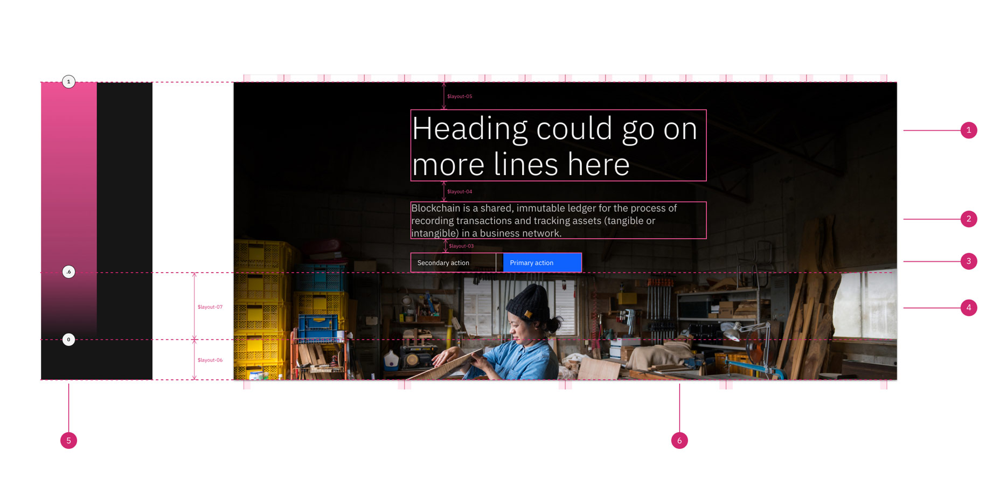

<Caption>
  Example: $display-01 at max breakpoint (1584px) for a Super (640px) lead space
</Caption>

 

1. **Heading:** \$display-01
2. **Short copy:** \$expressive-heading-03
3. **Button group**
4. **Content bottom spacer**  Height: $layout-07 + $layout-06 with background image,  or \$layout-07 without background image
5. **Gradient (applied over image)**
6. **Background image:** cover, width: 100% of container, position: center bottom.

 

<ComponentFooter name="Lead space" type="layout" />

## Resources

<Row className="resource-card-group">

<Column colMd={4} colLg={4} noGutterSm>
    <ResourceCard
      subTitle="Drupal design guide"
      aspectRatio="2:1"
      actionIcon="arrowRight"
      href="http://ibm.biz/Drupal_design_guide"
      >

</ResourceCard>

</Column>

</Row>
