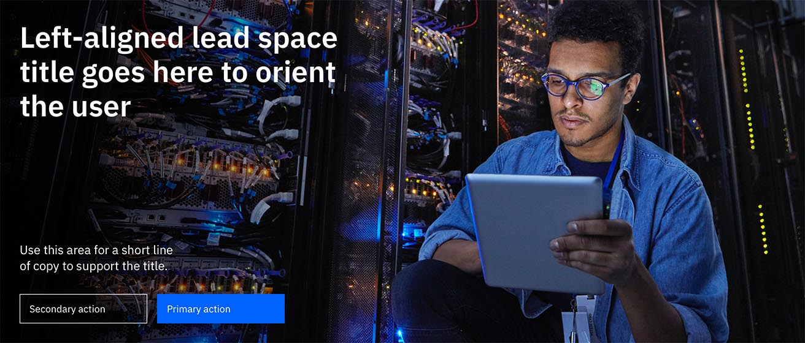
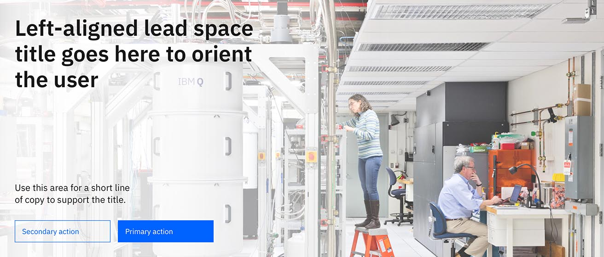
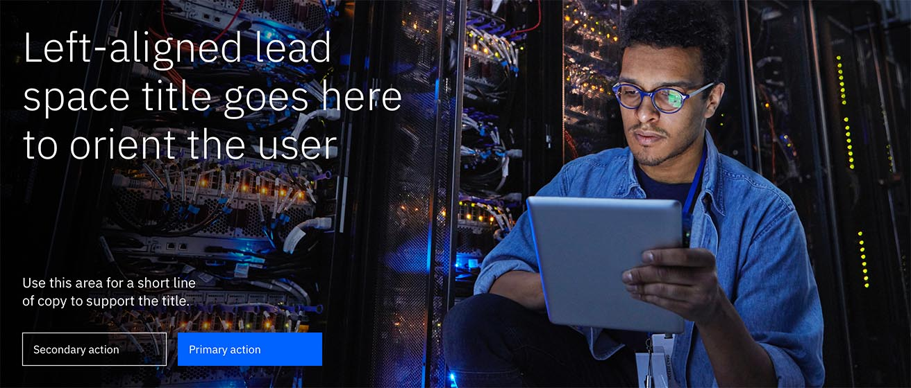
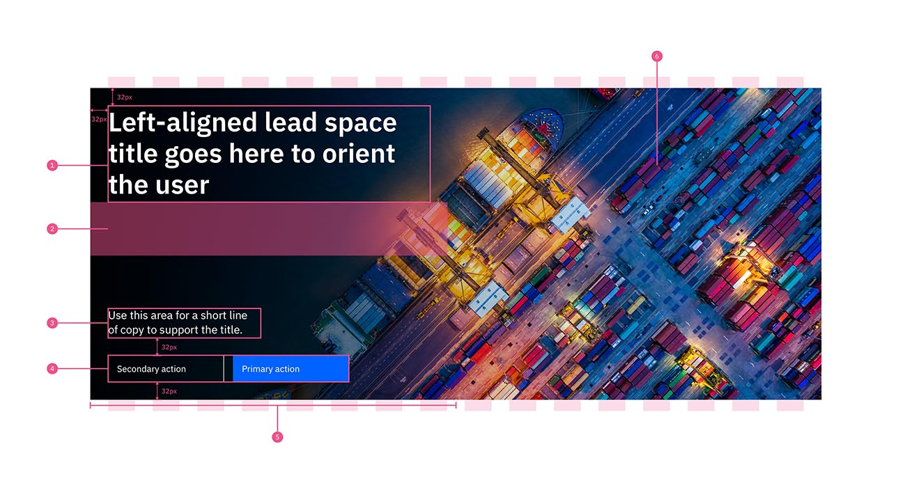
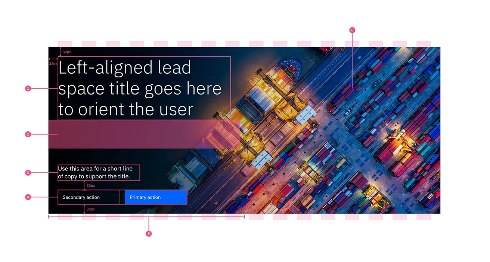
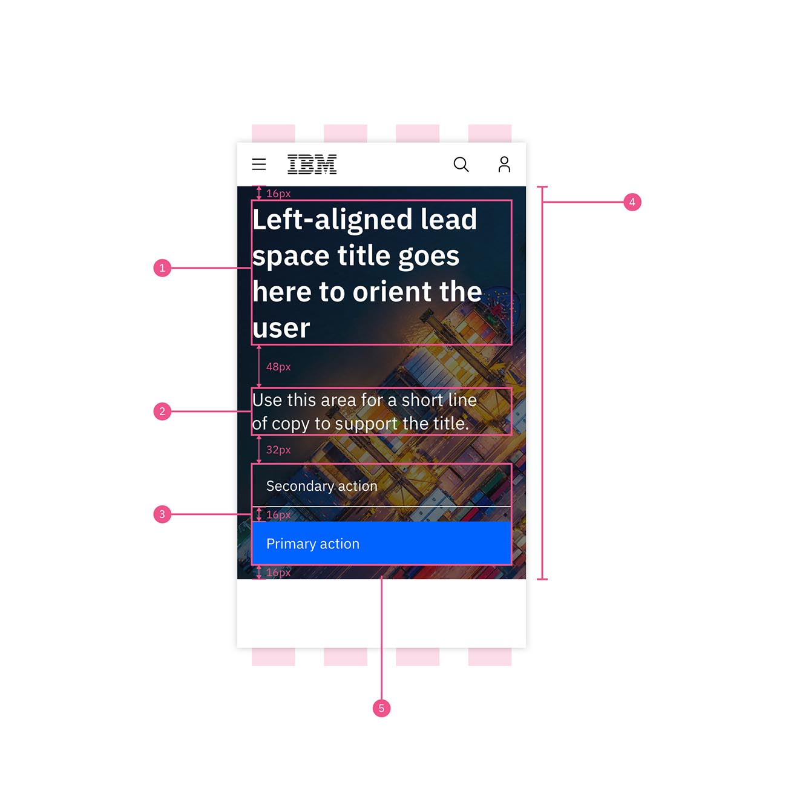
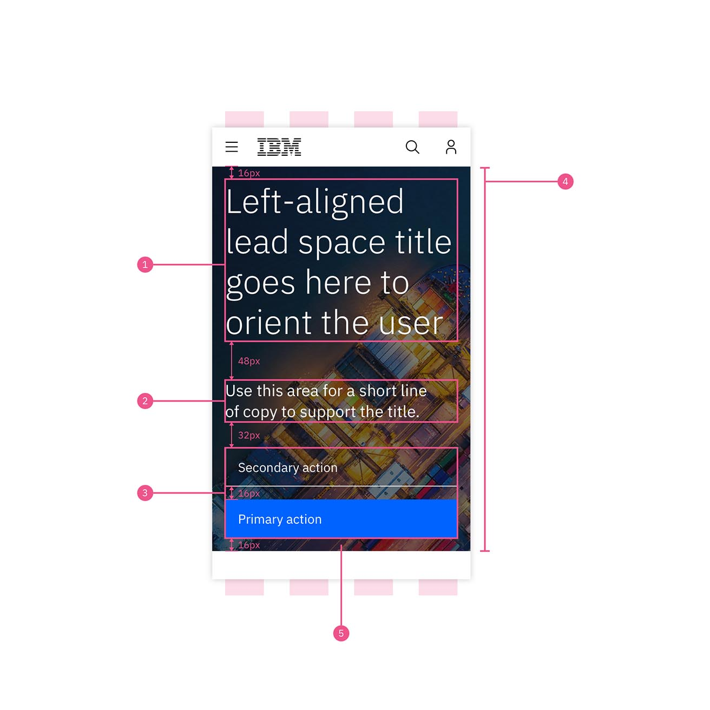

import { ComponentStatus } from 'components/ComponentList';
import ComponentDescription from 'components/ComponentDescription';
import ComponentFeedback from 'components/ComponentFeedback';

<ComponentDescription name="Lead space" type="layout" />

<AnchorLinks>

<AnchorLink>Lead space left-aligned</AnchorLink>
<AnchorLink>Lead space centered</AnchorLink>
<AnchorLink>Content guidance</AnchorLink>
<AnchorLink>Usage guidance</AnchorLink>
<AnchorLink>Color themes</AnchorLink>
<AnchorLink>Left-aligned style options</AnchorLink>
<AnchorLink>Design and functional specifications</AnchorLink>
<AnchorLink>Development documentation</AnchorLink>
<AnchorLink>Resources</AnchorLink>
<AnchorLink>References</AnchorLink>
<AnchorLink>Feedback</AnchorLink>

</AnchorLinks>

## Lead space left-aligned
This is the most commonly used Lead space style. The left-aligned type draws the users' attention to the Lead space messaging immediately. Used in marketing and product pages, among others.

## Lead space centered
This option has 4 empty columns on the left and right to accommodate pages that have content positioned in the center of the 16-column grid. Used in the upcoming Learn page template and other long-form reading experiences.

## Content guidance

| Field | Field type | Required   | Cardinality | Max character size  (English / translated) | Notes |
| -------- | --------- | ---------- | ---------- | ----------| ----------|
| Headline | Short copy | Yes | 1 | XS (65 / 85)| - |
| Description | Short copy | No | 1 | M (120 / 150)| - |
| [Button group](https://www.ibm.com/standards/web/carbon-for-ibm-dotcom/components/button-group) | Component | No | Max of two buttons | - | - |
| [Image](https://www.ibm.com/standards/web/carbon-for-ibm-dotcom/components/image) | Component | No | 1 | - | - |
| Gradient | True/False | Yes | - | - | True - Show gradient (default) False - No gradient |
| Type | Option list | Yes | - | - | Center, Left, or Small |

To see the list of all character count standards, go to this <a href="https://github.com/carbon-design-system/carbon-for-ibm-dotcom-website/wiki/Character-count-standards" target="_blank" rel="noreferrer">link</a>.

## Usage guidance

For detailed guidelines around usage, also reference the [Lead space pattern page](/patterns/lead-space).

## Color themes
There are two color themes to choose from when using Lead space:

* Use `Dark (gray-100)` when the background image has many shadows, is dimly lit, or uses a dark color palette. The gradient overlay will render dark and the text will be white.
* Use `Light (white)` when the background image is well-lit or brightly colored. The gradient overlay will render white and the text will be gray-100.

<Caption>Dark</Caption>
 

<Caption>Light</Caption>

## Left-aligned style options

### Type styles
There are two expressive type styles to choose from when using Lead space left-aligned:

* `$expressive-heading-06` is recommended for pages that surface detailed, productive content to users such as product pages.
* `$display-01` is recommended for pages that have rich editorial, expressive moments such as marketing or campaign pages.

<Caption>$expressive-heading-06 can be used to highlight the name of the product, offering or title of topic. This option is optimal if using all Lead space and components together. </Caption>

 

<Caption>$display-01 can be used to celebrate strong, editorial messaging.</Caption>

### Specifications

<Caption>$expressive-heading-06 at 1312 xlg breakpoint</Caption>

 

1. **Heading:** type: $expressive-heading-06, color: $text-01, width: 95% of container (8 columns)
1. **Content spacer:** Minimum space between lead space heading and short copy: 96px
1. **Short copy:** *optional, type: $expressive-heading-03, color: $text-01, width: 95% of container (4 columns)
1. **Button group:** Use the button group component
1. **Gradient stop:** color: black (#000000), opacity: 75%, linear: left to right, width: 50% of total container width
1. **Background image:** *optional, width: 100% of container for all breakpoints. For detailed guidelines, visit [the imagery section on the Lead space pattern page](/patterns/lead-space#imagery).

 
 

<Caption>$display-01 at 1312 xlg breakpoint</Caption>

 

1. **Heading:** type: $display-01, color: $text-01, width: 95% of container (8 columns)
1. **Content spacer:** Minimum space between lead space heading and short copy: 96px
1. **Short copy:** *optional, type: $expressive-heading-03, color: $text-01, width: 95% of container (4 columns)
1. **Button group:** Use the button group component
1. **Gradient stop:** color: black (#000000), opacity: 75%, linear: left to right, width: 50% of total container width
1. **Background image:** *optional, width: 100% of container for all breakpoints. For detailed guidelines, visit [the imagery section on the Lead space pattern page](/patterns/lead-space#imagery).

 
 

<Caption>$expressive-heading-06 mobile display</Caption>

 

1. **Heading:** type: $display-01, color: $text-01, width: 100% of container (4 columns)
1. **Short copy:** *optional, type: $expressive-heading-03, color: $text-01width: 95% of container (4 columns)
1. **Button group:** Use the button group component
1. **Gradient stop:** color: black (#000000), opacity: 50%, on mobile, gradient overlays the entire image
1. **Background image:** *optional, width: 100% of container, size: 320 X 370

 
 

<Caption>$display-01 mobile display</Caption>

 

1. **Heading:** type: $expressive-heading-06, color: $text-01, width: 100% of container (4 columns)
1. **Short copy:** *optional, type: $expressive-heading-03, color: $text-01, width: 95% of container (4 columns)
1. **Button group:** Use the button group component
1. **Gradient stop:** color: black (#000000), opacity: 50%, on mobile, gradient overlays the entire image
1. **Background image:** *optional, width: 100% of container, size: 320 X 370

## Design and functional specifications

The design specs and functional specs for Lead space can be viewed <a href="https://ibm.box.com/s/d9jey3rlfxqmxu059f0x9dtcx7f5ehuh" target="_blank" rel="noreferrer">here</a>.

## Development documentation

<ComponentStatus name="Lead space" type="layout" />

## Resources

<Row className="resource-card-group">

<Column colMd={4} colLg={4} noGutterSm>
    <ResourceCard
      subTitle="Drupal design guide"
      aspectRatio="2:1"
      actionIcon="arrowRight"
      href="http://ibm.biz/Drupal_design_guide"
      >

 
</ResourceCard>

</Column>

</Row>

## References

### Research findings
* View A/B testing for Lead space video [here](https://lux.w3ibm.mybluemix.net/library/research/71/).
* View A/B testing for buttons vs text [here](https://lux.w3ibm.mybluemix.net/library/research/2/).

<!-- Hiding since this information is duplicative of the dev docs on storybook.

### Developer notes
When viewing the [LeadSpace stories](https://ibmdotcom-patterns-react-experimental.mybluemix.net/?path=/story/leadspace--default-with-image), the knobs to toggle the buttons’ aspects are different for each story due to storybook knob limitations. In the no image story, button text and links can be modified or buttons can be removed entirely by setting the "buttons" knob to an empty array `[ ]`. Notice when editing the “renderIcon” field, the button icons do not reload hence in the image story, there are dropdown selectors to toggle the button icons. When using the LeadSpace, please follow the button structure in the no image story.

For further developer guidance view the LeadSpace README.md [here](https://github.com/carbon-design-system/carbon-for-ibm-dotcom/blob/master/packages/react/src/patterns/sections/LeadSpace/README.md).

-->

<!-- Hiding since this information is duplicative and does not fit in the content model for other pages

## Metadata 
* Components: [Button](https://www.carbondesignsystem.com/components/button/code/)
* Elements: [Photography](https://www.ibm.com/design/language/elements/photography/overview/)
* Github: [Carbon for IBM.com](https://github.com/carbon-design-system/carbon-for-ibm-dotcom)
-->

## Feedback

<ComponentFeedback />
