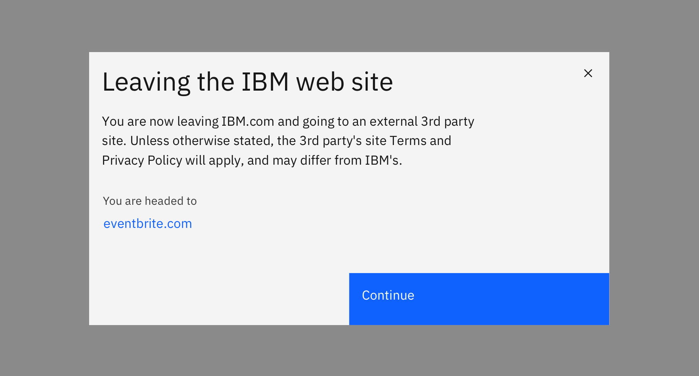

import ComponentDescription from 'components/ComponentDescription';
import ComponentFooter from 'components/ComponentFooter';
import ResourceLinks from 'components/ResourceLinks';

<ComponentDescription name="Leaving IBM modal" type="ui" />

<AnchorLinks>

<AnchorLink>Overview</AnchorLink>
<AnchorLink>Resources</AnchorLink>
<AnchorLink>Feedback</AnchorLink>

</AnchorLinks>

## Overview

Leaving IBM modal is intended for use when there is a need to link to a web pages or website outside of the ibm.com domain.

Do not apply this notice to all external links. Use this notice only when the
user leaves the ibm.com domain to complete a service or transaction (such as
commerce or to register for a conference or webinar) on behalf of IBM. For
example, when purchasing a product from IBM Marketplace, a user may choose to
use PayPal as a payment method. When they leave ibm.com to go to the PayPal site
to complete the transaction, the Leaving IBM overlay would be displayed.

If the destination URL contains parameters, it must be URL encoded to work
properly.

The link URL must be preceded with `//www.ibm.com/links/?url=`

Use the external link icon class.

When linking to the external site of a company that IBM has recently acquired,
do not use the Leaving IBM notice. When a user clicks on an external link it will
launch the Leaving IBM overlay to help users understand they are leaving
IBM.com. It includes a brief message about a possible change in terms, and the
host name of the external site is displayed to be transparent.

<Row>
<Column colMd={8} colLg={8}>

</Column>
</Row>

<ResourceLinks name="Leaving IBM modal" type="ui" />

<ComponentFooter name="Leaving IBM modal" type="ui" />
