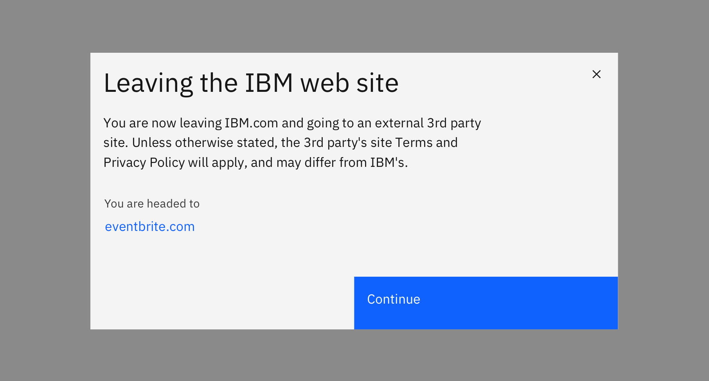

import { ComponentStatus } from "components/ComponentList";
import ComponentDescription from "components/ComponentDescription";
import ComponentFeedback from "components/ComponentFeedback";

<ComponentDescription name="Leaving IBM" type="ui" />

<AnchorLinks>

<AnchorLink>Default</AnchorLink>
<AnchorLink>Design and functional specifications</AnchorLink>
<AnchorLink>Development documentation</AnchorLink>
<AnchorLink>Feedback</AnchorLink>

</AnchorLinks>

## Default

When a use clicks on an external link it will launch the Leaving IBM overlay to help users understand they are leaving IBM.com. It includes a brief message about a possible change in terms, and the host name of the external site is displayed to be transparent.

<Row>
<Column colMd={8} colLg={8}>

</Column>
</Row>

## Design and functional specifications

The design specs and functional specs for Back to top can be viewed <a href="https://ibm.box.com/s/g79wdwdj0syjcfkdlgu5rpwe3zp9s37w" target="_blank" rel="noreferrer">here</a>.

## Development documentation

<ComponentStatus name="Leaving IBM" type="ui" />

## Feedback

<ComponentFeedback />
