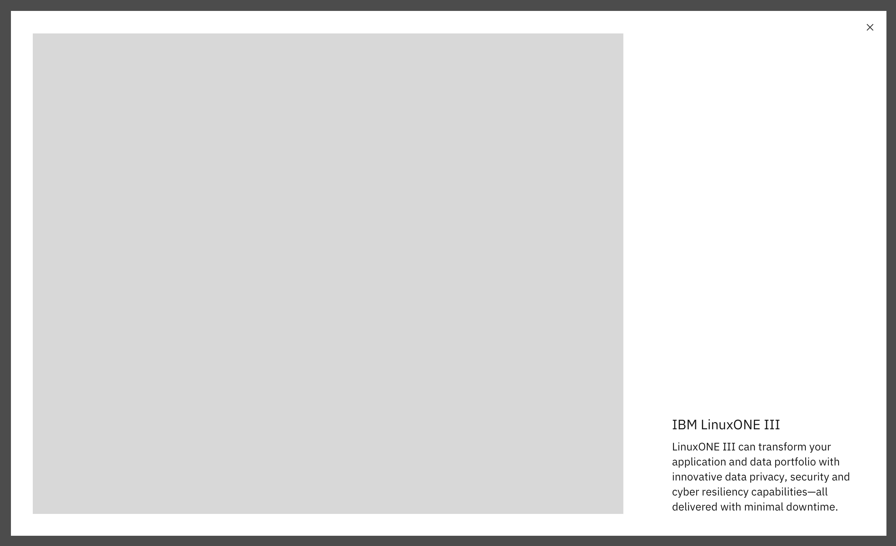

import ComponentDescription from 'components/ComponentDescription';
import ComponentFooter from 'components/ComponentFooter';
import ResourceLinks from 'components/ResourceLinks';

<ComponentDescription name="Lightbox media viewer" type="ui" />

<AnchorLinks>

<AnchorLink>Resources</AnchorLink>
<AnchorLink>Overview</AnchorLink>
<AnchorLink>Content guidance</AnchorLink>
<AnchorLink>Feedback</AnchorLink>

</AnchorLinks>

<ResourceLinks name="Lightbox media viewer" type="ui" />

## Overview

The Lightbox media viewer consists of an static image or video, heading, and description. The image size should be at 1x1, 2x1, 16x9, 15x4 and 12x11 aspect ratios. The video size should be at 16x9 aspect ratios.

<Row>
<Column colMd={8} colLg={8}>

</Column>
</Row>

<Title>Use case</Title>

## Content guidance

| Element                                                               | Content type                                                                                                                       | Required | Instances | Character limit  (English / translated) | Notes                                                                                                                   |
| --------------------------------------------------------------------- | ---------------------------------------------------------------------------------------------------------------------------------- | -------- | --------- | ------------------------------------------- | ----------------------------------------------------------------------------------------------------------------------- |
| Heading                                                               | Text                                                                                                                               | No       | 1         | 40 / 55                                     |                                                                                                                         |
| Copy                                                                  | Text                                                                                                                               | No       | 1         | 200 / 260                                   |                                                                                                                         |
| Media                                                                 | [Image](https://www.ibm.com/standards/carbon/components/images/) or [Video](https://www.ibm.com/standards/carbon/components/video) | Yes      | 1         | –                                           | The image size should be at 1x1, 2x1, 16x9, 15x4 or 12x11 aspect ratios. The video size should be at 16x9 aspect ratio. |
| Image alt text                                                        | Text                                                                                                                               | No       | 1         | 75 / 100                                    | Image description for accessibility.                                                                                    |
| [Carousel](https://www.ibm.com/standards/carbon/components/carousel/) | Component                                                                                                                          | No       | 1         | –                                           | Can be included to help view, and navigate between two or more pieces of media content.                                 |

<ComponentFooter name="Lightbox media viewer" type="ui" />
