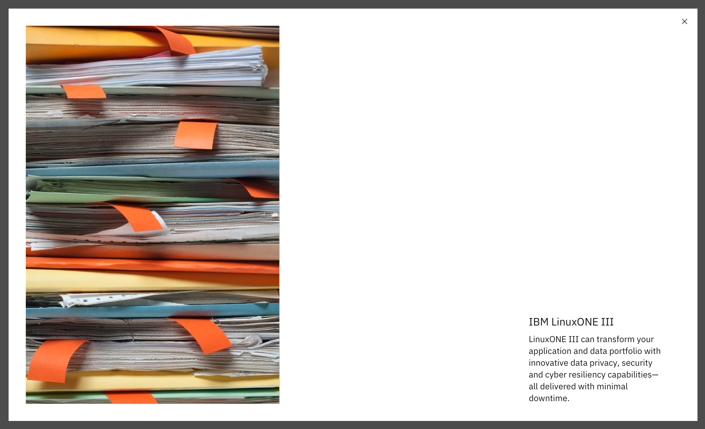

<PageDescription>

The Lightbox media viewer allows the user to view an image or video at a larger size within a modal.

</PageDescription>

<AnchorLinks>

<AnchorLink>Default</AnchorLink>
<AnchorLink>Design and functional specifications</AnchorLink>
<AnchorLink>Development documentation</AnchorLink>
<AnchorLink>Feedback</AnchorLink>

</AnchorLinks>

## Default
The Lightbox media viewer consists of an static image or video, heading, and description. The image size should be at 1x1, 2x1, 16x9, 15x4 and 12x11 aspect ratios. The video size should be at 16x9 aspect ratios.
<Row>
<Column colMd={8} colLg={8}>

</Column>
</Row>

<Title>Use case</Title>

## Design and functional specifications

The design specs and functional specs for Lightbox media viewer can be viewed <a href="https://ibm.box.com/s/mpeo1wy0jogkwxn68fahlg62q799ixox" target="_blank">here</a>.

## Development documentation

| Language      | Status        | Sandbox                                                                              |
| ------------- | -----------   | ------------------------------------------------------------------------             |
| React         | 
<pre>Stable</pre>
        | <a href="https://ibmdotcom-react.mybluemix.net/?path=/story/components-lightboxmediaviewer--default" target="_blank">View storybook</a>     |
| Web Components       | 
<pre>Under construction</pre>
  | Coming soon      |

## Feedback

Help us improve this component by providing feedback, asking questions, and leaving any other comments on <a href="https://github.com/carbon-design-system/ibm-dotcom-library" target="_blank">GitHub</a>.
