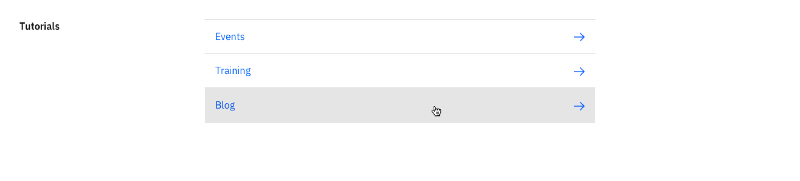
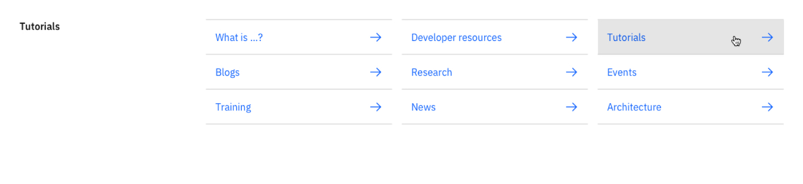

import ComponentDescription from 'components/ComponentDescription';
import ComponentFooter from 'components/ComponentFooter';
import ResourceLinks from 'components/ResourceLinks';

<ComponentDescription name="Link list section" type="ui" />

<AnchorLinks>

<AnchorLink>Resources</AnchorLink>
<AnchorLink>Overview</AnchorLink>
<AnchorLink>Variations</AnchorLink>
<AnchorLink>Content guidance</AnchorLink>
<AnchorLink>Feedback</AnchorLink>

</AnchorLinks>

<ResourceLinks name="Link list section" type="ui" />

## Overview

The Link list section displays links in a list format with a semibold heading on the left side.

<Row>
<Column colMd={8} colLg={8}>

</Column>
</Row>

 

## Variations

### One to three links

This variation divides the content’s remaining 8 column layout into 1 column when there are 1 to 3 links.

<Row>
<Column colMd={8} colLg={8}>

</Column>
</Row>

### Four to six links

This variation divides the content’s remaining 8 column layout into 2 columns when there are 4 to 6 links.

<Row>
<Column colMd={8} colLg={8}>

</Column>
</Row>

### Seven or more links

This variation divides the content’s remaining 12 column layout into 3 columns when there are 7 or more links.

<Row>
<Column colMd={8} colLg={8}>

</Column>
</Row>

## Content guidance

| Element                                                     | Content type | Required | Instances | Character limit  (English / translated) | Notes                                                                                                       |
| ----------------------------------------------------------- | ------------ | -------- | --------- | ------------------------------------------- | ----------------------------------------------------------------------------------------------------------- |
| Heading                                                     | Text         | Yes      | 1         | 40 / 55                                     |                                                                                                             |
| [CTA](https://www.ibm.com/standards/carbon/components/cta/) | Component    | Yes      | Max 16    | 40 / 55                                     | Uses [Link list end of section](https://www.ibm.com/standards/carbon/components/link-list/#end-of-section). |

For more information, see the [character count standards](https://www.ibm.com/standards/carbon/guidelines/content#character-count-standards).

<ComponentFooter name="Link list section" type="ui" />
