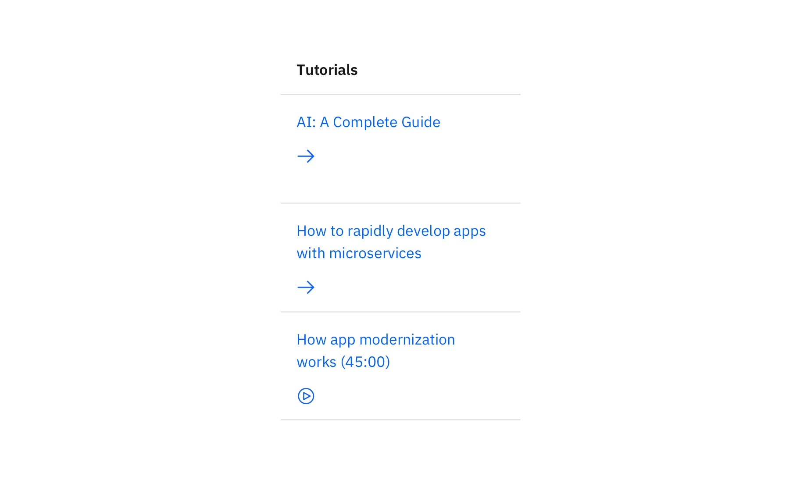
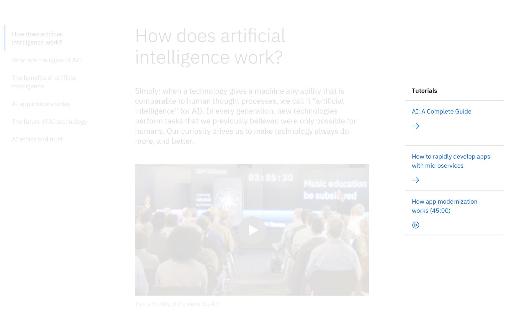
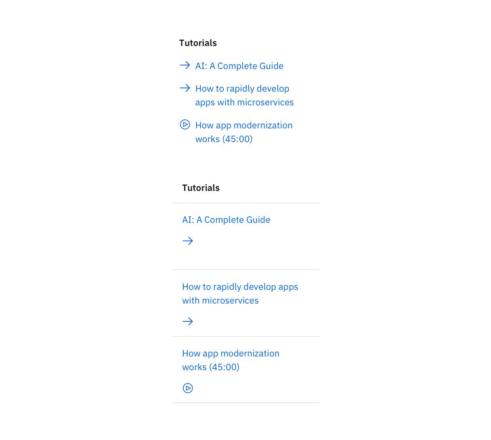
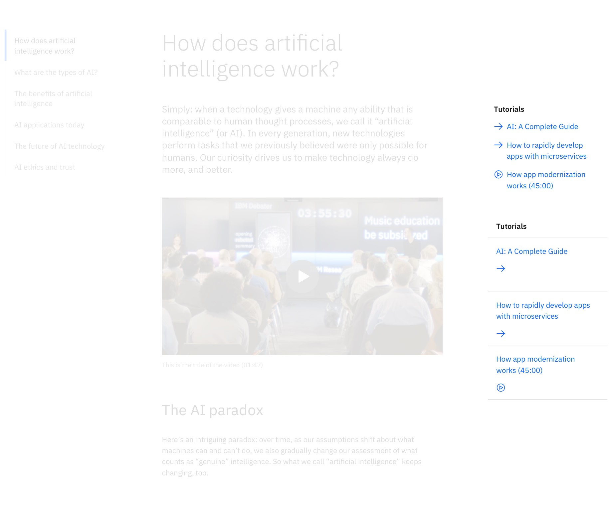
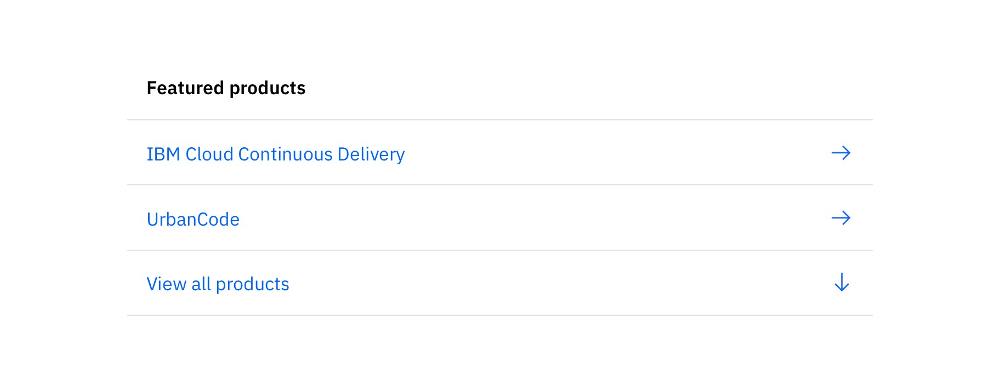
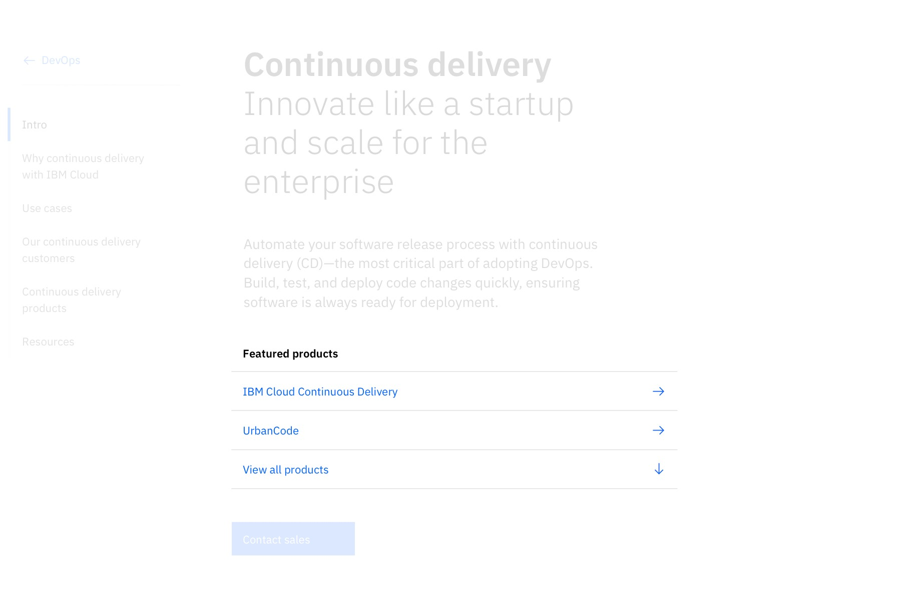

import ComponentDescription from 'components/ComponentDescription';
import ComponentFooter from 'components/ComponentFooter';
import ResourceLinks from 'components/ResourceLinks';

<ComponentDescription name="Link list" type="ui" />

<AnchorLinks>

<AnchorLink>Resources</AnchorLink>
<AnchorLink>Overview</AnchorLink>
<AnchorLink>Variations</AnchorLink>
<AnchorLink>Content guidance</AnchorLink>
<AnchorLink>Feedback</AnchorLink>

</AnchorLinks>

<ResourceLinks name="Link list" type="ui" />

## Overview

The Link list displays links in a card format, with a semibold heading and the icon shown below the link text. It is
typically used for resource links on the side of the main page content.

<Row>
<Column colMd={8} colLg={8}>

</Column>
</Row>

<Title>Use case</Title>

 

## Variations

### Vertical

This variation displays links as a minimal, vertical list with an icon. It is typically used for resource links on the
side of the main page content and features options to include a semibold heading or a horizontal rule at the bottom. The
icons can be placed on the left or right side of the text.

<Row>
<Column colMd={8} colLg={8}>

</Column>
</Row>

<Title>Use case</Title>

<!-- Vertical with cards is not currently used in an existing pattern or component, so the section below is commented out, until an active use case surfaces. -->

<!--
### Vertical with cards
Link list – vertical with cards combines Link list – vertical and the default Link list, stacked one on top of the other, respectively. This variation is typically used for varying resource links on the side of the main content of the page.

<Row>
<Column colMd={8} colLg={8}>

</Column>
</Row>

<Title>Use case</Title>

 -->

### End of section

This variation displays links as a vertical list with a semibold heading, divided by a horizontal rule, where icons
appear to the far right of the text. It is typically used at the end of a content section to list a number of CTAs for
the user.

<Row>
<Column colMd={8} colLg={8}>

</Column>
</Row>

<Title>Use case</Title>

 

## Content guidance

| Element                                                          | Content type | Required | Instances | Character limit  (English / translated) | Notes                                                |
| ---------------------------------------------------------------- | ------------ | -------- | --------- | ------------------------------------------- | ---------------------------------------------------- |
| Heading                                                          | Text         | Yes      | 1         | 30 / 45                                     | Not required for horizontal and vertical variations. |
| [CTA](https://www.ibm.com/standards/carbon/components/cta/#text) | Component    | Yes      | 2–3       | 40 / 55                                     | Text style CTA is required.                          |

For more information, see the [character count standards](https://www.ibm.com/standards/carbon/guidelines/content#character-count-standards).

<ComponentFooter name="Link list" type="ui" />
