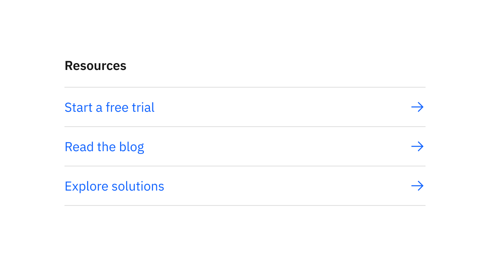
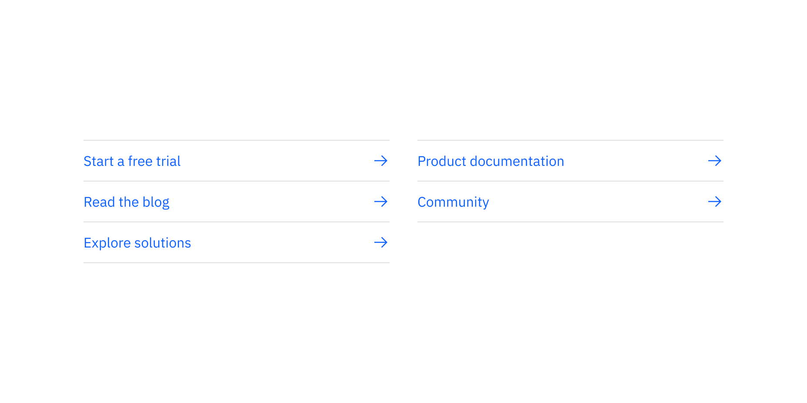
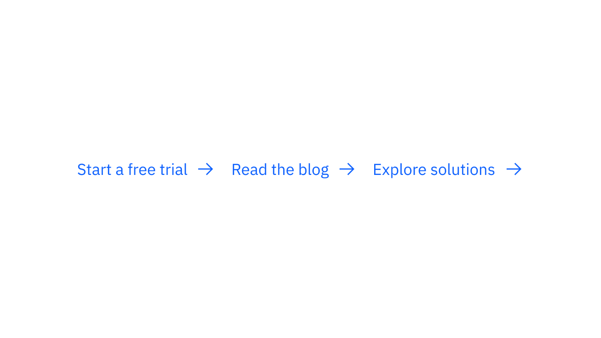
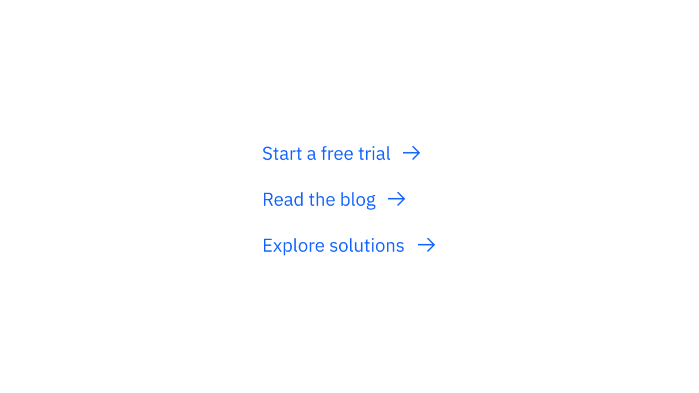

import ComponentDescription from 'components/ComponentDescription';
import ComponentFooter from 'components/ComponentFooter';
import ResourceLinks from 'components/ResourceLinks';

<ComponentDescription name="Link list" type="ui" />

<AnchorLinks>

<AnchorLink>Overview</AnchorLink>
<AnchorLink>Variations</AnchorLink>
<AnchorLink>Content guidance</AnchorLink>
<AnchorLink>Resources</AnchorLink>
<AnchorLink>Feedback</AnchorLink>

</AnchorLinks>

## Overview

The Link list displays links in a group format, with subtle divider lines, an optinal heading and the icon shown to the right of the link text. It is
typically used for resource links on the side of the main page content.

<Row>
<Column colMd={8} colLg={8}>

</Column>
</Row>

## Variations

### End of section

This variation displays is similar to the default variation and can support up to 16 CTAs. It is typically used at the end of a paragraph or content section to list a number of CTAs for
the user and will spread the links out across the grid based on the number of CTAs.

### Horizontal

This variation displays links in a horizontal row with an icon. It is typically used within the main body of the page.

<Row>
<Column colMd={8} colLg={8}>

</Column>
</Row>

### Vertical

This variation displays links as a minimal, vertical list with an icon. It is typically used for resource links on the
side of the main page content and features options to include a semibold heading or a horizontal rule at the bottom. The
icons can be placed on the left or right side of the text.

<Row>
<Column colMd={8} colLg={8}>

</Column>
</Row>

## Content guidance

| Element                                                          | Content type | Required | Instances     | Character limit  (English / translated) | Notes                                                                            |
| ---------------------------------------------------------------- | ------------ | -------- | ------------- | ------------------------------------------- | -------------------------------------------------------------------------------- |
| Heading                                                          | Text         | No       | 1             | 30 / 45                                     | Not required for horizontal and vertical variations.                             |
| [CTA](https://www.ibm.com/standards/carbon/components/cta/#text) | Component    | Yes      | 2–3; up to 16 | 40 / 55                                     | Text style CTA is required. The end of section variant can support up to 16 CTAs |

For more information, see the [character count standards](https://www.ibm.com/standards/carbon/guidelines/content#character-count-standards).

<ResourceLinks name="Link list" type="ui" />

<ComponentFooter name="Link list" type="ui" />
