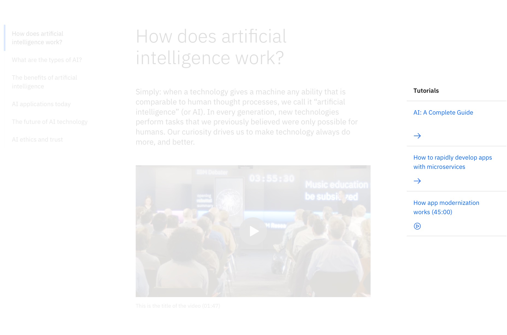
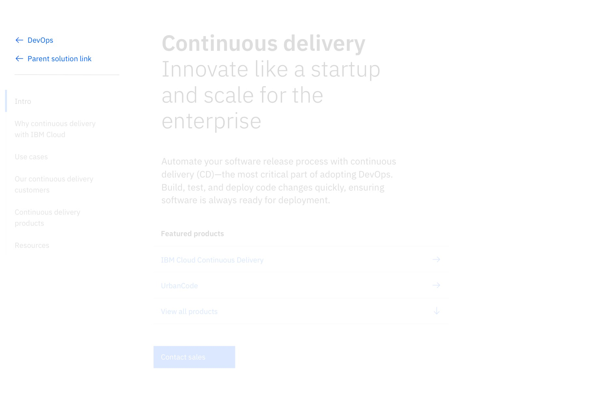

<PageDescription>

The Link list component is used to present links as a group.

</PageDescription>

<AnchorLinks>

<AnchorLink>Default</AnchorLink>
<AnchorLink>Variations</AnchorLink>
<AnchorLink>Design and functional specifications</AnchorLink>
<AnchorLink>Development documentation</AnchorLink>
<AnchorLink>Feedback</AnchorLink>

</AnchorLinks>

## Default
The Link list displays links in a card format, with a semibold heading and the icon shown below the link text. It is typically used for resource links on the side of the main page content.

<Row>
<Column colMd={8} colLg={8}>

</Column>
</Row>

<Title>Use case</Title>

## Variations

### Vertical
Link list – vertical displays links as a minimal, vertical list with a semibold heading, where icons can be placed on the left or right side of the text. This variation is typically used for resource links on the side of the main page content.

<Row>
<Column colMd={8} colLg={8}>

</Column>
</Row>

<Title>Use case</Title>

### Vertical with cards
Link list – vertical with cards combines Link list – vertical and the default Link list, stacked one on top of the other, respectively. This variation is typically used for varying resource links on the side of the main content of the page.

<Row>
<Column colMd={8} colLg={8}>

</Column>
</Row>

<Title>Use case</Title>

### End of section
Link list – end of section displays links as a vertical list with a semibold heading, divided by a horizontal rule, where icons appear to the far right of the text. This variation is typically used at the end of a section of content to list a number of CTAs for the user.

<Row>
<Column colMd={8} colLg={8}>

</Column>
</Row>

<Title>Use case</Title>

## Design and functional specifications

The design specs and functional specs for Link list can be viewed [here](https://ibm.box.com/s/dgnfrnpaqepbuyifa04aoc091v4cnz3d).

## Development documentation

| Language      | Status        | Sandbox                                                                              |
| ------------- | -----------   | ------------------------------------------------------------------------             |
| React         | 
<pre>Stable</pre>
        | [View storybook](https://ibmdotcom-react.mybluemix.net/?path=/story/components-linklist--default)     |
| Web Components       | 
<pre>Under construction</pre>
  |

## Feedback

Help us improve this component by providing feedback, asking questions, and leaving any other comments on <a href="https://github.com/carbon-design-system/ibm-dotcom-library" target="_blank">GitHub</a>.
