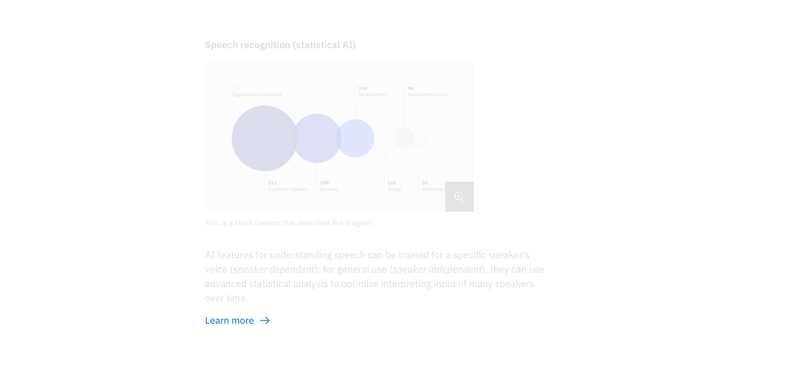

import ComponentDescription from 'components/ComponentDescription';
import ComponentFooter from 'components/ComponentFooter';
import ResourceLinks from 'components/ResourceLinks';

<ComponentDescription name="Link with icon" type="ui" />

<AnchorLinks>

<AnchorLink>Resources</AnchorLink>
<AnchorLink>Overview</AnchorLink>
<AnchorLink>Content guidance</AnchorLink>
<AnchorLink>Feedback</AnchorLink>
  
</AnchorLinks>

<ResourceLinks name="Link with icon" type="ui" />

## Overview

Link with icon should not be used within a paragraph. The icon can be placed on the left or right side of the text and is vertically centered.

<Row>
<Column colMd={8} colLg={8}>

</Column>
</Row>

<Title>Use case</Title>

## Content guidance

| Element                                                                  | Content type | Required | Instances | Character limit  (English / translated) | Notes |
| ------------------------------------------------------------------------ | ------------ | -------- | --------- | ------------------------------------------- | ----- |
| [CTA (text)](https://www.ibm.com/standards/carbon/components/cta#styles) | Link         | No       | 1         | 20 / 32                                     |       |

<ComponentFooter name="Link with icon" type="ui" />
