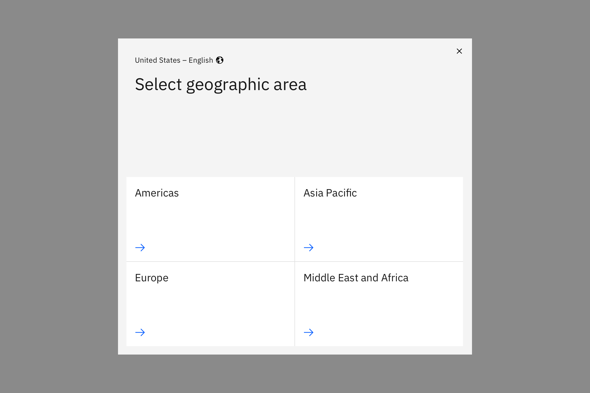
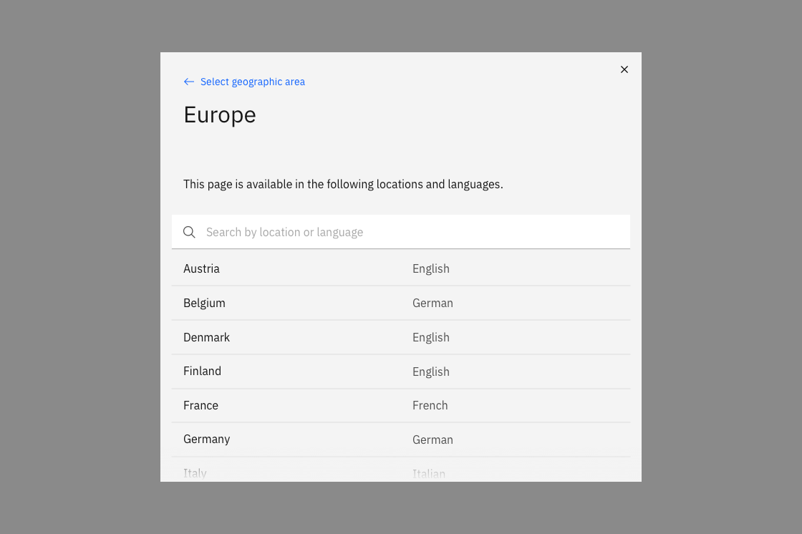

import ComponentDescription from 'components/ComponentDescription';
import ComponentFooter from 'components/ComponentFooter';
import ResourceLinks from 'components/ResourceLinks';

<ComponentDescription name="Locale modal" type="ui" />

<AnchorLinks>

<AnchorLink>Resources</AnchorLink>
<AnchorLink>Overview</AnchorLink>
<AnchorLink>Feedback</AnchorLink>

</AnchorLinks>

<ResourceLinks name="Locale modal" type="ui" />

## Overview

The Locale modal provides the option to select a geographic regions and languages. This modal is triggered by the Locale Selector button in the Footer. The user's current location is indicated at the top left of the modal.

<Row>
<Column colMd={8} colLg={8}>

</Column>
</Row>
<Caption>The first state of the modal displays region options.</Caption>

The user can click or tap a region to view a searchable list of locations and languages. They can select an option to reload the page as the corresponding location and language.

<Row>
<Column colMd={8} colLg={8}>

</Column>
</Row>
<Caption>The second state of the modal displays a searchable list of location and language pairings.</Caption>

<ComponentFooter name="Locale modal" type="ui" />
