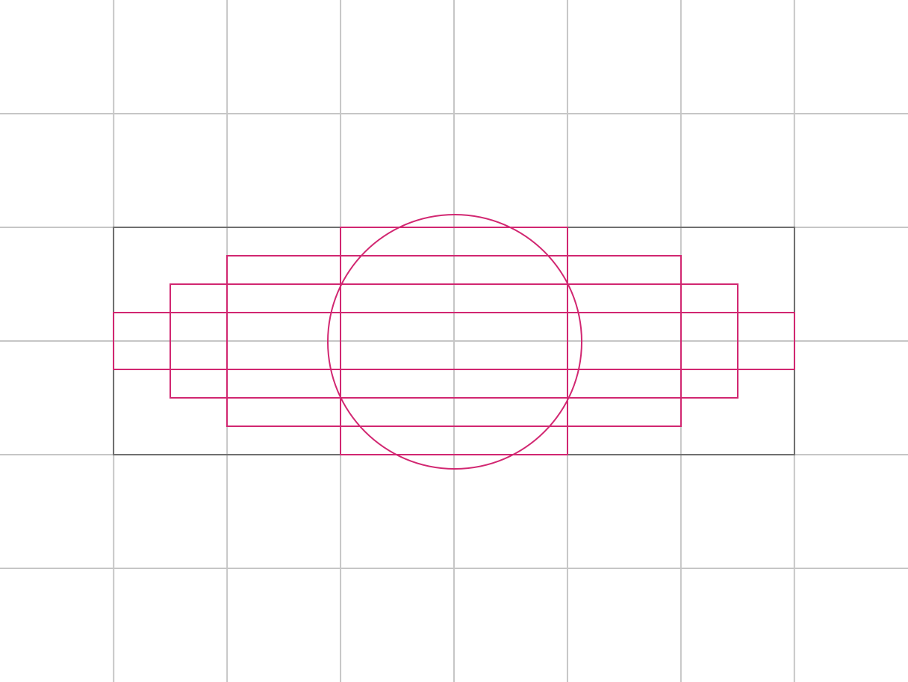
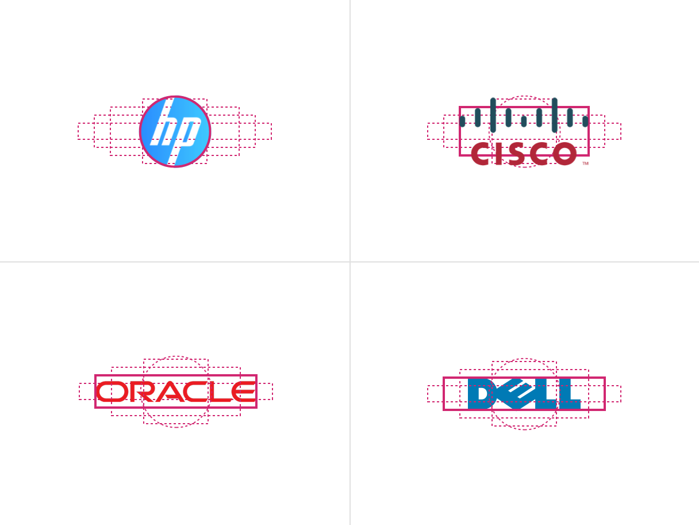
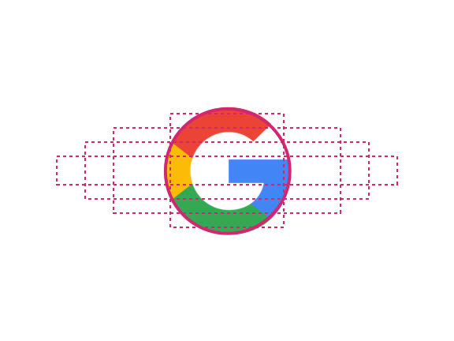

import ComponentDescription from 'components/ComponentDescription';
import ComponentFooter from 'components/ComponentFooter';
import ResourceLinks from 'components/ResourceLinks';

<ComponentDescription name="Logo grid" type="layout" />

<AnchorLinks>

<AnchorLink>Resources</AnchorLink>
<AnchorLink>Overview</AnchorLink>
<AnchorLink>Logo placement</AnchorLink>
<AnchorLink>Content guidance</AnchorLink>
<AnchorLink>Feedback</AnchorLink>

</AnchorLinks>

<ResourceLinks name="Logo grid" type="layout" />

## Overview

Logo grid consists of a heading and a group of logos. Each logo should be contained inside a space (4:3 aspect ratio)
and the logos are not clickable.

 

## Logo placement

Logos should be centered within a 4:3 aspect ratio to create optical alignment, visual hierarchy, and ensure all brands
have equal representation.

### Grid template

Use the [logo grid template](https://ibm.box.com/s/t85vh5blf8lbya13ro2c40pzp49m5es1) to size logos and align them within
the varying grid guides to achieve equal visual hierarchy.

<Row>

<Column colMd={8} colLg={8}>

<Caption>Logo grid template</Caption>

</Column>

</Row>

The grid is meant to be used as a guideline. Make optical adjustments when necessary.

<Row>

<Column colMd={8} colLg={8}>

<Caption>Example of logos within the logo grid</Caption>

</Column>

</Row>

<Row className="resource-card-group">
  <Column colMd={4} colLg={4} noGutterSm>
<ResourceCard
  subTitle="Logo placement grid"
  href="https://ibm.box.com/s/t85vh5blf8lbya13ro2c40pzp49m5es1"
>

</ResourceCard>
</Column>
</Row>

### Tips and techniques

#### Alignment

Logos should be vertically and horizontally centered within a 4:3 aspect ratio. Consider the weight, width, and height
when aligning the logo to the grid to find equal weight with all logos. Don’t fit every logo to the max width.

<DoDontRow>
  <DoDont caption="Always place logo in the center of the template and scale to fit the height or width within the logo grid guides.">

  </DoDont>
  <DoDont type="dont" caption="Don't scale every logo to the max width.">

  </DoDont>
</DoDontRow>

#### Orientation

When available, use horizontally-oriented logos to fit comfortably within the grid and to maintain visual hierarchy.

<DoDontRow>
  <DoDont caption="Horizontally oriented logos are easier to fit within the grid template to maintain optical hierarchy with other logos.">

  </DoDont>
  <DoDont type="dont" caption="Avoid using vertically oriented logos that don’t fit nicely within the grid template.">

  </DoDont>
</DoDontRow>

#### Type

Use logos that include the company name or wordmark, rather than an icon, to ensure brand recognition.

<DoDontRow>
  <DoDont caption="Use logos with the brand name or wordmark.">

  </DoDont>
  <DoDont type="dont" caption="Avoid using icon-only logos to ensure brand recognition.">

  </DoDont>
</DoDontRow>

#### Color

When placed in a group, ensure visual consistency by using either all full-color logos or all monotone logos. Don’t mix
full color and monotone, unless the brand colors are black and white.

<DoDontRow>
  <DoDont caption="Do use full color logos when placed in a group.">

  </DoDont>
  <DoDont type="dont" caption="Don't mix full-color and monotone logos when placed in a group.">

  </DoDont>
</DoDontRow>

## Content guidance

| Element                                                         | Content type                                                    | Required | Instances | Character limit  (English / translated) | Notes                                   |
| --------------------------------------------------------------- | --------------------------------------------------------------- | -------- | --------- | ------------------------------------------- | --------------------------------------- |
| Heading                                                         | Text                                                            | Yes      | 1         | 75 / 100                                    |                                         |
| Media                                                           | [Image](https://www.ibm.com/standards/carbon/components/images) | Yes      | 3–12      | –                                           |                                         |
| Image alt text                                                  | Text                                                            | No       | 3–12      | 75 / 100                                    | Image description(s) for accessibility. |
| [CTA](https://www.ibm.com/standards/carbon/components/cta#card) | Component                                                       | No       | 1         | –                                           | Local type and card style only.         |

For more information, see the [character count standards](https://www.ibm.com/standards/carbon/guidelines/content#character-count-standards).

<ComponentFooter name="Logo grid" type="layout" />
