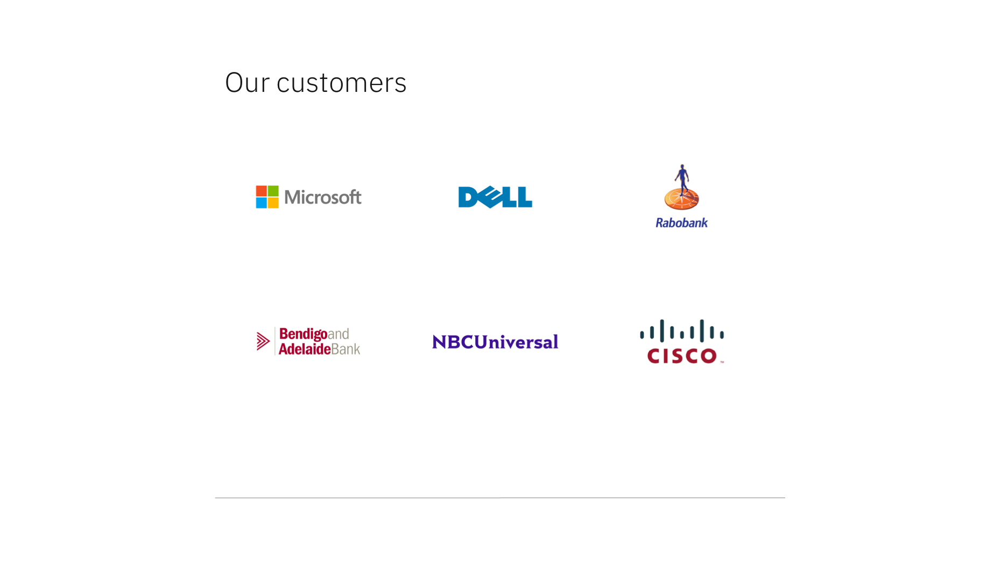

import ComponentDescription from "components/ComponentDescription";
import ComponentFooter from "components/ComponentFooter";

<ComponentDescription name="Logo grid" type="layout" />

<AnchorLinks>

<AnchorLink>Default</AnchorLink>
<AnchorLink>Content guidance</AnchorLink>
<AnchorLink>Design and functional specifications</AnchorLink>
<AnchorLink>Development documentation</AnchorLink>
<AnchorLink>Feedback</AnchorLink>

</AnchorLinks>

## Default

Logo grid consists of a heading and a group of logos. Each logo should be contained inside a space (4:3 aspect ratio) and the logos are not clickable.

 

## Content guidance

| Field                                                                                | Field type | Required | Cardinality | Max character size (English / translated) |
| ------------------------------------------------------------------------------------ | ---------- | -------- | ----------- | ----------------------------------------- |
| Headline                                                                             | Short copy | No       | 1           | S (75 / 100)                              |
| [Image](https://www.ibm.com/standards/web/carbon-for-ibm-dotcom/components/image)    | Component  | Yes      | 3–12        | –                                         |
| [CTA (card)](https://www.ibm.com/standards/web/carbon-for-ibm-dotcom/components/cta) | Component  | No       | 1           | –                                         |

To see the list of all character count standards, go to this <a href="https://github.com/carbon-design-system/carbon-for-ibm-dotcom-website/wiki/Character-count-standards" target="_blank" rel="noreferrer noopener nofollow">link</a>.

<ComponentFooter name="Logo grid" type="layout" />
