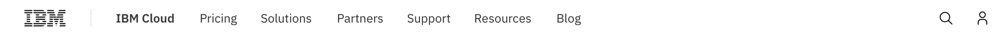
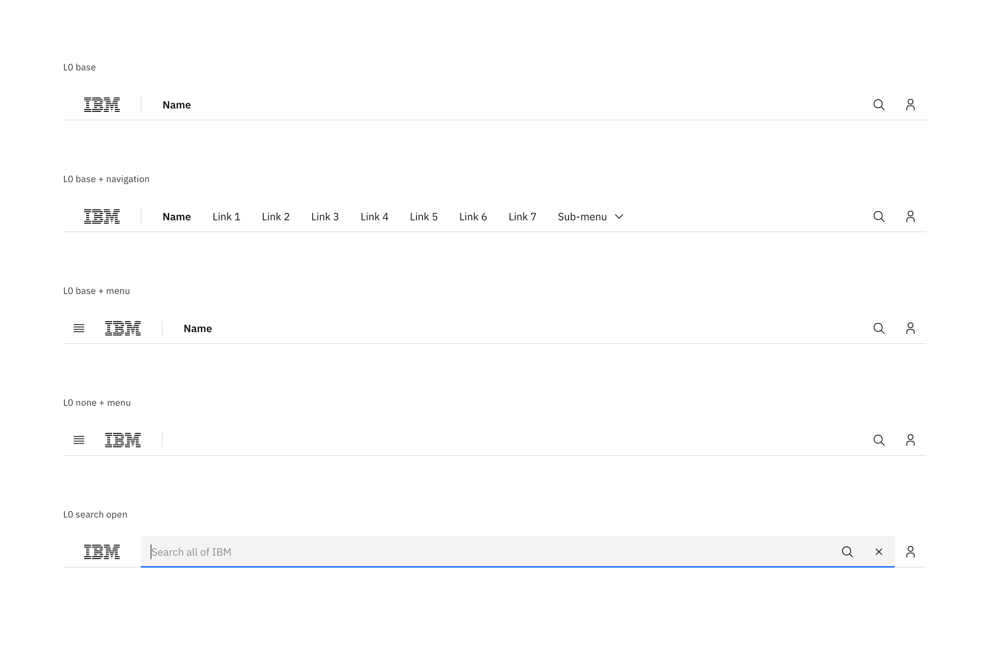
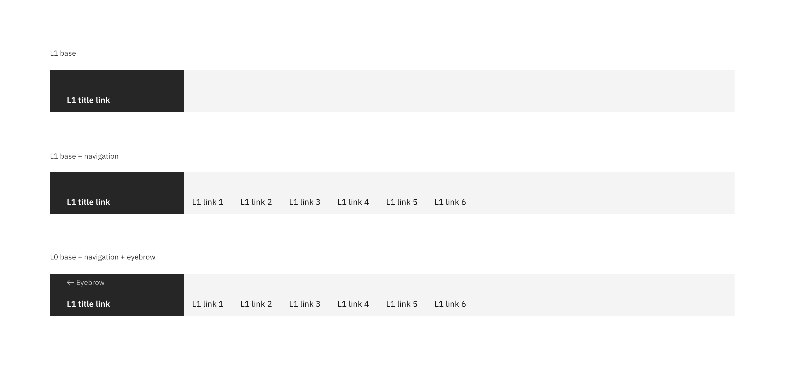
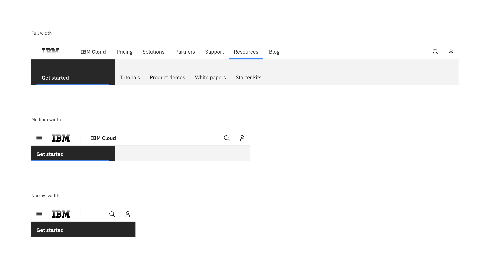

<PageDescription>

The masthead is a fundamental navigational component for IBM.com that displays consistently at the top of each page. It also includes search and profile services for IBM.com. 

</PageDescription>

## Masthead Level 0

## Masthead Level 1

## Documentation

| Language      | Status        | Sandbox                                                                              |
| ------------- | -----------   | ------------------------------------------------------------------------             |
| React         | Stable        | [View sandbox](https://ibmdotcom-react.netlify.com/?path=/story/masthead--default)   |
| Vanilla       | Coming soon   |                                                                                      |

## Formatting 

### Types

| Name          | Description                                                                          |
| ------------- | ------------------------------------------------------------------------             |
| Default L0  | L0 houses global elements and parent offering content.                                  |
| Default L1  | L1 houses local content which is part of the parent offering.          |

### Variations

**Default L0**

 

**Default L1**

## Anatomy
The masthead spans the full width of the viewport and is the topmost element in the browser window. Masthead elements are persistent throughout the online experience. 

### Titles 
Titles should have only one text and color treatment. Titles have a specific name based on the offering, product, and category:
 

* L0: A direct link back to the IBM product homepage. 
* L1: A direct link to that subtopic page. 
* Never use a logo and/or image for the title.  

### Nav link labels
These labels are short descriptors to inform the user what type of content they will find. Keep labels preferably to one word or a maximum of 20 characters in all languages, but two words are supported if necessary. Never use the name of a product, service, document, or event for labels. These labels should not link to non-IBM sites, or be used as anchor tags to page content. Avoid using IBM proprietary terminology or “inside” language. 

### Navigation
 

* L0 navigation supports a maximum of 8 nav links. 
* L1 navigation support a maximum of 6 nav links (this includes the L1 title). 
* Supports search and profile services.
* The masthead navigation informs the user of their location at all levels.
    
Once there is not enough space to accommodate L0 and L1 nav links, a hamburger menu will appear to house all nav links. 

For the product navigation pattern, please see the [Navigation Pattern](https://www.carbondesignsystem.com/experimental/navigation-pattern) page on the Carbon website for detail. 

### L1 eyebrow 
L1 eyebrow is only used when the L1 navigation is at a grandchild level of hierarchy. This must have two or more related pages to use this feature and is used to go back to the child level navigation.  

**Note:** The masthead L1 is not currently available for adoption. Please see the [Release Schedule](https://github.com/carbon-design-system/ibm-dotcom-library/issues) pinned on our Github for detail.

## Behavior 
As the masthead scales down to fit smaller screen sizes, nav links and menus should collapse into a left panel hamburger menu. See the examples below to better understand the masthead’s responsive behavior. 

The masthead is sticky when scrolling. If there is only an L0, the L0 sticks to the top of the browser. When there is an L0 and L1, the L1 collapses to 48px tall and sticks to the top or the browser.
