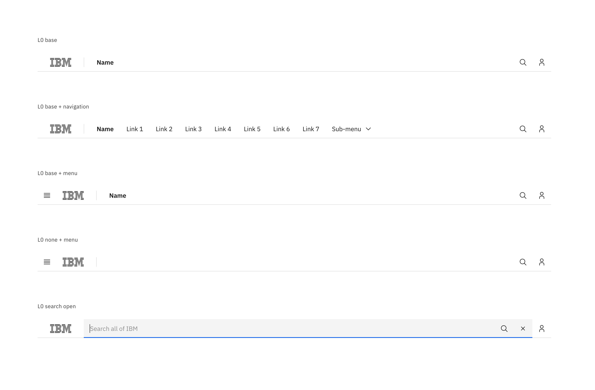

import { ComponentStatus } from 'components/ComponentList';

<PageDescription>

The masthead is a fundamental and required navigational component for IBM.com that displays consistently at the top of each page. Masthead refers to all the standard navigation above the lead space. L is abbreviated for the "Level" starting at base 0. The Level refers to the hierarchy of the navigation on the page.

There are two different variations of the masthead, which one is used depends on the page type. Masthead – L0 contains the default navigation for all of IBM.com and is most commonly used on the IBM.com homepage. Masthead – L1 is utilized for almost all other pages on IBM.com. 

</PageDescription>

<AnchorLinks>

<AnchorLink>Masthead Level 0</AnchorLink>
<AnchorLink>Masthead Level 1</AnchorLink>
<AnchorLink>Design and functional specifications</AnchorLink>
<AnchorLink>Development documentation</AnchorLink>
<AnchorLink>Feedback</AnchorLink>

</AnchorLinks>

## Masthead Level 0
The Masthead Level 0 (L0) houses global elements and navigation, and is most commonly used on the IBM.com homepage. 

**When to use**
- IBM homepage
- Product catalogue page

### Variations

**Search open by default**

The Search field can be set to be open by default, this variation is typically used on Search result pages.

**When to use**
- Search page

### Anatomy

The Masthead spans the full width of the viewport and is the topmost element in the browser window. Masthead elements are persistent throughout the online experience. 

- L0 navigation supports a maximum of 8 nav links. 
- Supports search and profile services.
- The masthead navigation informs the user of their location at all levels.

Once there is not enough space to accommodate Masthead L0 nav links, an overflow carousel will appear to allow users to navigate through the nav link labels. At smaller breakpoints a hamburger menu will appear to house all nav links. 

For the product navigation pattern, please see the [Navigation Pattern](https://www.carbondesignsystem.com/experimental/navigation-pattern) page on the Carbon website for detail.

1. **IBM logo:** Links to the IBM homepage and is a required piece of the masthead.
2. **Nav link labels:** Nav link labels are set to the default IBM global navigation, these labels are short descriptors to inform the user what type of content they will find in the menu.
3. **Search:** The search icon is persistent throughout the web experience, the search icon triggers the search bar to open and supports the search services for IBM.com
4. **Profile:** Links to a users MyIBM profile where they can access their IBMid.
5. **Mega menu:** The mega menu supports the large portfolio of offerings IBM provides and allows users to quickly scan and navigate to the information they are looking for. 

### Behavior

**Responsive**

The masthead is fully responsive and changes what is displayed based on the browser size.

**Default**

At large browser widths all the pieces of the masthead should display per the default design.

**Overflow carousel**

Once there is not enough space to accommodate the Masthead L0 nav links, an overflow carousel will appear to allow users to navigate through the nav link labels. The smallest browser size for the overflow carousel is 800px wide.

**Mobile**

All nav labels will collapse into a left panel hamburger menu on any browser size below 800px wide.

**Scrolling**

The masthead is sticky when scrolling the L0 sticks to the top of the browser. 

**Mega menu**

The mega menu spans the width of the browser and slides out from the Masthead L0 on click. It closes when the user selects a link within the menu, clicks outside the menu or collapses the menu via the nav label.
   
   
## Masthead Level 1
When the Masthead Level 1 (L1) is used there are no navigation links within the L0. An L1 should include an ecosystem name, like Analytics, to help the user identify where they are within the website. 

**When to use:**
- Product page
- Services page

### Anatomy

The masthead spans the full width of the viewport and is the topmost element in the browser window. Masthead elements are persistent throughout the online experience. 

- L0 contains the IBM logo, global search and profile services.
- Supports search and profile services.
- L1 navigation support an ecosystem name and additional nav links. 
- The masthead navigation informs the user of their location at all levels.

Once there is not enough space to accommodate Masthead L1 nav links, an overflow carousel will appear to allow users to navigate through the nav link labels, you can see an example in the Behavior section. At smaller breakpoints a hamburger menu will appear to house all nav links. 

For the product navigation pattern, please see the [Navigation Pattern](https://www.carbondesignsystem.com/experimental/navigation-pattern) page on the Carbon website for detail.

1. **IBM logo:** Links to the IBM homepage and is a required piece of the masthead.
2. **Search:** The search icon is persistent throughout the web experience, the search icon triggers the search bar to open and supports the search services for IBM.com
3. **Profile:** Links to a users MyIBM profile where they can access their IBMid.
4. **Ecosystem name:** Ecosystem names should have only one text and color treatment. The ecosystem name is specific and based on the offering, product, and category, it is a direct link back to the IBM product or sub-topic page. Never use a logo and/or image for the ecosystem name.
5. **Nav link labels:** Nav link labels are set to the default IBM global navigation, these labels are short descriptors to inform the user what type of content they will find in the menu.

### Behavior

**Responsive**

The masthead is fully responsive and changes what is displayed based on the browser size.

**Default**

At large browser widths all the pieces of the masthead should display per the default design.

**Overflow carousel**

Once there is not enough space to accommodate the Masthead L1 nav links, an overflow carousel will appear to allow users to navigate through the nav link labels. The ecosystem name is always present when the overflow carousel is activated. The smallest browser size for the overflow carousel is 800px wide.

**Mobile**

All nav labels will collapse into a left panel hamburger menu on any browser size below 800px wide.

**Scrolling**

When using the Masthead L1, the L0 (IBM logo, search and profile) scrolls away and L1 sticks to the top or the browser. If the user scrolls up the L0 comes back into view.

**Nav link labels**

All nav links in the Masthead L1 have the ability to support a single group of sub-links which will be displayed in a dropdown below the navigation label on click. If the sub-link does not take the user to a new page the navigation label will display as selected.

## Design and functional specifications

The design specs and functional specs for the Masthead can be viewed [here](https://ibm.box.com/s/knez30xt6kao1amylebbvs97vkemhrbp) 

## Development documentation

<ComponentStatus name="Masthead" type="ui" />

## Feedback

Help us improve this component by providing feedback, asking questions, and leaving any other comments on [GitHub](https://github.com/carbon-design-system/carbon-for-ibm-dotcom).
