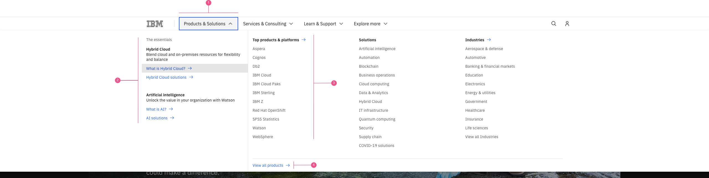
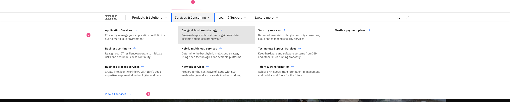
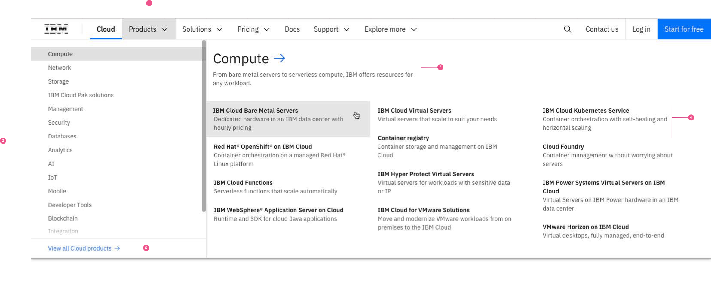

import { ComponentStatus } from 'components/ComponentList';
import ComponentDescription from 'components/ComponentDescription';
import ComponentFeedback from 'components/ComponentFeedback';

<ComponentDescription name="Masthead" type="ui" />

<AnchorLinks>

<AnchorLink>Masthead with Level 0</AnchorLink>
<AnchorLink>Masthead with Level 1</AnchorLink>
<AnchorLink>Mega menu</AnchorLink>
<AnchorLink>Design and functional specifications</AnchorLink>
<AnchorLink>Development documentation</AnchorLink>
<AnchorLink>Feedback</AnchorLink>

</AnchorLinks>

## Masthead with Level 0
The Masthead with Level 0 (L0) refers to the first position of navigational menus on a page, it houses global elements and navigation labels. L is abbreviated for the "Level" starting at base 0, the Level refers to the hierarchy of the navigation on the page.

#### When to use
Masthead with level 0 is suitable for top level pages. Examples include the home page, Products, and Solutions page.

### Variations

#### Search open by default

The Search field can be set to be open by default, this variation is typically used on Search result pages.

#### When to use
The Masthead with Search open by default is most commonly used on Search results pages where the search querey is displayed within the open search field.

### Anatomy

1. **IBM logo:** Links to the IBM homepage and is a required piece of the masthead. The IBM logo should not be altered.
2. **Navigation labels:** Navigation labels are set to the default IBM global navigation, these labels are short descriptors to inform the user what type of content they will find within the menu.
3. **Search:** The search icon is persistent throughout the web experience, the search icon triggers the search bar to open and supports the search services for IBM.com.
4. **Profile:** Links to a user's MyIBM profile where they can access their IBMid.
5. **Mega menu:** The mega menu supports the large portfolio of offerings IBM provides and allows users to quickly scan and navigate to the information they are looking for. 

### Behavior

The Masthead spans the full width of the viewport and is the topmost element in the browser window. Masthead elements are persistent throughout the online experience. 

- Masthead with L0 supports a maximum of 7 nav labels. 
- Supports search and profile services.
- The masthead navigation informs the user of their location at all levels.

The masthead is fully responsive and changes what is displayed based on the browser size.Once there is not enough space to accommodate Masthead with L0 navigation labels, an overflow carousel will appear to allow users to navigate through the navigation labels. At smaller breakpoints a hamburger menu will appear to house all navigation labels. 

For the product navigation pattern, please see the [Global header Pattern](https://www.carbondesignsystem.com/patterns/global-header) page on the Carbon website for detail.

#### Max breakpoint
If the broswer is wider than the max breakpoint of 1584px, the masthead and all other page content will center and extra margin will appear on either side of the page layout.

#### Default
At most desktop widths all the pieces of the masthead should display per the default design.

#### Overflow carousel
Once there is not enough space to accommodate the Masthead with L0 navigation labels, an overflow carousel will appear to allow users to navigate through the navigation labels. The smallest browser size for the overflow carousel is 800px wide.

#### Mobile
All navigation labels will collapse into a left panel hamburger menu on any browser size below 800px wide.

#### Scrolling
The masthead is sticky, when scrolling the Masthead with L0 sticks to the top of the browser. 

#### Mega menu
The mega menu spans the width of the browser and slides out from the Masthead with L0 on click. It closes when the user selects a link within the menu, clicks outside the menu or collapses the menu via the navigation label.
   
   
## Masthead with Level 1
When the Masthead with Level 1 (L1) is used there are no navigation labels within the Level 0. L1 refers to second position of navigation menu(s) on a page, and often offers navigation within an ecosystem of pages. A Masthead with L1 should include an ecosystem name, like Analytics, to help the user identify where they are within the website. 

#### When to use:
Masthead with Level 1 is used for pages that are determined to be an ecosystem and receive contextual navigation. Examples include Services landing page, Solution topic page, Brand family, Product family and Product pages.

### Anatomy

1. **IBM logo:** Links to the IBM homepage and is a required piece of the masthead. The IBM logo should not be altered.
2. **Search:** The search icon is persistent throughout the web experience, the search icon triggers the search bar to open and supports the search services for IBM.com.
3. **Profile:** Links to a user's MyIBM profile where they can access their IBMid.
4. **Ecosystem name:** Ecosystem names should have only one text and color treatment. The ecosystem name is specific and based on the offering, product, and category, it is a direct link back to the IBM product or sub-topic page. Never use a logo and/or image for the ecosystem name.
5. **Navigation labels:** Navigation labels are set to the default IBM global navigation, these labels are short descriptors to inform the user what type of content they will find in the menu or link.
6. **Menus:** If there are multiple options for a navigation area, a ^ is displayed next to the navigation label. The options are displayed as a drop-down (as indicated by the above) or through a mega menu if the drop-down is an inefficient interface.

### Behavior

The masthead spans the full width of the viewport and is the topmost element in the browser window. Masthead elements are persistent throughout the online experience. 

- Masthead with L0 contains the IBM logo, global search and profile services.
- Supports search and profile services.
- Masthead with L1 supports an ecosystem name and additional navigation labels. 
- The masthead navigation informs the user of their location at all levels.

The masthead is fully responsive and changes what is displayed based on the browser size.Once there is not enough space to accommodate Masthead with L1 navigation labels, an overflow carousel will appear to allow users to navigate through the navigation labels, you can see an example in the Behavior section. At smaller breakpoints a hamburger menu will appear to house all navigation labels. 

For the product navigation pattern, please see the [Global header Pattern](https://www.carbondesignsystem.com/patterns/global-header) page on the Carbon website for detail.

#### Max breakpoint
If the broswer is wider than the max breakpoint of 1584px, the masthead and all other page content will center and extra margin will appear on either side of the page layout.

#### Default
At large browser widths all the pieces of the masthead should display per the default design.

#### Mobile
All navigation labels will collapse into a left panel hamburger menu on any browser size below 800px wide.

#### Scrolling
When using the Masthead with L1, the Masthead with L0 (IBM logo, search and profile) scrolls away and Masthead with L1 sticks to the top or the browser. If the user scrolls up the Masthead with L0 comes back into view.

## Mega menu
Mega menus are one of the elements in the L0 and L1 masthead anatomy. They are used when the list of links for a navigation label in the L0 or L1 exceeds what can be achieved from a drop-down menu, either because the amount of link content is more than what is typically consumable in a drop-down or because the oganization of the content requires more than a simple list.

There are a number of options for the mega menu, depending on if certain links need emphasizing, if links need a description, and the amount of groups and links that need to be displayed.
1. Default - Groups of links that all have the same emphasis 
2. Variation - Emphasizing certain groups of links
3. Variation - Links with descriptions
4. Variation - Two tiers to support a large amount of groups and links

Regardless of the variations, there are commonalities shared by all the mega menus:
- For maximum breakpoints, it spans the full width of the viewport.
- Is fully responsive and changes what is displayed based on the browser size.
- Closes when the user (1) select a link in the mega menu or (2) taps / clicks the highlighted navigation label in the L0 or L1 or (3) taps / clicks anywhere outside the mega menu.
- When the user clicks / taps on another navigation label, the current mega menu closes and the menu / drop down for the selected navigation label opens.

#### When to use:
Mega menu is used to display links for the L0 and L1 navigation labels across the ibm.com web site when a drop-down is insufficient. 

NOTE: If you have a use case that is not covered by the variations below, please reach out to the Carbon for IBM.com team who will help you find an answer to the problem. This will help us ensure that there is a consistent navigation system across the site and that there are not one-off solutions.

## Default
The default option displays groups of links under a heading. While groups can be placed in any order, all the groups all have the same emphasis in expressing the information. For the maximum breakpoint, the mega menu can accomodate up to 4 columns of content.

### Anatomy

1. **Navigation label:** These are consistent regardless of which mega menu variation is implemented.
2. **Menu items:** The menu items are grouped. Each group has a group title and link (optional); if the group title is not a link, then the blue arrow image is not displayed and the group title is not clickable. Depending on the number of groups and the amount of links, the groups can stack on top of each other, as shown below. A group can also contain no links (see "Cloud platform support" in the Learn & Support example below). For both stacked groups and a group with no links, keep in mind how the groups should be displayed that will keep the experience simple and easy to digest for a user. In the maximum breakpoint view, the groups can span across 4 columns. 

### Behavior
1. **Navigation label:** When the mega menu is displayed, the corresponding navigation label is highlighted.
2. **Menu items:** When the user hovers over a menu item, the hover state is triggered (see "Annual report" in the Explore More example or "Hybrid cloud" in the Learn & Support example).
3. There is no scrolling for this variation

## Variation 1 - Emphasizing certain groups of links
This variation should be used when certain links need to be emphasized. There can be up to two groups of content that can be emphasized in the left-hand area.

### Anatomy

1. **Navigation label:** These are consistent regardless of which mega menu variation is implemented.
2. **Emphasis items:** This area provides a way to emphasize certain links. There is a heading for the area. Up to two groups of links can be displayed. For each group, there can be a heading, a short description, and up to two links.
3. **Menu items:** The menu items are grouped. Each group has a group title and link (optional); if the group title is not a link, then the blue arrow image is not displayed and the group title is not clickable (see Solutions for an example). Similar to the default option, depending on the number of groups and the amount of links, the groups can stack on top of each other. A group can also contain no links (see "Cloud platform support" in the Learn & Support example above). For both stacked groups and a group with no links, keep in mind how the groups should be displayed that will keep the experience simple and easy to digest for a user. In the maximum breakpoint view, the menu items can span across 3 columns. 
4. **Optional CTA:** There can be an optional CTA. Its purpose is to direct the user to the primary landing page for the navigation section. This CTA spans the entire 3 columns of the menu items section.

### Behavior
1. **Navigation label:** When the mega menu is displayed, the corresponding navigation label is highlighted.
2. **Emphasis items and Menu items:** Hover states for all links, whether it is a menu item link or a group heading link.
3. **Optional CTA:** The hover state covers the entire optional CTA area. See below for example.
4. There is no scrolling for this variation

## Variation 2 - Links with descriptions
This variation should be used when menu items should be displayed along with a short description. This is best suited when the menu item names may not be clear to a user, such as names of IBM services, and the description can provide more context to help the user make an informed decision on where to go next.  

### Anatomy

1. **Navigation label:** These are consistent regardless of which mega menu variation is implemented.
2. **Menu items:** There can be up to 12 items displayed, spanning across 4 columns in the maximum breakpoint view. Each item has a title and an optional description. A group can also contain no links (see "Flexible payment plans" in the example above); if you have this scenario, keep in mind the order the groups should be displayed that will keep the experience simple to scan for a user. 
3. **Optional CTA:** There can be an optional CTA. It’s purpose is to direct the user to the primary landing page for the navigation section. This CTA spans the entire width of the mega menu.

### Behavior
1. **Navigation label:** When the mega menu is displayed, the corresponding navigation label is highlighted.
2. **Menu items:** The link and the description are highlighted in the hover state and the user can select the entire hover area (see "Design & business strategy" above).
3. **Optional CTA:** The hover state covers the entire optional CTA area.
4. There is no scrolling for this variation

## Variation 3 - Two tiers
This variation caters to a large number of groups and large amount of links within each group. When the user selects a group on the left, the list of corresponding links displays on the right. This designs allows a description for each link.

### Anatomy

1. **Navigation label:** These are consistent regardless of which mega menu variation is implemented.
2. **List of groups:** The list of groups is displayed
3. **Group link and description:** The selected group is indicated in this area. The group has a title and in addition, it can have an optional description and a link.
4. **Menu items:** There can be up to 12 items displayed, spanning across 3 columns in the maximum breakpoint view. Each item has a title and an optional description. 
5. **Optional CTA:** There can be an optional CTA. It’s purpose is to direct the user to the primary landing page for the navigation section. This CTA spans only the column that displays the list of groups.

### Behavior
1. **Navigation label:** When the mega menu is displayed, the corresponding navigation label is highlighted.
2. **List of groups:** Scrolling is supported in this area if the list is longer than can be displayed. When the user selects a group in the list, the content is displayed on the right.
3. **Group link and description:** There is a hover behavior if the title is also a link.
4. **Menu items:** The link and the description are highlighted in the hover state and the user can select the entire hover area (see "IBM Cloud Bare Metal Servers" above).
5. **Optional CTA:** The hover state covers the entire 1 column CTA area.

## Design and functional specifications

The design specs and functional specs for the 
- Masthead can be viewed [here](https://ibm.box.com/s/knez30xt6kao1amylebbvs97vkemhrbp). 
- Mega menu can be viewed [here](https://ibm.box.com/s/lcjcmdoaz2hnj6gejx7ilafhrvje4k68).

## Development documentation

<ComponentStatus name="Masthead" type="ui" />

## Feedback

Help us improve this component by providing feedback, asking questions, and leaving any other comments on [GitHub](https://github.com/carbon-design-system/carbon-for-ibm-dotcom).
