import ComponentDescription from 'components/ComponentDescription';
import ComponentFooter from 'components/ComponentFooter';
import ResourceLinks from 'components/ResourceLinks';

<ComponentDescription name="Masthead" type="ui" />

<AnchorLinks>

<AnchorLink>Resources</AnchorLink>
<AnchorLink>Masthead with Level 0</AnchorLink>
<AnchorLink>Masthead with Level 1</AnchorLink>
<AnchorLink>Content guidance</AnchorLink>
<AnchorLink>Feedback</AnchorLink>

</AnchorLinks>

<ResourceLinks name="Masthead" type="ui" />

## Masthead with Level 0

The Masthead with Level 0 (L0) refers to the first position of navigational menus on a page, it houses global elements and navigation labels. L is abbreviated for the "Level" starting at base 0, the Level refers to the hierarchy of the navigation on the page.

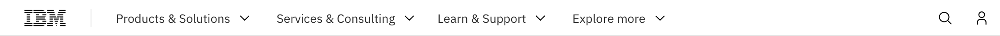

#### When to use

Masthead with level 0 is suitable for top level pages. Examples include the home page, Products, and Solutions page.

 

### Options

#### Search open by default

The Search field can be set to be open by default, this variation is typically used on Search result pages. Search querey text can be prefilled within the open search field, allowing users to easily change querey and search again.

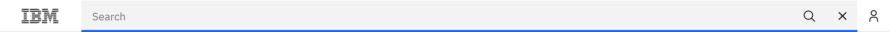

#### White theme only

As a mandatory component of the IBM.com web experience, the white masthead should remain consistent, creating a branded anchor across all pages.

Visually the white theme has proven to be safer and more versatile than the dark masthead, which could create a stark band when used in contrast, or blend into a dark lead space. Keeping the global navigation locked, above and "out of the way" allows page makers to explore any theming combinations for the rest of the page.

Unlike some products and dashboards, the IBM.com web experience does not support dark and light mode switching. The majority of IBM.com is comprised of marketing pages using expressive imagery, company logos, and different themes across page sections. Dark and light mode switching can cause unexpected results at scale, which is another reason for keeping the masthead white.

<InlineNotification>

**Note:** If you believe a color theme change will have a positive impact on your web experience, please contact us and we will evaluate it together.

</InlineNotification>

 

### Anatomy

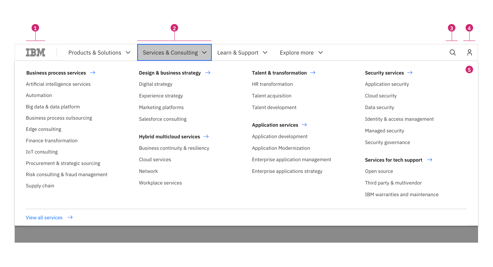

1. **IBM logo:** Links to the IBM homepage and is a required piece of the masthead. The IBM logo should not be altered.
2. **Navigation labels:** Navigation labels are set to the default IBM global navigation, these labels are short descriptors to inform the user what type of content they will find within the menu.
3. **Search:** The search icon is persistent throughout the web experience, the search icon triggers the search bar to open and supports the search services for IBM.com.
4. **Profile:** Links to a user's MyIBM profile where they can access their IBMid.
5. **Mega menu:** The mega menu supports the large portfolio of offerings IBM provides and allows users to quickly scan and navigate to the information they are looking for.

 

### Behavior

The Masthead spans the full width of the viewport and is the topmost element in the browser window. Masthead elements are persistent throughout the online experience.

- Masthead with L0 supports a maximum of 7 nav labels.
- Supports search and profile services.
- The masthead navigation informs the user of their location at all levels.

The masthead is fully responsive and changes what is displayed based on the browser size.Once there is not enough space to accommodate Masthead with L0 navigation labels, an overflow carousel will appear to allow users to navigate through the navigation labels. At smaller breakpoints a hamburger menu will appear to house all navigation labels.

For the product navigation pattern, please see the [Global header Pattern](https://www.carbondesignsystem.com/patterns/global-header) page on the Carbon website for detail.

#### Max breakpoint

If the broswer is wider than the max breakpoint of 1584px, the masthead and all other page content will center and extra margin will appear on either side of the page layout.

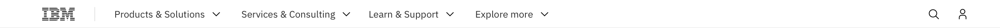

#### Default

At most desktop widths all the pieces of the masthead should display per the default design.

#### Overflow carousel

Once there is not enough space to accommodate the Masthead with L0 navigation labels, an overflow carousel will appear to allow users to navigate through the navigation labels. The smallest browser size for the overflow carousel is 800px wide.

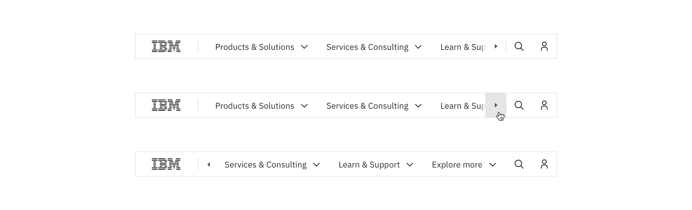

#### Mobile

All navigation labels will collapse into a left panel hamburger menu on any browser size below 800px wide.

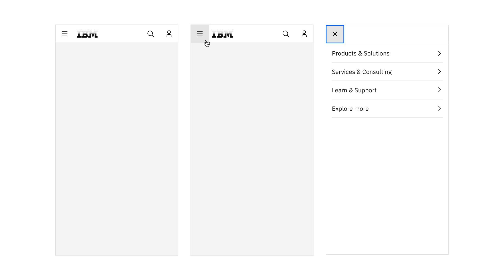

#### Scrolling

The masthead is sticky, when scrolling the Masthead with L0 sticks to the top of the browser.

#### Mega menu

The mega menu spans the width of the browser and slides out from the Masthead with L0 on click. It closes when the user selects a link within the menu, clicks outside the menu or collapses the menu via the navigation label.

 

## Masthead with Level 1

When the Masthead with Level 1 (L1) is used there are no navigation labels within the Level 0. L1 refers to second position of navigation menu(s) on a page, and often offers navigation within an ecosystem of pages. A Masthead with L1 should include an ecosystem name, like Analytics, to help the user identify where they are within the website.

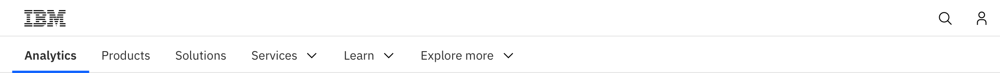

#### When to use:

Masthead with Level 1 is used for pages that are determined to be an ecosystem and receive contextual navigation. Examples include Services landing page, Solution topic page, Brand family, Product family and Product pages.

 

### Anatomy

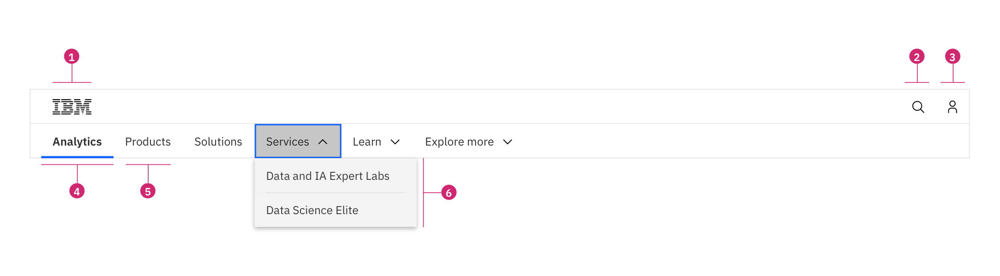

1. **IBM logo:** Links to the IBM homepage and is a required piece of the masthead. The IBM logo should not be altered.
2. **Search:** The search icon is persistent throughout the web experience, the search icon triggers the search bar to open and supports the search services for IBM.com.
3. **Profile:** Links to a user's MyIBM profile where they can access their IBMid.
4. **Ecosystem name:** Ecosystem names should have only one text and color treatment. The ecosystem name is specific and based on the offering, product, and category, it is a direct link back to the IBM product or sub-topic page. Never use a logo and/or image for the ecosystem name.
5. **Navigation labels:** Navigation labels are set to the default IBM global navigation, these labels are short descriptors to inform the user what type of content they will find in the menu or link.

 

### Behavior

The masthead spans the full width of the viewport and is the topmost element in the browser window. Masthead elements are persistent throughout the online experience.

- Masthead with L0 contains the IBM logo, global search and profile services.
- Supports search and profile services.
- Masthead with L1 supports an ecosystem name and additional navigation labels.
- The masthead navigation informs the user of their location at all levels.

The masthead is fully responsive and changes what is displayed based on the browser size.Once there is not enough space to accommodate Masthead with L1 navigation labels, an overflow carousel will appear to allow users to navigate through the navigation labels, you can see an example in the Behavior section. At smaller breakpoints a hamburger menu will appear to house all navigation labels.

For the product navigation pattern, please see the [Global header Pattern](https://www.carbondesignsystem.com/patterns/global-header) page on the Carbon website for detail.

#### Max breakpoint

If the broswer is wider than the max breakpoint of 1584px, the masthead and all other page content will center and extra margin will appear on either side of the page layout.

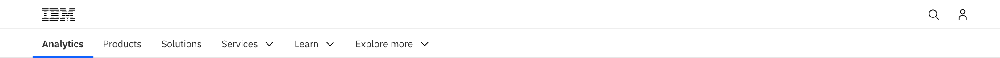

#### Default

At large browser widths all the pieces of the masthead should display per the default design.

#### Mobile

All navigation labels will collapse into a left panel hamburger menu on any browser size below 800px wide.

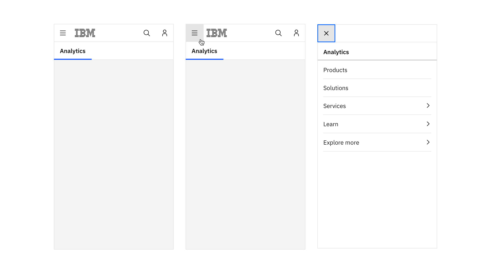

#### Scrolling

When using the Masthead with L1, the Masthead with L0 (IBM logo, search and profile) scrolls away and Masthead with L1 sticks to the top or the browser. If the user scrolls up the Masthead with L0 comes back into view.

#### Navigation link labels

All navigation links in the Masthead with L1 have the ability to support a single group of sub-links which will be displayed in a dropdown below the navigation label on click. If the sub-link does not take the user to a new page the navigation label will display as selected.

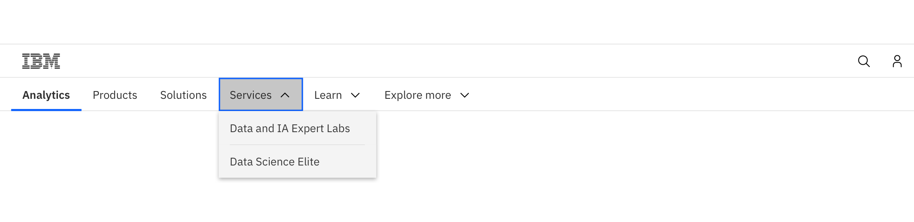

## Content guidance

Masthead with L0 is always present as a part of the masthead and cannot be modified. The below table provides guidance for masthead with L1.

### Masthead with L1

| Element              | Content type | Required | Instances | Character limit  (English / translated) | Notes                                                                                                                    |
| -------------------- | ------------ | -------- | --------- | ------------------------------------------- | ------------------------------------------------------------------------------------------------------------------------ |
| Ecosytem name        | Text         | Yes      | 1         | 25 / 35                                     | Text style CTA only, direct link back to the IBM product or sub-topic page.                                              |
| Primary menu item    | Text         | Yes      | 6         | 25 / 35                                     | Links to page or opens dropdown menu for label. If link, URL assigned in setup. Consult IA group on label customization. |
| Secondary menu items | Text         | No       | 8         | 40 / 55                                     |                                                                                                                          |

<ComponentFooter name="Masthead" type="ui" />
