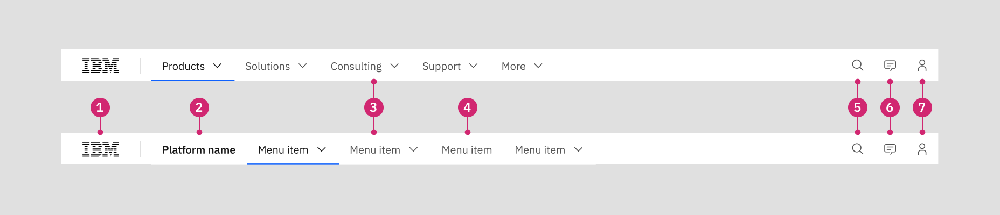
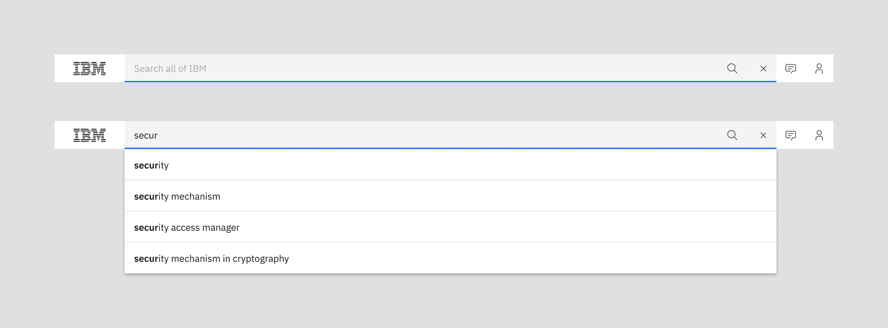
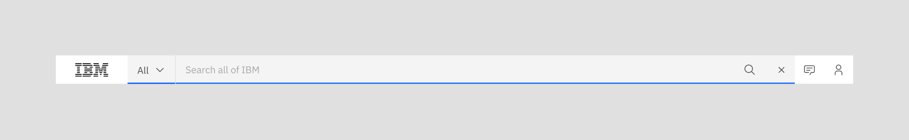
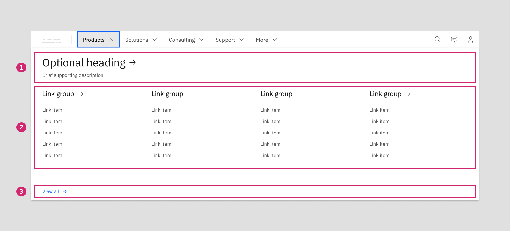
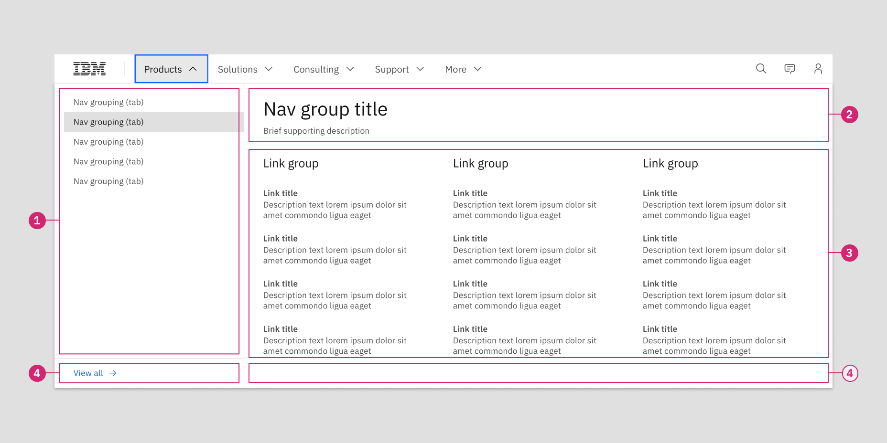

import ComponentFooter from 'components/ComponentFooter';
import ResourceLinks from 'components/ResourceLinks';

<PageDescription>

The masthead level 0 is the first level of the navigation on IBM.com.

</PageDescription>

<AnchorLinks>

<AnchorLink>Masthead Level 0 (L0)</AnchorLink>
<AnchorLink>Standards</AnchorLink>
<AnchorLink>Menu patterns</AnchorLink>
<AnchorLink>Behavior</AnchorLink>
<AnchorLink>Resources</AnchorLink>
<AnchorLink>Content guidance</AnchorLink>
<AnchorLink>Feedback</AnchorLink>

</AnchorLinks>

## Masthead Level 0 (L0)

The dominant use of the L0 masthead displays global navigation for IBM.com, displaying the IBM logo, navigation labels and utility items. While this is the most commonly used pattern, the L0 masthead supports use for platform navigation, introducing the platform name before the navigation labels. The L0 masthead also allows the option to display the search bar open on page load.

### Anatomy

1. **IBM logo:** Image asset that links to the IBM home page.
2. **Platform name:** Optional label that identifies and links to a specific platform as global navigation.
3. **Navigation menu:** Short descriptor that opens a menu of navigation items, refer to menu patterns.
4. **Navigation link:** Short descriptor that directly links to a destination.
5. **Search:** Opens the search bar within the L0 menu and supports search services.
6. **Contact us:** Triggers a contact panel to slide up from the bottom of the browser window.
7. **Profile:** Displays the user’s authentication state and allows access to MyIBM and authenticated site features.

## Standards

### Search

The default behavior for the search feature allows users to search IBM.com and redirects to the site’s search results page.

The search bar is typically triggered when interacting with the magnifying glass icon, layering the input field on top of navigation labels. The L0 masthead also allows the option to display the search bar open on page load.

<Caption>The open search bar and example of search suggestions</Caption>

The L0 masthead also allows for scoped search to be enabled, displaying a dropdown menu at the left of the search bar and allowing the user to select a specific segment for limiting their results.

<Caption>The scoped search dropdown</Caption>

### Profile

Lorem ipsum details to follow...

## Menu patterns

When a navigation label displays a carat icon, it opens a full-width dropdown menu with a subset of navigation options. The two primary menu patterns are a standard pattern that offers a flexible arrangement of link groups, as well as a tabbed pattern that allows more complex sets of links to be hidden or exposed. Both patterns also offer additional options for showcasing a feature item.

### Standard Menu

The standard menu pattern is made up of three main zones that accommodate a flexible set of main navigation, along with options to include a heading or title area and a terminal link to view all options on a relevant category or listing page.

** 1. Heading zone (optional) **

When there is an encompassing category or topic, a heading and optional supporting description may be displayed at the top of the open menu. While the heading may either be a link or static label, it’s more likely to be used as a link in the standard menu pattern, as a static label may be redundant with the parent navigation label.

A linked heading is also likely to direct to broader category or listing page, duplicating the function of the optional “view all” link at the bottom of the menu. In the case these share the same destination link, only one of these elements should be used.

** 2. Main navigation zone (Required) **

The core navigation area is likely to be composed of a number of link groups, which can be flexibly styled based on the shape of the content. It’s recommended to display a title a link group, particularly when multiple groups are present.

- A link group title may be a static label or a link
- A link group title may optionally display a supporting description
- When multiple link groups are present and a standalone link is needed, the link group title may be used as a standalone link
- A link item may consist of simply a link label, or a link may be supported by a brief description
- Link groups may occupy their own column or multiple can be stacked in a column

** 3. View all link zone (Optional) **

When there is an encompassing category or listing page that supports the parent navigation label, the “view all” link may be appended to the bottom of the open menu to link to this destination.

Because “view all” can serve the same function as the optional linked header at the top of the menu, the “view all” option should be used when the destination page is considered supplemental to the user’s understanding of the content and we prefer to drive them to more detailed content first.

### Tabbed menu

The tabbed menu pattern includes many of the same elements as the standard pattern, but introduces a tab panel in the left column of the open menu that displays a specific segment of content, based on the selected tab item.

** 1. Tabbed navigation zone (Required) **

The left column displays the labels for the tabbed navigation categories or groupings. The first item in the column is displayed by default upon opening the menu—and on click of other tab names, the associated set of navigation items appear to the right. Each tab consists of a link label which ideally is brief and does not wrap to multiple lines.

** 2. Heading zone (Optional) **

In the tabbed menu pattern, the nav group title is often used to reinforce the name of the selected tab. Therefore, it’s recommended to keep copy related or consistent between both items. The nav group title may optionally be paired with a supporting description.

** 3. Main navigation zone (Required) **

The core navigation area is likely to be composed of a number of link groups, which can be flexibly styled based on the shape of the content. It’s recommended to display a title a link group, particularly when multiple groups are present.

- A link group title may be a static label or a link
- A link group title may optionally display a supporting description
- When multiple link groups are present and a standalone link is needed, the link group title may be used as a standalone link
- A link item may consist of simply a link label, or a link may be supported by a brief description
- Link groups may occupy their own column or multiple can be stacked in a column

** 4. View all link zone (Optional) **

The “view all” option may be used at the bottom of the tabbed navigation zone when the destination page is relevant to all content across tabs and relates directly to the parent navigation label.

It may also be used within a tab, occupying the bottom of the rightmost three columns. In this case, the “view all” link is relevant specifically to the content within this tab. As with the standard menu pattern, be cautious if the nav group title displays a link and do not use this “view all” to duplicate a path to the same destination.

## Behavior

**Menu overflow**

At the large breakpoint and all wider breakpoints, the L0 masthead will truncate the set of navigation labels when their collective character lengths are wider that the available width of their display container. Initially, a right-facing caret will appear with a subtle gradient, indicating to the user that they can interact with this element to display the overflow menu items. As the user scrolls these items into view, a caret will be mirrored at the left side of the navigation label area, allowing the user to control which labels are in view.

**Mobile layout**

On small and medium breakpoints, the mobile layout of the L0 masthead is displayed. A menu icon is shown at the left of the menu bar, along with the IBM logo and utility navigation items. On click of the menu icon, the open menu appears and displays one level of navigation items on screen, allowing the user to navigate back and forth through levels to find their desired destination.

If a heading zone is used in a menu, both the label and description display on mobile. However, any supporting descriptions that are associated with link group titles or individual link items are suppressed at these breakpoints.

<ResourceLinks name="Masthead" type="ui" />

## Content guidance

L0

| Element               | Required | Instances | Character limit  (English / translated) | Notes                                                                              |
| --------------------- | -------- | --------- | ------------------------------------------- | ---------------------------------------------------------------------------------- |
| Platform label        | Optional | 1         | Mini 25 / 35                                | Typically rarely used.                                                             |
| Navigation menu label | Required | Up to 6   | Mini 25 / 35                                | Limit character lengths to prevent overflow. Can support link, menu, or mega menu. |

Tabbed menu

| Element                | Required | Instances | Character limit  (English / translated) | Notes                                           |
| ---------------------- | -------- | --------- | ------------------------------------------- | ----------------------------------------------- |
| Menu: Tab label        | Optional | No limit  | XXS 40 / 55                                 | Limit character length to prevent line wrapping |
| Menu: Nav group title  | Optional | 1         | Mini 25 / 35                                |                                                 |
| Menu: Link group title | Optional | No limit  | Mini 25 / 35                                |                                                 |
| Menu: Link item label  | Required | No limit  | XXS 40 / 55                                 |                                                 |
| Menu: Descriptions     | Optional | No limit  | XS 65 / 85                                  | Attempt to wrap no longer than 2 lines          |
| Menu: View all link    | Optional | 1         | Mini 25 / 35                                | Should use “view all” and optional noun phrase  |

<ComponentFooter name="Masthead" type="ui" />
