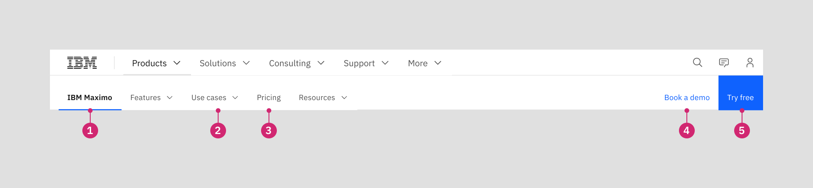
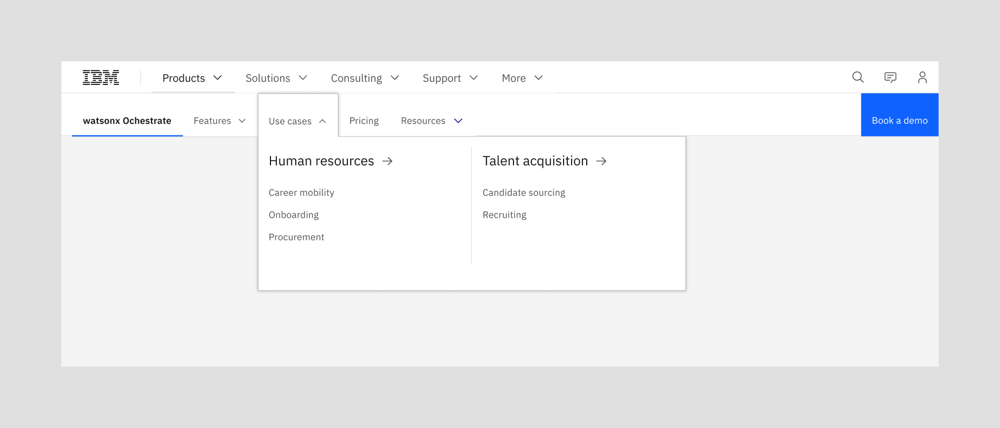
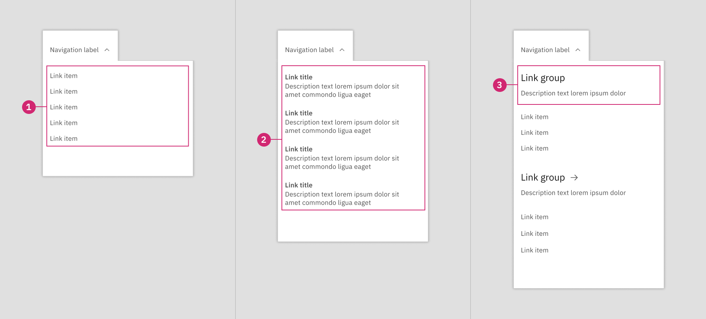
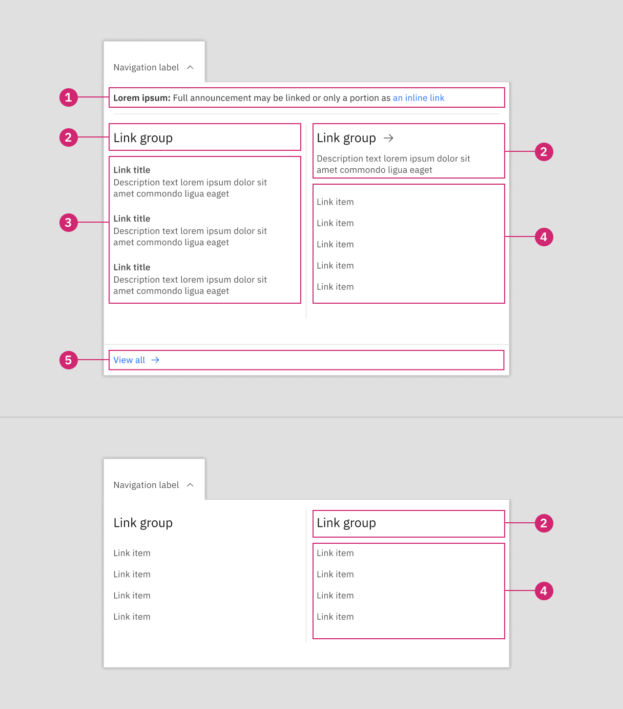
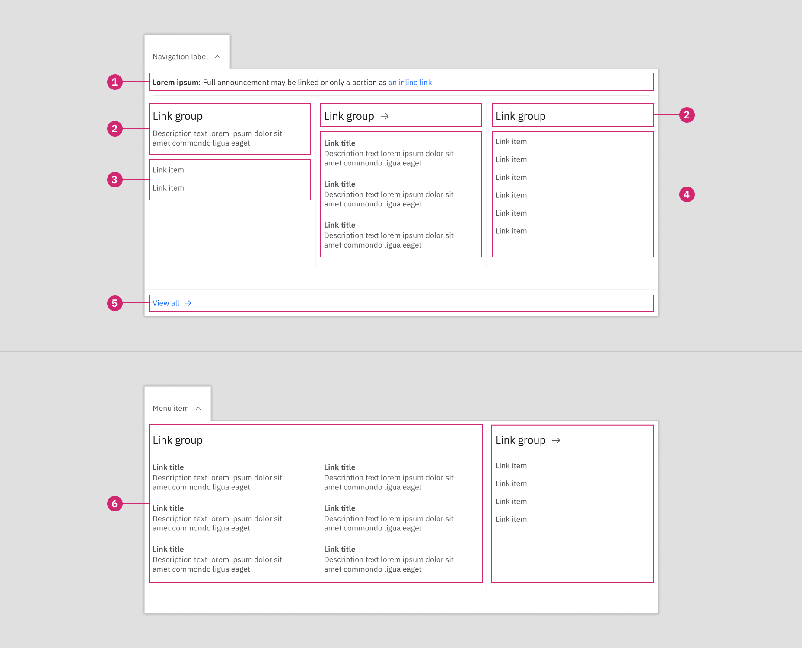

import ComponentFooter from 'components/ComponentFooter';
import ResourceLinks from 'components/ResourceLinks';

<PageDescription>

The masthead level 1 is the second level of the navigation on IBM.com.

</PageDescription>

<AnchorLinks>

<AnchorLink>Masthead Level 1 (L1)</AnchorLink>
<AnchorLink>Anatomy</AnchorLink>
<AnchorLink>CTA options</AnchorLink>
<AnchorLink>Menu patterns</AnchorLink>
<AnchorLink>Behavior</AnchorLink>
<AnchorLink>Resources</AnchorLink>
<AnchorLink>Content guidance</AnchorLink>
<AnchorLink>Feedback</AnchorLink>

</AnchorLinks>

## Masthead Level 1 (L1)

The L1 menu is used as a part of the masthead to supply navigation across a specific sub-section of the site, usually providing a deeper set of content branching from an item selected at the global L0 level.

When an L1 menu bar is present, it is always paired with the L0 menu bar, sitting below it in a secondary position. If the L1 sub-section is related to one of the parent navigation labels in the L0, the L0 menu item will display in a selected state to re-enforce the relationship between the content items.

### Anatomy

1. **L1 section name:** Required label that identified the section and links to its main page.
2. **Navigation menu:** Short descriptor that opens a menu of navigation items, refer to menu patterns.
3. **Navigation link:** Short descriptor that directly links to a destination.
4. **Button group:** Optional set of calls to action relevant to the section.

### CTA options

The button group at the right side of the L1 masthead is an optional element that is intended to provide one or two key actions or conversion opportunities that are relevant across the section.

The CTA options are most likely to be used in conjunction with products, where they may drive to product trials, demonstration or sales followup. In the case that a product has a login that’s not included in MyIBM, the secondary link item may be used as a login link. These CTAs should not be used to drive to assets.

When this button group is enabled, any CTA labels should be as concise as possible. Excessive character counts reduce the width available to the container that the main navigation items sit within, running the risk of triggering the overflow mechanisms to display.

## Menu patterns

Overall, there tends to be less content associated with dropdown menus in the L1 in comparison with the L0—while also having a broader range of complexity. Therefore, the dominant differentiator in open L1 menu patterns is column usage. Open L1 menus can use a one, two or three column layout. Each option allows for flexibility in the organization of content.

<Caption>An example of an open L1 menu using a two column layout</Caption>

### One column

The one-column layout is ideal for simpler sets of links, either as a list of items that relates to the parent label or a shallow collection of link groups. Ideally, the number of links should avoid triggering an in-menu scroll bar. If this is the case, move up to a two-column menu layout.

** 1. Link list (Recommended) **

A simple list of ungrouped links that provide access to page URLs that are relevant to the parent navigation label. To promote a scannable menu, try to keep link labels concise so that they are not forced to wrap to a second line.

** 2. Link list with descriptions (Recommended)**

Displays a set of ungrouped links that are relevant to the parent navigation label, though adds additional context or information through brief descriptions to support the link title. If displaying descriptions, these should be used for all links in the menu. Note that supporting descriptions are hidden on mobile screen sizes.

** 3. Link group title (Optional) **

Either style of link list [1, 2] can be paired with a link group title to provide clearer organization of information. The title may be static or a link. It also has the option to be paired with a supporting description. If groups are used in the one column layout, it is recommended to use the simple link list in conjunction with the link group title. Note that supporting descriptions are hidden on mobile screen sizes.

### Two columns

This layout option expands the main distribution of links to a 2-column layout and introduces an optional announcement area, as well as a terminal “view all” link to drive to an encompassing category or listing page. Both the announcement and “view all” options span both columns.

<Row>
<Column colMd={8} colLg={8}>

</Column>
</Row>

**1.Announcement (Optional)**

A rich text area that allows a timely announcement or piece or news to be showcased. This content item should be relevant to the parent navigation label, like the announcement of a new product release inside a product features menu. Consider using bold text at the front of the announcement to define the type of news being shared. Actionable text should be an inline link.

**2.Link group title (Recommended)**

Either style of link list [3, 4] can be paired with a link group title to provide clearer organization of information. The title may be static or a link. It also has the option to be paired with a supporting description. Always use the same type of link list treatment within a group—do not mix items with and without descriptions. However, the link list type may be varied across groups. Note that supporting descriptions are hidden on mobile screen sizes.

**3.Link list with descriptions (Recommended)**

A affiliated set of links that are relevant to their link group title, with brief descriptions providing additional context or information to support the link title. If displaying descriptions, these should be used for all links in the group. Note that supporting descriptions are hidden on mobile screen sizes.

**4.Link list (Recommended)**

A simple list of affiliated links that provide access to page URLs that are relevant to their link group title. To promote a scannable menu, try to keep link labels concise so that they are not forced to wrap to a second line.

**5.View all link (Optional)**

When there is an encompassing category or listing page that supports the parent navigation label, the “view all” link may be appended to the bottom of the open menu to link to this destination.

### Three column

When an L1 navigation label has a complex amount of associated links, the 3-column layout is the largest pattern available. The overall structure and features are similar to the 2-column layout, simply with the addition of another column—and option to change the vertical rules used between columns.

** 1. Announcement (Optional) **

A rich text area that allows a timely announcement or piece or news to be showcased. This content item should be relevant to the parent navigation label, like the announcement of a new product release inside a product features menu. Consider using bold text at the front of the announcement to define the type of news being shared. Actionable text should be an inline link.

** 2 Link group title (Recommended) **

Either style of link list [3, 4] can be paired with a link group title to provide clearer organization of information. The title may be static or a link. It also has the option to be paired with a supporting description. Always use the same type of link list treatment within a group—do not mix items with and without descriptions. However, the link list type may be varied across groups. Note that supporting descriptions are hidden on mobile screen sizes.

** 3. Link list (Recommended) **

A simple list of affiliated links that provide access to page URLs that are relevant to their link group title. To promote a scannable menu, try to keep link labels concise so that they are not forced to wrap to a second line.

** 4. Link list with descriptions (Recommended) **

A affiliated set of links that are relevant to their link group title, with brief descriptions providing additional context or information to support the link title. If displaying descriptions, these should be used for all links in the group. Note that supporting descriptions are hidden on mobile screen sizes.

** 5. View all link (Optional) **

When there is an encompassing category or listing page that supports the parent navigation label, the “view all” link may be appended to the bottom of the open menu to link to this destination.

** 6. Column usage options **

The default behavior for the 3-column layout is to display a vertical rule between each column (1:1:1). The layout can also adapted to accommodate a longer list link that breaks across two columns. The double wide column may be set to the left side of the menu (2:1) or to the right (1:2).

## Behavior

### Menu overflow

At the large breakpoint and all wider breakpoints, the L1 masthead will truncate the set of navigation labels when their collective character lengths are wider than the available width of the container. Initially, a right-facing carat will appear with a subtle gradient, indicating to the user that they can interact with this element to display the overflow menu items. As the user scrolls these items into view, a carat will be mirrored at the left side of the navigation label area, allowing the user to control which labels are in view. The L1 section name and button group remain anchored to their respective sides of the menu bar.

### Mobile layout

On small and medium breakpoints, the mobile layout of the L0/L1 masthead is displayed. For the L1 menu bar, the section name is shown, along with a chevron icon that allows the menu to be toggled open and closed. If a button group is present, these CTAs nest at the bottom of the open menu state.

Unlike the open L0 navigation that shows one level of content per screen view, the L1 masthead uses accordions to allow the user to access all navigation items contained in the menu. The user has full control over the accordion items and may choose to open and close each as suits their browsing behavior.

Because the L1 section name acts as the toggle mechanism for opening and closing the menu, the open state introduces an “Overview” link item that allows access to the section’s main page.

Note that if supporting descriptions are used with `link group titles` or `link list with descriptions`, this copy is suppressed at the mobile breakpoints.

<ResourceLinks name="Masthead" type="ui" />

## Content guidance

| Element             | Required | Instances | Character limit  (English / translated) | Notes                                        |
| ------------------- | -------- | --------- | ------------------------------------------- | -------------------------------------------- | ------------------------------------------- |
| L1: Section name    | Required | 1         | XXS 40 / 55                                 | Limit character length when possible         |
| L1: Navigation link | Required | Up to 6   | Mini 25 / 35                                | Limit character lengths to prevent overflow. |
| L1: Primary CTA     | Optional | 1         |                                             | Micro 20 / 32                                | Limit character lengths to prevent overflow |
| L1: Secondary CTA   | Optional | 1         | Micro 20 / 32                               | Limit character lengths to prevent overflow  |

| Element                | Required | Instances | Character limit | Notes                                          |
| ---------------------- | -------- | --------- | --------------- | ---------------------------------------------- | --- | -------- | --- | ------------ | ---------------------------------------------- |
| Menu: Announcement     | Optional | 1         | M 120 / 150     |                                                |
| Menu: Link group title | Optional | No limit  | Mini 25 / 35    |                                                |
| Menu: Link item label  | Required | No limit  | XXS 40 / 55     |                                                |
| Menu: Description      | Optional | No limit  | XS 65 / 85      | Attempt to wrap no longer than 2 lines         |
| Menu: View all link    | Optional | 1         | Mini 25 / 35    | Should use “view all” and optional noun phrase |     | Optional | 1   | Mini 25 / 35 | Should use “view all” and optional noun phrase |

<ComponentFooter name="Masthead" type="ui" />
