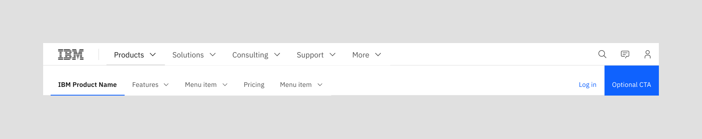

import ComponentDescription from 'components/ComponentDescription';

<ComponentDescription name="Masthead" type="ui" />

## Masthead properties

The masthead is made up of two levels, expressed as horizontal menu organisms that span the width of the page.

<Caption>The IBM.com masthead level 0 and and level 1</Caption>

The top navigation menu is referred to as Level 0 (L0) because it sits in the first position on the page. It contains global navigation elements, such as the link to the IBM.com home page and utility services like search and profile. It typically includes navigation labels and menus that apply to a global set of content across IBM.com.

The masthead also allows the option to display a secondary section-specific navigation menu that’s referred to as Level 1 (L1), referring to its position under the L0 menu. It offers a narrower and deeper set of navigation that is specific to a given site section. The L1 menu is always paired with and sits under the L0 menu.

### Carbon theme

#### White theme

The masthead is available solely in the white theme to create a consistent visual anchor across a user’s site journey.

It is not recommended to switch between light and dark modes as a way to differentiate pages or sections. As a core functional element of the site, the masthead is designed to be an immediately recognizable wayfinding device, whereas other content and assets on a page can deliver a more expressive experience.

### Scroll behavior

The navigation elements are sticky. As a user scrolls down a page, the lowest navigation item in a stack will remain affixed to the top of a browser window and higher items will scroll out of view. When a user scrolls back up a page, all navigation items will immediately scroll back into view.

1. **If only an L0 menu is displayed in the masthead, it will consistently stick to the top of the browser window as the user scrolls.** If only an L0 menu is displayed in the masthead, it will consistently stick to the top of the browser window as the user scrolls.
2. **If a page also has an L1 menu present, the L0 menu will slide out of view and the L1 menu will affix to the top of the window on downward scroll.** If a page also has an L1 menu present, the L0 menu will slide out of view and the L1 menu will affix to the top of the window on downward scroll.

When a [table of contents](./table-of-contents) element is used on a page, it is considered part of the navigation stack and will always inhabit the lowest position. On small and medium breakpoints, a vertical TOC will collapse into a horizontal menu and be the sticky item that displays on on downward scroll. All masthead items come back into view on upward scroll.

<ComponentFooter name="Masthead" type="ui" />
